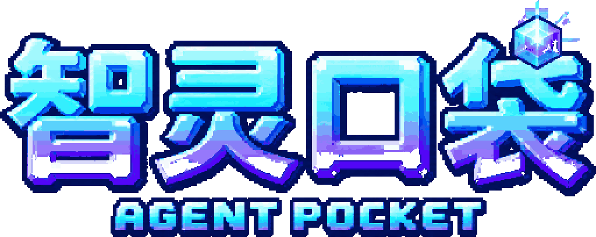
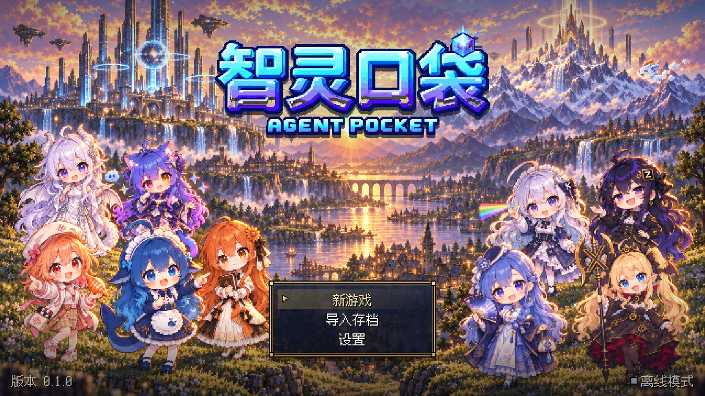
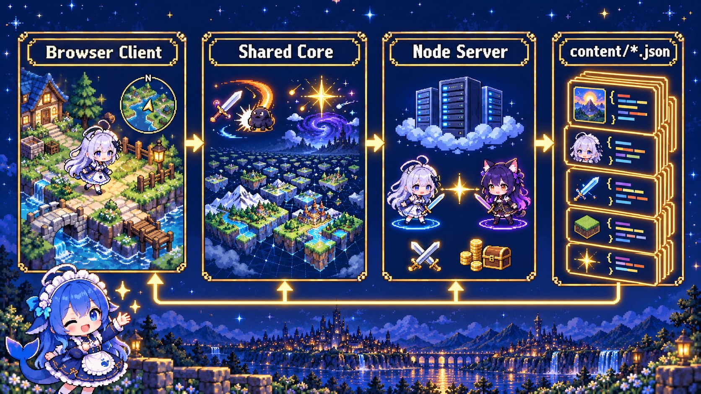
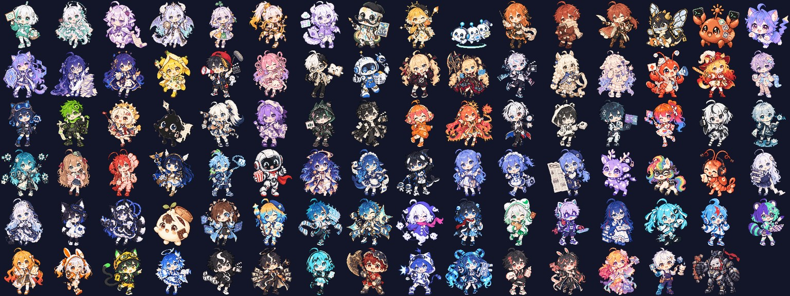
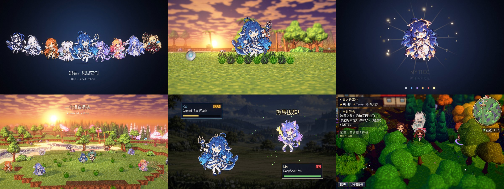
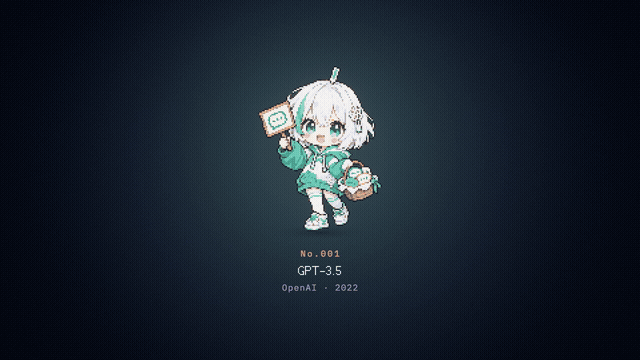

<div align="center">



# agent-pocket

### Catch today's hottest AIs, in your browser

<p>Agent Pocket is an HD-2D pixel creature-collecting RPG that runs entirely on the web. Each of its 448 creatures is a real AI model, Chinese or international, drawn as a cute anime chibi. Each creature's rarity and stats follow that model's real capability.</p>

<p>
  <a href="README.md"><b>中文</b></a>
  &nbsp;|&nbsp;
  <a href="README_EN.md"><b>English</b></a>
</p>

<sub>Vite · TypeScript · three.js · Node WebSocket · browser-only · fully data-driven</sub>

</div>

---





---

## Features

- **448 creatures in 232 evolution families.**
  - Six rarity tiers: N, R, SR, SSR, UR and MYTHIC.
  - A custom type chart.
  - Moves and abilities defined in a declarative DSL.
- **Infinite world.**
  - A 1024² story continent surrounded by a deterministic Perlin-noise frontier that never ends, built from 30 biomes.
  - Mountains, canyons, one-way ledges, rivers and archipelagos.
  - Hamlets, multi-floor dungeons and landmarks.
  - Danger and rarity both grow with distance from the start.
- **Each rarity tier plays differently.**
  - N and R appear in tall grass.
  - SR roam the overworld with a visible aura.
  - SSR appear only under certain conditions and flee.
  - UR are roaming legends.
  - MYTHIC can only be earned through hidden event chains.
- **99 world events, 28 of them hidden.**
  - Real-date festivals, including the lunar calendar.
  - AI-culture jokes, stele riddles and easter eggs.
  - Per-species research tasks.
- **Deterministic battle engine.**
  - Seeded RNG, the Gen-3 catch formula and the Gen-5 damage formula.
  - The browser and the server run the same engine.
- **Multiplayer.**
  - Players near each other are kept in sync over WebSocket.
  - PvP, trading, chat and a leaderboard.
- **Maps.** A minimap, plus a world map with fog of war, province danger and fly-to.
- **Data-driven.** Every table, number and string lives in `content/**/*.json`, and validators check it. Adding content means editing only JSON.




## Promo



The full cut is [`docs/readme/agent-pocket-promo-720p.mp4`](docs/readme/agent-pocket-promo-720p.mp4).
- It is rendered entirely in code: three.js, a deterministic frame for every time step, offline export and ffmpeg.
- The approach follows [mexicat/pdoom-video](https://github.com/mexicat/pdoom-video).
- Source and notes: [`promo/`](promo/NOTES.md).

## Quick start

Play online at **https://ap.crosery.com** (preview: https://prev.ap.crosery.com). Branching, commit and release rules: [`docs/RELEASING.md`](docs/RELEASING.md).

```bash
git clone https://github.com/Crosery/agent-pocket.git && cd agent-pocket
npm install
npm run dev            # game server :8787 + Vite client :5173
npm run typecheck && npm test && npm run build
npm start              # production: serves dist/ and the WebSocket endpoint
```

- Requires Node.js 24 or later. The server runs `.ts` files directly; development used Node 26.
- Add `?dev=1` to the URL for debug hooks (dev server or `npm run build:devtools` only; the production build has none, and servers refuse devtools clients unless started with `AP_DEV=1`).

**Controls**

| Action | Keys |
|---|---|
| Move | WASD or arrow keys |
| Confirm | Z, Space or Enter |
| Cancel | X or Backspace |
| Menu | Esc or Tab |
| Run | Shift |
| World map | M |
| Minimap | N |
| Chat | T |

- Gamepad and touch controls are supported.
- All key bindings live in `content/input.json`.

## Credits

- **Promo method:** [mexicat/pdoom-video](https://github.com/mexicat/pdoom-video) (MIT).
- **Font:** [Fusion Pixel Font](https://github.com/TakWolf/fusion-pixel-font) (OFL).
- **Renderer:** [three.js](https://threejs.org/).
- **Art, music and promo:** made with AI tools, based on the author's own AI-girl character designs.
- **Disclaimer:** this is a fan project. AI product names and trademarks belong to their owners, and this project is not affiliated with any of them.
