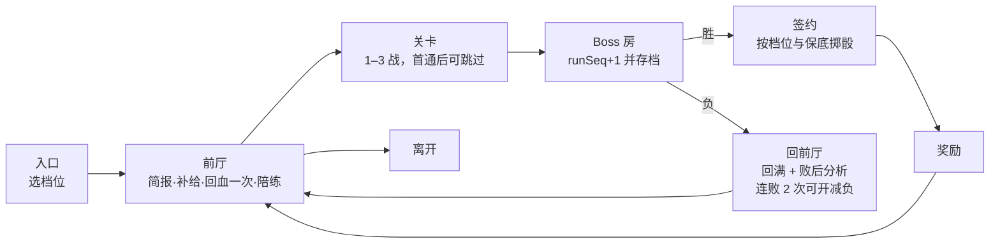

# 设计稿 0003：剧情与成长——教学式主线、早期 DeepSeek Boss、Boss 副本与签约、全世界随机属性

**状态：** 提议（2026-10-09），只设计，不改代码。第 9 节的 8 项决策待所有者拍板。
**关联：** #41（本稿）；#28 副本与组队、#37 属性克制图、#38 传送锚点、#40 红点提醒、#32 Boss 演出；ADR 0001（服务端权威、副本与掉落）、ADR 0002（开发场景）。
**约定：** 文中所有数值都是初值，落地前用 `tools/balance` 与 `node scripts/boss-sim.ts` 校准；引用写成 `文件:键` 或 `文件:行`。新文本键都放 `content/text/zh-CN/`。

---

## 0 一页摘要

1. **问题：** 主线 13 个阶段里有 8 个写着"挑战某道馆"，阶段由徽章数推出来；教学是 57 张弹窗；17 个 Boss 只在前线游荡（DeepSeek 最早 Lv54），和剧情没有关系；第一小时只能抓到 N/R；个体值存在却没人在意。
2. **新序章（约 60 分钟）：** 全镇的智灵都"服务器繁忙"——一位 DeepSeek-V4 顺着冷却水管游进了研究所地下机房，在高峰期摸鱼。玩家选搭档、打零、上属性课，看零下楼碰壁，然后按"上岗清单"边玩边学（收服文心一言、逛商店、登记补给站），由 V4 的妹妹 **DeepSeek-R1（小 R）** 远程带教，在前厅打陪练，在走廊打"中转站老板"，第 45–53 分钟打 **DeepSeek 体验版（Lv12）**。
3. **引导战：** 高峰/谷时的规律在镇上（保安大叔、公告屏）、零的失败、小 R 的简报、陪练、战中教练台词、败后分析里各讲一遍。输两次可以开"减负模式"，所以没人卡死。
4. **签约：** Boss 战里不再投球。赢了之后单独签约：剧情首通必定成功，之后按档位 35/25/15%，有保底。签约后的 Boss 回滚到 checkpoint，从 **Lv1** 开始。
5. **Boss 卡：** 带教加成让它追等级（Lv1→Lv10 约 3 场上场或 7 场替补），等级上限随徽章开放（0 徽章 12 级，之后为下一馆王牌 +2），超出的经验存进"算力储备"，拿到徽章时一次结算。序章签到的卡保底 A 级，带签名特性"峰谷电价"和签名招式"权重空投"。
6. **副本：** 每个 Boss 是一个副本，分前厅、关卡、Boss 房三段；有剧情、进阶、满血三档（满血 = 现有 `bosses.json` 数值），之后为 #28 加集群版。
7. **凹属性（全世界）：** 沿用 0–31 的个体值，新增 25 种性格（±10%）和品质 C/B/A/S/SS（按个体值总和；SS 叫"满血·天选"），特性按权重抽取，Boss 卡多一个签名特性。玩家只看到字母、星级和性格箭头。
8. **凹的途径：** 重抓野生、重刷副本、蒸馏（同族献祭转移单项）、LoRA 补丁、人设重写卡、特性胶囊、转交研究所换训练语料。
9. **公平：** 离线时签约结果由 `rollSeed + runSeq` 预先决定，读档改不了；联机时由服务端掷骰并限制每日次数（依赖 ADR 0001 的 WP5/6/11/13）。
10. **17 个 Boss 的分配：** 8 个主线、8 个支线、1 个终局，每个都有 2–4 幕小剧情、教机制的本地 NPC、陪练和签约回报。零的人物线拿到千问卡，最后放下"说明书"。
11. **里程碑：** M1 新序章 + DeepSeek 引导战 + Lv1 签约 + 随机属性 + 存档 v2；M2 副本框架、三档与微调台；M3 第 1–4 章；M4 第 5–8 章与终局；M5 联机权威；M6 集群版（#28）。

---

## 1 诊断：为什么像"一直去打徽章"

### 1.1 主线就是徽章计数器

- **主线文本：** `content/world/story/quests.json:main` 有 13 个阶段，其中 8 个（阶段 1、2、3、5、6、7、9、10）的正文就是"挑战 X 道馆"。剩下 5 个是研究所、两次幻觉团、圣殿和传说。
- **阶段推导：** 阶段号由 `content/world/story/scripts.json:main-progress` 用 `badgeTiers` 按徽章数推出，只额外看 `villain:swamp`、`villain:boss` 两个旗标。任务日志实际上是一个徽章计数器。
- **奖励脚本：** 8 个 `reward-<gym>` 脚本（`scripts.json:reward-code … reward-logic`）全部以"下一座道馆在哪"收尾，例如"下一座道馆，在开源林镇北边的和弦沙城。"
- **博士的临别话：** 选完搭档后，博士的最后一句是"那里的代码道馆是新人训练家的第一站"（`npcs/story.json:prologue.professor`）。

### 1.2 教学是弹窗流，不是剧情

- **弹窗：** `content/tutorial.json:tips.list` 有 57 张提示卡，按事件触发、排队，间隔 20 秒（`docs/tutorial-curriculum.md`）。
- **NPC 课：** 只有 4 处 NPC `teach`：阿灵的属性课（`aide-types`，唯一带引导战斗的课），以及店员、护士、仓库管理员（`tutorial.json:curriculum.lessons[].npcs`）。
- **其余机制没有剧情理由：** 状态、能力等级、换人、道具、读 Boss 机制，都靠战斗中的一张卡片带过。没有一个剧情事件逼你去用它们。

### 1.3 Boss 和剧情是两张皮

- **数量与等级：** `content/bosses.json` 有 17 个 Boss，等级 55–72。
- **只在两处出现：**
  - **游荡传说：** `content/events/legends.json` 按离原点的距离分圈，等级取 `content/events/spawn.json:legends.levelByBand` = [40, 50, 58, 66, 74] 再加 `levelBonus`。DeepSeek 的 `minBand` 是 1，只在 380 格以外的前线出现，最低 Lv54。
  - **神话链终点：** `content/events/mythic.json`，要求 3–6 枚徽章或图鉴 40 种。
- **没有任务和剧情：** 任何任务或剧情都不引用 Boss，只有村民闲聊（`gossip`）会提到。
- **抓法：** 战斗中直接投球，捕获率乘 `catchRateMul`（0.5–0.6，`src/shared/battle/engine.ts:1334`）。抓到的是同等级的普通物种（`docs/bosses.md` 的引擎契约一节）。

### 1.4 第一小时没有回报

- **只能抓到 N/R：** `content/world/world.json:encounters.rarityLevelCaps` 规定 9 级以下只出 N 稀有度、5 种属性，14 级以下最高 R。路线一的训练家也套这个上限（`docs/balance.md` §7.4）。
- **第一份大奖励是代步工具：** 首个徽章送技能芯片、徽章盒和滑板（`scripts.json:reward-code`），没有一只让人眼前一亮的智灵。
- **剧情时刻少：** 博士选完搭档后连发 3 件道具；零的第一战只有 1 只 Lv3。整个第一小时只有"选搭档"这一个剧情时刻。

### 1.5 随机性看不见，也没有目标

- **已有的随机：**
  - 个体值 0–31（`content/config.json:creature.ivMax`，`src/shared/creature.ts:90` 的 `createCreature`）；
  - 20% 概率抽到第二特性（`secondAbilityChance`）；
  - 闪光 1/256。
- **展示：** 详情页有每项"潜力"星级（`src/client/ui/screens/summary.ts:116`）。
- **缺什么：** 没有性格、没有总评，也没有"再抓一只更好的"的理由，所以玩家从不重抓。Boss 被固定为满个体（`src/shared/battle/boss-battle.ts:30`）。

### 1.6 缺的东西

| 缺口 | 表现 | 本稿的回答 |
|---|---|---|
| 教学没有剧情理由 | 弹窗教状态、换人、道具 | 每个机制由一个剧情事件引出，最后都汇进 DeepSeek 引导战（§3） |
| 玩法单调 | 道馆、训练家、两段幻觉团 | 每章一个 Boss 副本，各有一个"毛病"要破解（§4、§7） |
| 角色是哑的 | 智灵少女不说话，零只有 4 场战斗 | 搭档、小 R、Boss 都有台词和立绘；零有完整的人物弧（§3、§7） |
| 早期没有爽感 | 第一小时只有 N/R | 第 50 分钟拿到 UR Boss 卡，每拿一枚徽章再结算一次（§3.4、§5） |
| 缺长期目标 | 图鉴和徽章之外没事做 | 凹属性、重刷副本、微调台（§6） |

---

## 2 支柱与节奏

### 2.1 六条支柱

1. **教学即剧情：** 每个机制先给一个剧情理由，再给一次安全的练习，最后在 Boss 战里考一次。提示卡退为辅助。
2. **每章一个"毛病"：** 每个 Boss 的机制就是它的社区梗（服务器繁忙、酱汁、风控……），破解方法能在世界里打听到，不需要查攻略。
3. **早爽、常爽：** 第一小时拿到 UR，之后每拿一枚徽章，Boss 卡就涨一截。
4. **智灵少女是主角：** Boss 和搭档都开口说话、有立绘，签约后的跟随台词随时间和许可变化。
5. **凹而不肝：** 随机有趣但有底线——首签保底、签约保底、重复卡能拆成材料。不做付费抽卡。
6. **徽章只是一条线：** 每章至少同时推进 4 条线（见 §2.4）。

### 2.2 第一个 60 分钟

**目标：** 新玩家在第 45 分钟前后进入 Boss 战，熟练玩家 25–30 分钟。**等级检查点**指首发搭档的等级。

| 时间 | 节拍 | 学会什么 | 内容落点 | 等级检查点 |
|---|---|---|---|---|
| 00:00–02:00 | 序幕：醒来，手机上一行"服务器繁忙" | 移动 | `game.json:newGame.introScript` 追加 3 句 | — |
| 02:00–04:00 | 妈妈：全镇 AI 罢工，博士找你 | 对话、当前目标 | `npcs/story.json:prologue.mom` 改写 | — |
| 04:00–07:00 | 小镇：保安大叔说"凌晨好用"，广场公告屏写"高峰期" | 路牌、交互、**第一次听到高峰/谷时** | 4 名镇民加旗标分支，新增公告屏 NPC | — |
| 07:00–11:00 | 研究所：地下的气泡声，选搭档 | 选搭档、图鉴 | `professor` 改写；`byStarter` 反应 | Lv5 |
| 11:00–15:00 | 零：热身战 | 战斗指令、招式信息 | `rival-lab-battle` 改写 | Lv6 |
| 15:00–19:00 | 阿灵属性课，打开属性克制图（#37） | 克制、抵抗、双属性；**V4 的弱点** | `aide-types` 追加；`openScreen typeChart` | Lv7 |
| 19:00–21:00 | 零下楼碰壁，博士开"上岗清单" | 为什么要准备 | 新脚本 `ds-zero-back`、任务 `ds-prep` | — |
| 21:00–30:00 | 原点草原：抓"国内第一个"文心一言；打 1–2 名路线一训练家 | 高草丛、野战、收服、训练家对战、钱 | 新事件 NPC `ds-ernie`（`wild:wild-meadow-1:1`） | Lv8 |
| 30:00–33:00 | 商店 | 买卖、背包、兑换 | `clerk` 加一句 | — |
| 33:00–35:00 | 补给站：登记复活点 | 回复、复活点、队伍顺序 | `nurse` 已设 `ob:healed` | — |
| 35:00–37:00 | 小 R 从图鉴里来电 | Boss 情报的概念 | 剧情触发器 `ds-r1-call` | — |
| 37:00–41:00 | 前厅：简报，领 2 张半价券，和 V2 前辈打陪练 | **读 Boss 计量条**、对 Boss 用道具、高峰期强化 | `origin-lab-b1`，陪练 Boss `deepseek-drill` | Lv9 |
| 41:00–45:00 | 走廊：中转站老板（按搭档出克制队）、黄牛 | 被克制时换人、训练家 AI | `origin-lab-b2`，`starterBattle ds-relay` | Lv10 |
| 45:00–53:00 | **DeepSeek 体验版 Lv12** | 综合运用以上全部 | `bossBattle deepseek story coach` | — |
| 53:00–56:00 | 签约：回滚到 Lv1，展示品质 | 战后签约、品质与性格 | 签约流程 + 鉴定卡 | — |
| 56:00–60:00 | 出发：全镇恢复；博士讲带教和徽章许可；零在镇口下战书 | Boss 卡的成长规则 | `ds-signed`、`ds-depart` | Boss 卡 Lv1→ |

### 2.3 全篇章节大纲

| 章 | 标题 | 时段 | 等级 | 地点 | 徽章 | 主线 Boss（剧情档等级） | 支线 Boss | 人物线 | 其他线 |
|---|---|---|---|---|---|---|---|---|---|
| 序 | 服务器繁忙 | 0:00–1:00 | 5–12 | 原点镇、原点草原、研究所地下 | — | DeepSeek（12） | — | 零碰壁立志；小 R 登场 | 教学全覆盖；Boss 卡带教 |
| 一 | 开源之森 | 1:00–2:00 | 6–14 | 1 号道路、开源林镇 | 代码 | — | — | Boss 卡追等级；零留言去像素港 | 开源擂台 `sq-arena`、古董软盘 `sq-floppy`；研究入门 |
| 二 | 红包雨与港口 | 2:00–3:30 | 7–22 | 2 号道路、像素港 | 视觉 | 豆包（18） | Seedance（22）、Cursor（22，回开源林镇） | 零囤邀请码失败，羁绊三选一 `rival:bond` | 港口写真集；世界事件"谷时双倍" |
| 三 | 沙海打榜 | 3:30–5:00 | 11–27 | 3 号道路、和弦沙城、和弦沙海 | 音律 | 海螺 H3（23） | Grok（27）、Claude Code（27，开源林镇） | 韵："我的歌不在任何一张榜单上" | 沙城合唱团；徽章鉴赏家 |
| 四 | 遗都的幻觉 | 5:00–7:00 | 16–31 | 4 号道路、检索遗都、检索沼泽 | 检索 | 干部·妄言 → Kimi（27） | Gemini（31） | 幻觉团第一幕；典藏的图书馆 | 图书馆杀毒；潜水协议 |
| 五 | 熔炉与机甲 | 7:00–8:30 | 22–36 | 5 号道路、熔炉镇、算力火山 | 算力 | 宇树 GD01（34） | GLM（36） | **零亮出 Boss 卡（千问）** | DeepSeek 进阶档开放；服务器风扇快递 |
| 六 | 霜盾与风控 | 8:30–10:30 | 28–40 | 6 号道路、霜盾城、霜盾雪山 | 对齐 | Opus（40） | OpenClaw（39） | 零的霜盾战（千问做王牌）；霜："对齐不是封号" | 雪原迷途者；`glasswing` 神话链开启 |
| 七 | 枢纽市的酱汁 | 10:30–13:00 | 34–46 | 7 号道路、枢纽市、数据塔 | 智能体 | 首领·幻影 → Astra（46） | 千问（44） | 零放下"说明书" | 被困研究员的选择 `choice:dataset`；集群版首开（#28） |
| 八 | 高原棋局 | 13:00–15:00 | 40–55 | 8 号道路、衡理镇 | 推理 | 阿尔法（54，`move37` 链） | — | 衡："推理的尽头是意外" | 满血档逐个开放 |
| 终 | AGI 圣殿 | 15:00–17:00 | 48–65 | 9 号道路、AGI 圣殿 | — | 冠军·启 | — | 零的最终战；圣殿长老；守档人 `hq-zero` | 遗迹铭文 |
| 后 | 满血与集群 | 17:00+ | 55–75 | 全大陆与前线 | — | Mythos（64；满血 72） | 所有满血档与集群版 | 小 R 的最终情报 | 研究满级、PvP |

**主线任务改写：** `main` 的阶段从"挑战 X 道馆"改为章节目标（例如"帮像素港止住红包雨，再挑战视觉道馆"）。
- 推导方式：由新宏 `chapterTiers` 读 `content/world/story/chapters.json`，按章节完成旗标推出阶段，取代 `main-progress` 的纯徽章推导。
- 道馆的位置：道馆仍是每章的固定一环，但只是其中一环。

### 2.4 徽章之外的线

| 线 | 每章怎么推进 | 数据 |
|---|---|---|
| Boss 副本 | 主线 1 个 + 支线 0–2 个，签约后开放进阶档、满血档 | `content/world/instances.json` |
| 人物 | 零（第二、五、六、七章和终章）、小 R（每个 Boss 的情报）、Boss 少女签约后的跟随台词 | `npcs/story.json`、`bosses.json:coach` |
| 研究 | 新增任务 `bossClear`（各档首通）和 `bossGrade`（拥有 S 级以上） | `content/research.json` |
| 事件 | "谷时双倍"：夜间副本奖励 ×1.5，呼应 DeepSeek 梗 | `content/events/*.json` |
| 对手 | 零的 Boss 卡和人物弧 | `rival.json` |
| 联机 | 第七章开放集群版（2–4 人） | #28、ADR 0001 §5.6 |

---

## 3 序章重写：边玩边学，打醒 DeepSeek

### 3.1 场景与布局

- **研究所地下（推荐）：** `content/world/towns.json` 中原点镇的 `lab` 建筑新增 `below: ["lab_b1", "lab_b2", "lab_b3"]`。
  - 生成的地图 id 为 `origin-lab-b1`、`origin-lab-b2`、`origin-lab-b3`；`origin-lab` 本身不改名，`origin-lab:professor` 等锚点照旧有效。
  - 需要一处小的生成器改动：`src/shared/world/towns.ts:125` 现在只把多层建筑命名为 `-<n>f`，要另外支持地下层。
  - lab 模板（`content/world/layouts/interiors.json:lab`）新增 `stairs_down` 道具和锚点 `stairs`、`stairs-front`。位置由布局负责人定，示意 `[14, 9]`。
  - 三层的布局参考 `datacenter` 与 `tower_f1–f3` 模板的 `links` 写法；地面可以铺 `shallow` 浅水，表现冷却水漫进机房。
- **退路（只改内容）：** 把原点镇的 `house3`（当前没有 NPC）换成 `datacenter` 室内，叫"研究所机房分部"。叙事弱一些，但不用改生成器。
- **镇内新锚点用途：**
  - `town:origin:square` 放广场公告屏；
  - `town:origin:rival` 放第 60 分钟时的零；
  - `town:origin:npc-3` 已被老王占用（`npcs/quests.json:q-floppy-wang`），不能用。

### 3.2 节拍表（每拍一个机制）

| # | 节拍 | 机制 | 讲法 | 触发与验收 |
|---|---|---|---|---|
| B0 | 序幕 | 移动 | 手机停在"服务器繁忙"，楼下有人喊 | 已有提示 `move` |
| B1 | 妈妈 | 对话、目标 | 妈妈问了 8 遍菜谱，隔壁说半夜才好用 | 提示 `talk`、`objective`；`intro:mom` |
| B2 | 小镇 | 交互、**高峰/谷时（伏笔）** | 保安大叔："凌晨好用，天一亮就繁忙"；公告屏按时段换字（`ifTime`） | 不设门槛 |
| B3 | 选搭档 | 搭档 | 博士讲清楚地下发生了什么，再请你选 | `chooseStarter`、`byStarter` |
| B4 | 零热身 | 战斗指令 | 零 Lv3，只会白噪音（沿用 `rival.json:battles[lab]`） | 提示 `battle`、`moveInfo` |
| B5 | 属性课 | 克制、双属性 | 阿灵的 3 只陪练；课后剧透 V4 是开源+推理双属性 | `lesson:typeChart`；#37 克制图 |
| B6 | 零碰壁 | 准备的意义 | 零"打了八下，八下服务器繁忙"，被一尾巴拍回一楼 | 任务 `ds-prep` 开始 |
| B7 | 文心一言 | 收服 | 草丛里自称"国内第一个"的大小姐；带"网络爬虫"（寄生，每回合吸 1/8） | `ifCaught`，提示 `catch`、`caught` |
| B8 | 路线一前段 | 训练家对战、金钱 | `r1-xin`、`r1-jie` | 提示 `trainer`、`save` |
| B9 | 商店 | 道具 | 店员："半价券是熔炉镇特产……研究所囤了几张" | `lesson:shop`；`ob:shopped`（新旗标） |
| B10 | 补给站 | 回复、复活点 | 护士："万一被限流了，我们接你回来" | `ob:healed`（已有） |
| B11 | 小 R 来电 | Boss 情报 | 剧情触发器：清单三项都完成 → 来电 | `ds:called` |
| B12 | 前厅简报 | **读计量条** | 时段栏写"高峰期"就忍，写"谷时半价"就上 | `lesson:bossMechanic` |
| B13 | 陪练 | **道具反制**、**高峰期强化** | V2 前辈：2 回合高峰、2 回合谷时；练习用券 | `lesson:bait`；能力等级提示 `battleEffects` |
| B14 | 中转站老板 | **换人** | 他的队伍按你的搭档挑克制属性 | 提示 `takenSuper`（被克制时）；`starterBattle` |
| B15 | Boss 战 | 读 Boss 机制（综合） | 体验版加教练台词 | `ds:done` |
| B16 | 签约 | 战后签约、品质 | V4："被打败的 Boss 要回滚到初始 checkpoint" | `lesson:capture`、`lesson:grade` |
| B17 | 出发 | Boss 卡的成长 | 博士讲带教、许可和储备；零下战书 | `lesson:bossCard`；主线进入第一章 |

**提示卡的去留：**
- 已经由剧情讲过的机制，对应的提示卡由 `expires` 跳过：`typeMatchup` 看 `lesson:typeChart`，`catch` 看 `ds:prep:caught` 等。避免讲两遍。
- 新增 5 课：`bossMechanic`、`bait`、`capture`、`grade`、`bossCard`。每课要有手册页，`tests/curriculum.test.ts` 会检查。

**每拍的"学会"判定：**
- 能落在旗标上的（`lesson:*`、`ob:*`、`ds:*`）由 `tests/opening.test.ts` 按脚本图验证可达。
- 时长按 §8.8 的验收方法实测。

### 3.3 DeepSeek 引导战

#### 3.3.1 战前怎么教：六层，越来越具体

1. **生活：** 镇民的 AI "凌晨好用、白天繁忙"，公告屏白天写"高峰期·排队∞"，夜里写"谷时半价·排队 3"。
2. **反面教材：** 零硬冲，"八下都是服务器繁忙"，然后被一尾巴拍回来。
3. **讲解：** 阿灵课后点明 V4 的属性（开源+推理：检索、对齐打她 ×2；对话 ×0.5；算力 ×0.25）。
4. **简报：** 小 R 讲作息表（6 回合一轮，3 高峰 3 谷时）、高峰期该做什么、半价券只在高峰期能用，并给每种搭档一句具体建议：
   - o1："深度专注"让下一击很容易打出要害，"反思"加稳健和知识——高峰期用；
   - Haiku："代码审查"让她的稳健降两级——高峰期审查，谷时开打；
   - V3："扩大规模"同时加推理和稳健——高峰期先堆。
5. **陪练：** V2 前辈是缩小版的作息（2 高峰 + 2 谷时），输不了，打完自动回满。
6. **战中：** 小 R 的教练台词（附录 B）。

#### 3.3.2 体验版数值（初值）与目标

在 `content/bosses.json:bosses.deepseek` 下新增 `tiers.story`。字段说明见 §8.2。

```json
{
  "tiers": {
    "story": {
      "level": 12,
      "statMul": {"hp": 1.5, "atk": 1.0, "spa": 1.0},
      "moves": ["distill-strike", "deductive-slash", "quick-deduce", "weight-drop"],
      "pattern": [{"move": "distill-strike", "weight": 34}, {"move": "deductive-slash", "weight": 34}, {"move": "quick-deduce", "weight": 22}, {"move": "weight-drop", "weight": 10}],
      "rules": {"peak": {"dealtMul": 1.0, "takenMul": 0.15}, "valley": {"dealtMul": 0.5, "takenMul": 3.0}},
      "addRules": [{"id": "family", "if": {"foeCompany": ["DeepSeek"]}, "dealtMul": 0.6}],
      "residualMul": 0.4,
      "enrage": {"turn": 18, "warnBefore": 3},
      "assist": {"statMul": {"hp": 1.1}, "rules": {"peak": {"dealtMul": 0.8, "takenMul": 0.3}}}
    },
    "hard": {"level": 35, "statMul": {"hp": 3.0, "atk": 1.8, "spa": 1.8}},
    "full": {}
  }
}
```

**为什么这样设：**
- **时段规律不变：** 仍是第 1–3 回合高峰、4–6 回合谷时，由 `turnCycle` 决定（`src/shared/battle/boss.ts:76`，取 `(turn-1) % 6`）。半价券沿用现有的 `coupon` 触发器。
- **`residualMul` 0.4：** 寄生（`content/volatiles.json:leech`）每回合吸最大 HP 的 1/8，而 `takenMul` 只作用于招式伤害（`boss.ts:211` 的 `filterHit`）。不打折的话，文心一言靠寄生 8 回合就能把她磨死；打 0.4 折后约 5%/回合，足以演示"持续伤害不看她忙不忙"，又不至于喧宾夺主。
- **体验版不放大招：** 去掉"专家混合爆发"（120 威力），"权重空投"只占 10% 权重。

**目标（`scripts/boss-sim.ts` 增加 `--tier=story --party=opening`）：**
- **开局队伍：** 首发搭档 Lv10 + 文心一言 Lv7 + 一只早期上限内的 N Lv6；背包 5 瓶缓存药水、2 张半价券。

| 策略 | 目标胜率（每种搭档 200 个种子） | 胜局平均回合 |
|---|---|---|
| 引导策略：高峰期强化、寄生、回血、换人、用券；谷时打最高伤害 | ≥ 90% | 10–16 |
| 朴素策略：只打最高伤害，不用道具 | 35–60% | — |
| 减负模式加引导策略 | ≥ 98% | — |
| 减负模式加朴素策略 | ≥ 60% | — |

- **进阶与满血：** 进阶档按现有规则（朴素 30–50%，用反制 ≥ 85%，队伍 Lv33）；满血档就是现在的 `bosses.deepseek`，继续受 `tests/boss.test.ts` 的蒙特卡洛约束。

#### 3.3.3 战中教练

- **怎么触发：** 用 Boss 触发器 DSL 加一个新动作 `{op: "coach", text}`，只在 `BattleInit.coach` 为真时发出。
- **怎么显示：** 战斗事件 `coach` 显示在消息条上方的教练条：小 R 的头像加一句话，不盖精灵和 HUD，遵守 `battle-ui-taste`。
- **次数：** 每条台词每场最多一次，"谷时开始"最多 3 次。

| 时机 | 触发器写法 | 台词键 |
|---|---|---|
| 开局 | `on: start` | `boss.deepseek.coach.start` |
| 高峰期第一次打中她 | `on: foeMove`，`categories: [physical, special]`，`if: {meter: {id: tide, atMost: 0}}` | `.peakWasted` |
| 高峰最后一回合 | `on: turnEnd`，`turnCycle {period 6, from 2, to 3}`，`grace` 为 0 | `.peakEndsNext` |
| 谷时开始 | `on: turnEnd`，`turnCycle {from 3, to 4}` | `.valleyStart` |
| 谷时最后一回合 | `turnCycle {from 5, to 6}` | `.valleyEndsNext` |
| 第二个高峰 | `on: turnStart`，`turn` 等于 7 | `.peakAgain` |
| 用了券 | 附加到现有 `coupon` 触发器的 `do` | `.couponUsed` |
| 效果拔群 | `on: foeMove`，新过滤 `effectiveness: super` | `.superEffective` |
| 持续伤害生效 | `on: turnEnd`，新条件 `bossHas: {volatile: leech}`（或任一异常） | `.residual` |
| 涨价 | 附加到现有 `price-hike` | `.hike` |
| 我方血少 | `on: turnEnd`，新条件 `foeHpBelow: 0.3` | `.ownLow` |
| 狂暴预警 | 沿用 `enrage.warn`，加一条教练台词 | `.enrageWarn` |

#### 3.3.4 失败与重试

- **输了不送回补给站：** 淡出后回到前厅，队伍回满，不扣钱（`instances.json:defaults.lossPolicy = "lobby"`）。
- **小 R 的败后分析：** 引擎在战斗结束时给出摘要 `BattleSummary`：
  - 我方伤害按时段分别统计；
  - 是否用过 bait、是否用过回复道具；
  - 在高峰期倒下的只数；
  - 是否进入狂暴。

  `content/world/instances.json:instances.deepseek-tide.lossHints` 按顺序匹配，取第一条：

  | 条件 | 键 |
  |---|---|
  | 高峰期伤害占比 ≥ 60% | `boss.deepseek.loss.peakDamage` |
  | 包里有券却没用 | `.noCoupon` |
  | 在高峰期倒下 ≥ 2 只，且没用回复道具 | `.noHeal` |
  | 在狂暴中落败 | `.enrage` |
  | 其他 | `.default` |
- **不会卡死：**
  - 回前厅时，如果包里一张半价券都没有，小 R 补 1 张（`ifItem`）；
  - 连败 2 次，小 R 提出"减负模式"（`tiers.story.assist`），奖励和签约都不变，旗标 `ds:assist`；
  - 任何时候都可以离开去草原练级。
- **重试很快：** 走廊首通后锁定为已清。重试从前厅出发，直接下到 Boss 房（`repeatSkipGauntlet`）。

#### 3.3.5 三种搭档的差异

| 搭档 | 打 V4 的倍率 | V4 打它 | 设计 |
|---|---|---|---|
| o1（推理） | 推理 ×1 | 开源 ×1、推理 ×1 | 标准难度；高峰期"深度专注"+"反思"，谷时打三段论 |
| Claude Haiku（代码） | 代码 ×1（开源 ½ × 推理 2） | 开源 ×2、推理 ×1 | 高峰期"代码审查"让她稳健 −2，谷时输出 |
| DeepSeek-V3（算力） | 算力 ×0.25 | 开源 ×2、推理 ×2 | **认亲：** `addRules.family` 让 V4 对 DeepSeek 公司的智灵伤害 ×0.6；剧情上 V4 喊"小 V3 回家吃饭"。V3 负责扛和堆规模，文心一言和第三只负责输出 |

`foeCompany` 是新增的 `BossCond`，读 `species.company`。
- 不能用 `family` 字段：V4 是 `deepseek-v3x`，V3 和 R1 是 `deepseek`，V2 是 `deepseek-early`（`content/species.json`）。

### 3.4 早期强度：第一张 Boss 卡

- **时间对比：** 第 50 分钟拿到 DeepSeek-V4（UR，BST 585）。下一张 Boss 卡最早在第二章、徽章 ≥1（豆包，约 2.5 小时），游荡传说最早 Lv42。DeepSeek 是最快的一张，而且领先很多。
- **序章签约的保证：**
  - 品质保底 A：剧情首签做拒绝采样，个体值总和 ≥ 115；
  - 签名特性"峰谷电价"；
  - 一开始就会签名招式"权重空投"（`weight-drop`，开源 100 威力，PP 10）；
  - 首通奖励还附 `chip-weight-drop`，用于以后的重学。
- **Lv1 的招式：**
  - 1 级时 `defaultMoves` 会给出合并主干（85）、速推、扩大规模、张量核心（`species.json:deepseek-v4.learnset` 中 0/1 级的项）；
  - 签名招式替换张量核心，变成合并主干、速推、扩大规模、权重空投。
- **爽感曲线：**
  - 第 56–70 分钟：Boss 卡在路线一追等级，每场 +2–3 级；
  - 到达开源林镇时约 Lv12，正好是 0 徽章许可上限；
  - 首馆（王牌 Lv10）被它横扫——首馆本来就是教学馆（`docs/balance.md` §7.2）；
  - 拿到徽章后许可涨到 19，储备的经验立刻结算，当场连升几级。

### 3.5 门禁与老档

- **门禁：**
  - **西出口：** 两名巡逻员仍然 `hiddenIfFlag: starter`，选完搭档就能去草原和 1 号道路前段。
  - **东、北、南出口：** 巡逻员改为 `hiddenIfFlag: ds:gateOpen`，台词改成"外面的路网也跟着限流"。
  - **开源林镇入口：** 新增 `ds-gate-opensource`，站在 `town:opensource:exit-east`（锚点由 `towns.ts:176` 自动生成），`hiddenIfFlag: ds:gateOpen`。
- **老档：**
  - 迁移时，凡是有 `starter` 旗标的存档都写入 `ds:gateOpen` 和 `ds:legacy`，任何路都不会被锁；
  - 博士多一句"地下机房还占着，有空去看看"，DeepSeek 剧情档成为可选任务 `ds-legacy`；
  - 详见 §6.7、§8.5。
- **测试：** 门禁会让 `tests/story.test.ts` 的"封闭的起始镇"断言改为按新旗标检查。

---

## 4 Boss 副本

### 4.1 结构



- **入口：** 世界里的一个锚点。交互后弹出档位选择（`choice`），未解锁的档位置灰并写明条件。
- **前厅（lobby）：**
  - 教练 NPC 做简报；
  - 补给员按标价出售该 Boss 的反制道具；
  - 回血机每轮能用一次（`lobbyHealPerRun`）；
  - 陪练：机制的缩小版，Boss 定义带 `scriptedOnly: true`，不参与 `bossBySpecies`，所以野外的 V2 不会变成陪练。
- **关卡（gauntlet）：** 1–3 场按 Boss 梗设计的训练家战或机制小战。首通后可以从前厅直达 Boss 房。
- **Boss 房：** 首次进入放完整开场（可接 #32 的出场过场），之后只放一句。战斗按所选档位进行。
- **地图：** 离线时就是普通室内地图；联机时按 ADR 0001 §5.6 使用 `<地图 id>#<实例 id>`，不同实例互相看不见。

### 4.2 档位

| 档位 | 显示名（例：DeepSeek） | 解锁 | 等级 | 数值来源 | 签约首通 / 重复 / 保底 | 个体底线 | 教练 |
|---|---|---|---|---|---|---|---|
| `story` 剧情 | 体验版 | 剧情前置 | 章节等级（见 §7.2） | `tiers.story` 覆盖 | 100% / 35% / 3 | 1 项满值，其余 ≥5；首签保底 A | 开 |
| `hard` 进阶 | 正式版 | 徽章（DeepSeek 为 ≥4） | 剧情档 +15 左右 | `tiers.hard` 覆盖 | 60% / 25% / 4 | 2 项满值，其余 ≥8 | 关 |
| `full` 满血 | 满血版 | 徽章 ≥7 或冠军后 | 现有 `BossDef.level` | 现有定义，不改 | 40% / 15% / 5 | 3 项满值，其余 ≥10 | 关 |
| `cluster` 集群（M6） | 集群版 | 第七章后，2–4 人 | 满血档 | HP 池 ×N^0.8（ADR §5.6） | 每人各掷，概率同满血档 | 同满血档 | 关 |

- **显示名：** 每个 Boss 有自己的档位名，放在文本里（`boss.<id>.tier.story/hard/full`）。例如 Kimi 叫免费版/会员版/满血版，Astra 叫体验版/Plus/Pro。
- **品质分布（精确计算，阈值见 §6.3）：**

  | 来源 | C | B | A | S | SS | 平均总和 |
  |---|---|---|---|---|---|---|
  | 野生（6 项均匀 0–31） | 35.7% | 46.8% | 15.7% | 1.8% | 0.03% | 93 |
  | 剧情档（1 满，其余 5–31） | 1.7% | 34.2% | 49.3% | 14.4% | 0.46% | 121 |
  | 进阶档（2 满，其余 8–31） | 0 | 3.2% | 45.4% | 47.6% | 3.8% | 140 |
  | 满血档（3 满，其余 10–31） | 0 | 0 | 9.1% | 71.9% | 19.0% | 154.5 |

### 4.3 战后签约

1. **Boss 战里不能投球：** `BattleInit.canCatch = false`，背包的球页提示"Boss 战中无法投球，打赢后可以签约"。bait 道具照常可用。
2. **打赢后进入签约画面，留在战斗场景里：**
   - Boss 倒在场上，数据核心闪烁，界面显示本次成功率、保底进度（例如"保底 2/4"）和可选的球；
   - 球带来固定加成：少样本球 +5%、思维链球 +10%、稀有球 +15%，AGI 密钥必定成功（`content/quality.json:capture.ballBonus`）；
   - 投 1 颗球，掷 1 次。
3. **成功：** 摇晃动画后显示"签约成功"，等级数字从 12 滚到 1（回滚 checkpoint 动画），随后弹出鉴定卡（§6.4）。智灵入队或进仓库，`origin = {kind: "boss", boss, tier, run}`。
4. **失败：** "数据核心断开了连接……"Boss 下线；额外给 1 个 `boss-shard`，保底 +1；奖励照发。
5. **保底：** 连续失败达到档位的保底数，下一次必定成功；成功后保底清零。每个 Boss、每个档位分开计数，存在 `save.instances.<id>.pity`。
6. **结果在进房时就定了：** 离线时，进入 Boss 房那一刻 `runSeq += 1` 并立刻存档。签约掷骰和个体生成都用 `hash(rollSeed:instanceId:tier:runSeq)`，所以读档重来结果不变（§6.6）。

### 4.4 奖励

- **普通奖励：** 每次通关都给。金钱和 `boss-shard`（通用 Boss 残片）按档位递增，外加该 Boss 的反制道具。现有 `BossDef.reward` 改作满血档的普通奖励。
- **首通奖励：** 每档一次。剧情档给半价券 ×2 和 `chip-weight-drop`；进阶档给人设重写卡；满血档给人设重写卡和特性胶囊。
- **研究：** 新增 `bossClear` 任务（各档首通）和 `bossGrade` 任务（拥有该 Boss 的 S 级以上），写在 `content/research.json:tasks`；`byRarity.UR` 与 `byRarity.MYTHIC` 加入这两项。
- **材料去处：** 残片和训练语料在研究所的微调台兑换 LoRA 补丁、人设重写卡、特性胶囊（§6.5）。

### 4.5 防刷（选项，推荐见 §9 D4）

| 方案 | 规则 | 优点 | 代价 |
|---|---|---|---|
| A（推荐） | 通关不限次数；联机时每个 Boss 每天 3 次签约机会、5 次完整奖励，超出只给 1 个残片；离线不限次，但结果预先决定 | 想刷就能刷，节奏由保底和材料控制，离线也读档无效 | 联机要有服务端的每日计数 |
| B | 每次通关必定签约，只凹属性 | 最爽 | 重复卡泛滥，材料体系变得多余 |
| C | 体力制：100 点"算力配额"，进本扣 20，每 6 分钟回 1 点 | 节奏可控，手游玩家熟悉 | 打断游玩，和单机定位冲突 |

**日界：** 写在内容里，`instances.json:period = {"utcOffset": "+08:00", "dayStartHour": 5}`，与 ADR 的"周期边界写在内容里"一致。

### 4.6 联机与 #28

- **单刷与组队共用一条路径：** 实例、组队和 Raid 都按 ADR 0001 §5.6 的纯状态机实现，单刷就是 N=1。
- **集群版：**
  - 共享 `BossState`，Boss 的 HP 池乘 N^0.8；
  - 贡献达到 `minContribution` 的成员各掷一次签约；
  - 签约次数计入每日上限，保底各算各的。
- **DeepSeek 集群版的梗：** 人多更繁忙——高峰期 4 回合，谷时受伤 ×3。
- **数据接口：** 副本定义（`instances.json`）的类型就是 WP11 里的"副本定义扩展类型"；掉落表沿用 WP13 的 schema。

### 4.7 与现有战中投球（`catchRateMul`）共存

- **推荐（§9 D2-A）：** 所有 Boss 战都不能投球，副本和游荡传说一样。
- **游荡传说 Boss 打赢后也进签约画面：** 成功率 = `quality.json:capture.roamingBase`（0.3）× `catchRateMul / 0.6`，所以 0.6 对应 30%、0.5 对应 25%。
  - 不设保底；
  - 失败后照常写 `defeatedDay`，下个轮换周期再来（`src/shared/gameplay/spawns.ts:legendPool`）。
- **字段兼容：** `catchRateMul` 保留，`validateBosses` 不用改，只是含义从"投球乘数"变成"游荡签约乘数"。`docs/bosses.md` 要同步改。
- **神话链终点**（`mythic.json` 中的 Mythos、阿尔法等）按 §7 改为副本入口。

---

## 5 签约从 1 级起

### 5.1 规则

- **适用范围：** 凡是 `origin.kind = "boss"` 的智灵（简称 Boss 卡）。
  - 签约时等级为 `quality.json:bossCard.startLevel`（1）；
  - 招式取 `defaultMoves(species, 1)`，再按 §3.4 换入签名招式；
  - 亲密度为初始值，个体按档位规则生成。
- **剧情解释：** 被打败的 Boss 要回滚到初始 checkpoint，潜力（个体、性格、特性）保留，等级清零。
- **老档里在战斗中抓到的 Boss：** 记为 `origin.kind = "legacy"`，等级和数值都不动，也不受许可上限约束（§6.7）。

### 5.2 成长曲线与追赶（带教）

**带教规则：** 只对 Boss 卡生效，并且只在差距 ≥ 1 级时生效。差距 = 队伍里**其他成员的最高等级** − 卡的等级。
- **上场时：** 经验 × `min(10, 1 + 0.5 × 差距)`。复用 `BattleModifiers.expByParty`（`src/client/world/battles.ts:battleMods`），不用改引擎。
- **在替补席时：** 拿到"一名参战者份额"的 50%，同样乘上面的系数。引擎在 `awardExp` 里新增 `mods.benchExp?: number[]`（`src/shared/battle/engine.ts:1508`）。

**追到队伍等级所需的训练家战场数（估算）：**
- 成长曲线为慢速（×1.25·L³）；
- 经验按 `docs/balance.md` §7.1 的同级野生经验 ×1.25（训练家）；
- 差距系数逐场重算。

| 队伍等级 | 每场都上场 | 只在替补席 |
|---|---|---|
| 10 | 3 | 7 |
| 20 | 7 | 15 |
| 30 | 12 | 24 |
| 40 | 18 | 37 |
| 50 | 23 | 47 |
| 60 | 27 | 54 |

**含义：**
- 序章拿到的卡，十几分钟就能追上队伍。
- 后期签的卡（满血档、Lv1）要投入 1–1.5 小时。这正好让凹属性先于培养：先刷几张、蒸馏出最好的一张，再培养它。

### 5.3 徽章许可与算力储备

- **许可上限：** `quality.json:bossCard.capByBadges = [12, 19, 25, 30, 35, 41, 47, 57, 100]`，下标是徽章数。
  - 规则：下一座道馆的王牌等级 +2。王牌等级取自 `trainers/gyms.json`：10、17、23、28、33、39、45、55。
- **到顶以后：**
  - 等级停在上限，经验继续累积，叫"算力储备"；
  - 储备最多 `bankMaxLevels`（12）级，用来封顶 `sanitizeCreature` 对经验的上界；
  - 跟随台词提示："许可到顶了。去拿徽章，我等着结算。"
- **拿到徽章时：** 遍历所有 Boss 卡，按新上限一次结算储备，弹出"算力许可升级：V4 Lv12 → Lv17"，照常学招和进化。这是又一个爽点，#40 的红点也接在这里。
- **实现：**
  - `gainExp` 增加可选参数 `{levelCap, expCap}`（`src/shared/creature.ts:132`）；
  - 引擎通过 `mods.levelCapByParty` / `mods.expCapByParty` 拿到这两个值；
  - 上限由客户端按徽章数算好再传入。

### 5.4 让 1 级卡在早期就强，又不至于毁掉游戏

| 手段 | 作用 | 数据 |
|---|---|---|
| UR 种族值 | 同等级下 BST 比 R 搭档高 68%（585 对 348）；低等级时等级项占主导，差距不夸张 | `species.json` |
| 签名招式 | 1 级就会"权重空投"；PP 只有 10，不能连发 | `instances.json:tiers.story.capture.firstMoves` |
| 签名特性"峰谷电价" | 6 回合一轮：前 3 回合受到伤害 ×0.75、造成伤害 ×0.85；后 3 回合造成伤害 ×1.3。期望约 +7% 输出、−12.5% 承伤，但需要卡准节奏 | `abilities.json` 新增，`AbilityCondition` 增加 `turnCycle` |
| 带教 | 很快追平 | §5.2 |
| 许可上限 | 永远不超过下一馆王牌 +2 | §5.3 |
| 属性弱点 | 开源+推理，弱检索（第四馆）、对齐（第六馆）；不让一张卡通吃全程 | `types.json` |

**为什么不用服从度：** 让卡"不听指挥"（宝可梦式）会让玩家觉得被惩罚，和"早期爽感"正好相反。硬上限加储备只做加法。

### 5.5 与现有平衡的关系

- **`tests/opening_balance.test.ts`：** 只测搭档单独作战，要求宿敌战 ≥ 90%，路线一、野生、首馆 ≥ 70%。这些不变，并且必须继续通过——没有 Boss 卡的路径不能变难。
- **新增约束（`tools/balance` 增加 `bosscard` 子命令，`tests/balance-framework.test.ts` 接入）：**
  1. 卡在上限等级、个体取中值时，**单挑**下一座道馆馆主的**整队**，胜率 ≤ 50%：需要队友，不能单刷。首馆除外，本来就允许横扫。
  2. 有卡的完整队伍打下一座道馆，胜率 ≥ 85%（没有卡时的目标仍是 ≥ 70%）。
  3. UR 对同级 SSR 现有胜率 78%（`docs/balance.md` §10.3）。卡在上限 = 王牌 +2，对 SR/SSR 王牌一对一预计 80–88%，这是允许的。
- **PvP：** 等级上限 50（`config.json:net.pvpLevelCap`）不变。Boss 卡在 PvP 中是否限数量，放在 PvP 规则里另议，不在本稿范围。

---

## 6 全世界随机属性（凹属性）

### 6.1 个体模型

| 项 | 范围 | 规则 | 现状 |
|---|---|---|---|
| 个体值 | 每项 0–31（6 项，不含命中和闪避） | 野生、赠送：均匀分布；Boss 卡：按档位底线；训练家：均匀分布（现状） | 已有，`createCreature` |
| 性格 | 25 种：5 种中性 + 20 种"一项 +10%、一项 −10%"（推理、稳健、创造、知识、速度，不含上下文） | 均匀抽取；NPC 训练家固定"均衡"（`quality.json:npcNature`），保证现有对战和平衡测试不漂移 | 新增 |
| 特性 | 物种的 1–2 个特性；Boss 卡多一个签名特性 | 普通智灵沿用 80/20；Boss 卡按档位权重（例：签名 40%、一号位 40%、二号位 20%）；剧情首签必定签名 | 已有，扩展 |
| 闪光 | `shinyRate` 1/256 × 稀有度的 `shinyMultiplier` | 沿用 | 已有 |
| 品质 | C / B / A / S / SS | 由个体值总和推出，**不存储** | 新增 |

**性格表**（id、中文名和吐槽句放附录 C）：

| 提升 \ 降低 | 推理 | 稳健 | 创造 | 知识 | 速度 |
|---|---|---|---|---|---|
| 推理 | 均衡 | 激进 | 严谨 | 直觉 | 深思 |
| 稳健 | 稳妥 | 佛系 | 保守 | 固执 | 厚重 |
| 创造 | 天马 | 放飞 | 随缘 | 脑洞 | 文艺 |
| 知识 | 博闻 | 书呆 | 考据 | 守序 | 谨慎 |
| 速度 | 急性 | 轻量 | 务实 | 冲浪 | 中庸 |

**命名冲突：** 对角线是 5 种中性性格。详情页现在把物种自带的 `personality` 文案标作"性格"（`screens.summary.personality`），这一行改名为"人设"，"性格"留给个体性格。

### 6.2 公式与影响

```
其余五项 = floor( (floor((2·B + IV) · L / 100) + 5) · N )      N ∈ {0.9, 1.0, 1.1}
上下文   = floor((2·B + IV) · L / 100) + L + 10                  （性格不影响）
```

- **改动点：** `calcStats`（`src/shared/creature.ts:26`）读 `cr.nature`，倍率取 `quality.json:natureMul`。
- **影响有多大：**

  | 种族值 100 | Lv10 | Lv50 | Lv100 |
  |---|---|---|---|
  | IV 0、性格 −10% | 22 | 94 | 184 |
  | IV 0、中性 | 25 | 105 | 205 |
  | IV 31、中性 | 28（+12%） | 120（+14%） | 236（+15%） |
  | IV 31、性格 +10% | 30 | 132 | 259 |
  | 最好 / 最差 | 1.36 倍 | 1.40 倍 | 1.41 倍 |

- **换算成等级：** Lv50 时，满个体相当于同物种约高 6–7 级；一项性格 ±10% 约等于这一项 ±5 级。
- **相对位置：** 比一次属性克制（约 6 级，`docs/balance.md` §3）略小，比一个稀有度台阶小。凹得好有明显好处，凹不好也不至于没法玩。
- **低等级时影响小：** 序章不被运气左右。
- **平衡工具：** `tools/balance` 的队伍已经用随机个体值（`docs/balance.md` §6）。新增性格后，玩家侧样本也随机抽性格；NPC 侧固定"均衡"。

### 6.3 品质与星级

| 品质 | 个体值总和（0–186） | 外号（AI 梗） | 颜色 |
|---|---|---|---|
| C | 0–84 | INT4 量化 | `#9aa5b1` |
| B | 85–114 | INT8 量化 | `#5fb0ff` |
| A | 115–139 | FP16 | `#b07cff` |
| S | 140–164 | 满血版 | `#ffb43c` |
| SS | ≥ 165 | 满血·天选 | `#ff5c5c` |

- **阈值、颜色：** 在 `quality.json:grades`；外号在 `screens.quality.grade.<id>`。
- **"满血版"：** 社区对未蒸馏、未量化部署的叫法，正好对上 DeepSeek 和 Astra 的梗。
- **星级：** 沿用详情页每项 0–5 星的"潜力"（`ivStars`）。不另造星级系统。

### 6.4 玩家看到什么（核心信息可见，不堆数字）

- **鉴定卡（新增浮层，≤2.5 秒，可跳过）：**
  - 出现时机：收服、签约或获赠后各一次；
  - 内容：大字品质章（例如"A · FP16"），性格条（"深思　推理↑ 速度↓"），特性条（签名特性镶金边），6 项星级条，最高一项高亮；
  - Boss 卡另加金色卡框和"BOSS"角标；
  - 手机竖屏时纵向排列，必须过 `scripts/qa-layout-audit.mjs` 的 5 个视口。
- **队伍：**
  - 等级后面加品质字母（"Lv12 · A"）；
  - Boss 卡显示"BOSS"角标；到顶时等级写成"12/12"，有储备时显示"储备 +3"。
- **详情页的能力页：**
  - 标题行显示品质和外号；
  - 能力名按性格标 ↑（绿）、↓（红）；
  - 星级照旧。
- **仓库：** 可以按品质排序，可以筛"只看 A 以上"。
- **战斗中：** 抓过某个物种之后，再遇到它会在名字旁显示品质字母（图鉴知识），让"找一只 S"成为可能，又不用每只都抓。
- **具体数值：** 默认不显示。设置项"显示个体数值"（`defaultSettings.showIvNumbers: false`）开启后，详情页才显示 0–31。

### 6.5 凹的循环

| 途径 | 规则 | 成本 / 来源 | 何时 |
|---|---|---|---|
| 重抓野生 | 每只野生都重新掷；战斗中显示品质（见上） | 球和时间 | M1 |
| 重刷副本 | §4.2 的档位底线和保底 | 时间；联机每日上限 | M2 |
| **蒸馏** | 选一只同家族（同进化链，或同一 Boss 的卡）作供体，选 1 项：受体该项 = max(受体, 供体)；供体消耗 | Token 币按稀有度：N 500 / R 1000 / SR 2000 / SSR 4000 / UR 8000 / MYTHIC 12000 | M2 |
| LoRA 补丁（`lora-patch`） | 选 1 项：新值 = max(旧值, 随机 0–31)，只升不降 | 3 个残片或 40 训练语料；研究等级奖励 | M2 |
| 人设重写卡（`persona-card`） | 改成任选的一种性格 | 8 个残片或 120 训练语料；进阶、满血首通 | M2 |
| 特性胶囊（`ability-capsule`） | 在允许的特性之间切换（Boss 卡包含签名特性） | 5 个残片或 80 训练语料；满血首通 | M2 |
| 转交研究所 | 从仓库放生，换训练语料：稀有度基数（N1 / R2 / SR4 / SSR8 / UR20 / MYTHIC30）× 品质系数（C1 / B1 / A2 / S3 / SS5） | 不可撤销，二次确认 | M2 |

- **兑换走现有柜台系统：** `content/exchange.json` 新增柜台 `finetune`，挂在研究所小图（`origin-lab:aide-1`）。
  - 必须遵守"兑换所得标价 ≤ 所交材料标价"（`src/shared/gameplay/exchange.ts` 有测试）。
  - 初值：`boss-shard` 标价 2000，`training-corpus` 150，`lora-patch` 5000，`persona-card` 15000，`ability-capsule` 9000。
- **新的道具效果：** `ivUp`、`nature`、`abilitySwap`。都只能在野外使用，使用时选智灵，再选能力项、性格或特性。
- **蒸馏：** 是小图的服务，新剧本操作 `openScreen finetune`。
- **不做繁殖：** 繁殖会带来蛋、孵化步数和亲代个体遗传一整套系统。蒸馏用"献祭同族"达到了同样的"把好的属性集中到一只身上"，并且对 AI 题材贴题（"蒸馏"本来就是把一个模型的能力传给另一个）。

### 6.6 公平：联机权威、离线种子、交易与组队

**离线（单机，信任模型内）：**
- 新档生成 `save.rollSeed`（随机 uint32）。
- **签约和副本掉落：** 种子 = `hashString(rollSeed:instanceId:tier:runSeq)`。`runSeq` 在进入 Boss 房时 +1 并立刻存档，所以读档重来结果完全一样。
- **野外个体：** 用 `RngHub` 新增的 `roll` 流（`src/client/core/rng-hub.ts:RNG_STREAMS`）。这里不追求防读档，因为野外重抓本来就是玩法。
- **离线没有真正的保证：** 改存档就能作弊（ADR 0001 §3.5 已说明）。离线存档也永远进不了官方服。

**联机（依赖 ADR 0001 的 WP5/6/11/13）：**
- **野生个体：** 个体值、性格、特性、闪光都由服务端在遇敌时掷（ADR §3.2 已规定个体值和闪光）。
- **副本：**
  - `inst.enter` 由服务端按库里的进度校验解锁，建 `InstanceState`；
  - Boss 战走 `pve-channel`，由服务端执行；
  - 胜利后客户端发 `inst.capture {runId, ball}`，服务端用自己的随机源掷骰，种子不能从任何客户端已知的值推出；
  - 生成的智灵写入库，`origin = boss:<runId>`；
  - 每日上限和保底存在服务端。
- **微调台：** `creature.finetune` / `creature.distill` / `creature.release` 由服务端校验归属、材料和价格，写 `ledger`。
- **异常检测（`net.json:anticheat`）：** 签约成功率偏离期望、通关时间低于下限、品质分布偏离，都只记审计，不自动封号。

**交易：**
- **Boss 卡：** 推荐绑定，不可交易（§9 D6）。
- **普通智灵：** 交易界面显示品质和性格。
- **校验：** `sanitizeCreature` 校验 `nature` 是否存在于表中；`origin.kind = "boss"` 时，要求物种属于某个 Boss，特性 ∈ 物种特性 ∪ 签名特性。联机时只能交易库里自己的 uid（ADR §3.2），伪造的 Boss 卡会被拒并写审计。

**组队：** 每个合格成员各自掷签约，个体各自生成，不存在分赃（ADR §5.6 的"个人掉落"）。

### 6.7 老存档迁移

- **版本：** `content/config.json:save.version` 从 1 升到 2。新增纯函数 `migrateSave(raw, content)`，放在 `src/client/core/save-migrate.ts`，在 `sanitizeSaveData` 之前执行。联机导入旧档（ADR D2）时也用同一个函数。
- **v1 → v2 的步骤（幂等）：**
  1. 队伍和仓库里的每只智灵：
     - `nature ??= quality.legacyNature`（"均衡"，数值零变化）；
     - `origin ??= {kind: "legacy"}`；
     - 物种属于某个 Boss 的（`bossBySpecies`），记为 `{kind: "legacy", boss}`，不受许可上限约束，等级和个体都不动。
  2. 存档里没有 `rollSeed` 的，生成一个。
  3. 新增 `instances: {}`。
  4. 有 `starter` 旗标的：写入 `ds:gateOpen = true`、`ds:legacy = true`。
  5. `quests.main.stage` 按 `content/world/story/migrations.json:mainStage["1"]` 映射。M1 只在前面插入 2 个序章阶段，旧阶段 0 不变，旧阶段 ≥1 的 +2。M3 改成章节结构时再加 `mainStage["2"]`。
  6. 写入一次性旗标 `gift:quality-legacy`，背包加 `quality.json:legacyGift`（人设重写卡 ×2），并由博士发一条提示。
- **选"均衡"的理由：** 不让任何人的老搭档变弱。重写卡让想凹的人马上就能凹。详见 §9 D5。

---

## 7 每个 Boss 的剧情

### 7.1 Boss 剧情模板（每个 Boss 都按这 6 段写）

1. **传闻：** 村民闲聊，复用现有的 `boss.<id>.gossip1/2`。
2. **受害现场：** 本地 NPC 被这个"毛病"坑了，常用"反面教材"演示失败。
3. **教学：** 本地 NPC 在世界里讲清机制，送 2 件反制道具，本镇商店有售。
4. **前厅陪练：** 机制的缩小版，输不了。
5. **Boss 战：**
   - 教练默认是小 R；每个 Boss 可以用 `coach.speaker` 换成本地 NPC，例如豆包换成阿彩、Astra 换成诺瓦；
   - 有败后分析；
   - 剧情档开启教练。
6. **签约与回报：**
   - 签名特性；
   - 跟随台词（`ifTime` 或许可状态）；
   - 世界变化：NPC 改台词、商店上新；
   - 小 R 的"Boss 情报"页解锁（`boss.<id>.intel.*`）。

### 7.2 总表

**说明：**
- **签名特性：** "现有效果"表示用现有的 `AbilityEffect` 就能实现，只是新名字和新文本。
- **剧情档等级：** 要和章节等级带一致，落地时按 §3.3.2 的方式校准（剧情档目标：引导策略 ≥ 85%，朴素策略 30–55%）。

| # | Boss | 线 | 章 | 副本（地图） | 解锁 | 剧情档 Lv | 签名特性 |
|---|---|---|---|---|---|---|---|
| 1 | DeepSeek 繁忙战神 | 主 | 序 | 潮汐机房（`origin-lab-b1..b3`） | 选完搭档、清单完成 | 12 | 峰谷电价（新增 `turnCycle` 条件） |
| 2 | 豆包 领个寂寞 | 主 | 二 | 像素港·红包雨会场 | 徽章 ≥1 且 `rival:pixelport` | 18 | 补贴：登场知识 +1，回合末回复 1/16（现有效果） |
| 3 | Seedance 屋顶打斗 | 支 | 二 | 像素港·屋顶片场 | 徽章 ≥2 且 `sq-photo` 完成 | 22 | 一镜到底：影像、音律招式 ×1.2（现有效果） |
| 4 | Cursor 冤种年费 | 支 | 二 | 开源林镇·订阅大厅 | 徽章 ≥2 | 22 | Tab 补全：变化招式优先度 +1（现有 tool-use） |
| 5 | 海螺 H3 拉夯之间 | 主 | 三 | 和弦沙城·打榜擂台 | 徽章 ≥2 | 23 | 私有题库：受跑分属性伤害 ×0.7（现有效果） |
| 6 | Grok 偷仓库战神 | 支 | 三 | 和弦沙海·沙暴机房 | 徽章 ≥3 | 27 | 就这？：登场时对手推理 −1（现有 aura） |
| 7 | Claude Code 源码裸奔王 | 支 | 三 | 开源林镇·源码镜像站 | 徽章 ≥3 | 27 | 宠物挡刀：HP 全满时伤害减半（现有 long-context） |
| 8 | Kimi 蹬完了仙人 | 主 | 四 | 检索遗都·长文本馆 | 徽章 ≥3 且 `villain:swamp` | 27 | 长文本：回合末创造 +1（现有效果） |
| 9 | Gemini 吃石头仙人 | 支 | 四 | 检索遗都·AI 概述终端 | 徽章 ≥4 | 31 | AI 概述：命中 ×1.2 且无视闪避（现有 retrieval） |
| 10 | 宇树 GD01 剧情需要 | 主 | 五 | 熔炉镇·机甲展销会 | 徽章 ≥4 | 34 | 剧情需要：被效果拔群的招式击中后稳健、知识 +1（现有 rlhf） |
| 11 | GLM 毒鸡蛋发放员 | 支 | 五 | 算力火山·免费云盘营地 | 徽章 ≥5 | 36 | 性价比：回合末回复 1/16（现有 context-cache） |
| 12 | Opus 封号斗罗 | 主 | 六 | 霜盾城·风控大厅 | 徽章 ≥5 且到达霜盾城 | 40 | 风控：对手以自身为目标的变化招式 30% 无效（现有 safety-filter） |
| 13 | OpenClaw 裸奔的龙虾 | 支 | 六 | 霜盾温泉·养虾场 | 徽章 ≥6 | 39 | 钳一下：打倒对手后推理 +1（现有 agentic-loop） |
| 14 | 千问 蒸馏战神 | 支 + 对手线 | 七 | 枢纽市·奶茶旗舰店 | 徽章 ≥6 | 44 | 请喝奶茶：退场时回复 1/3（现有 open-weights） |
| 15 | Astra 酱汁之王 | 主 | 七 | 数据塔·中转站机房 | 徽章 ≥6 且 `villain:boss` | 46 | 满血宣称：HP 全满时招式威力 ×1.3（现有 powerMul 加 hpFull） |
| 16 | 阿尔法 78挖 | 主 | 八 | 衡理镇·棋院 | 徽章 ≥7，`move37` 链完成 | 54 | 神之一手：要害等级 +1（现有 distilled） |
| 17 | Mythos 太危险仙人 | 终局 | 后 | 霜盾城·封存库 | 冠军之后，`glasswing` 链完成 | 64 | 沙箱隔离（物种已有特性） |

**进阶档等级：** 默认取"剧情档 +15，且不高于满血档 −5"。满血档都是现有的 `BossDef.level`，不改。

**神话链改接：**
- `mythic.json` 中 `move37` 的 `requires` 从 `dexCaughtAtLeast: 40` 改为 `badgesAtLeast: 7`，5 步线索作为阿尔法的前置小剧情。
- `glasswing` 保留"徽章 ≥6"开启，完成后在冠军之后开放 Mythos 副本。

### 7.3 DeepSeek 繁忙战神（完整）

**位置与开放：** 序章，研究所地下"潮汐机房"。剧情档 Lv12，之后开放进阶档（徽章 ≥4）和满血档（徽章 ≥7）。

**人物：**
- 图灵博士（`professor`）；
- 零（`rival-lab`，新增 `rival-lab-back`）；
- 阿灵（`aide-types`）；
- 小满、花店阿姨、保安大叔、阿哲（`o-xiaoman`、`o-florist`、`o-guard`、`o-azhe`）；
- 广场公告屏（新增，站在 `town:origin:square`）；
- 文心一言（事件 NPC `ds-ernie`）；
- 小 R（DeepSeek-R1）：来电时只有立绘，在前厅是智灵 NPC；
- V2 前辈（陪练）；
- 中转站老板·阿转、黄牛·阿排；
- DeepSeek-V4。

**小剧情（4 幕）：**
1. **全镇繁忙：** 手机、妈妈、镇民和公告屏。
2. **零碰壁：** 热身战后零冲下楼，被一尾巴拍回一楼，博士开出上岗清单。
3. **小 R 来电：** 她是 V4 的妹妹，借图鉴连进来，想让姐姐回去上班。按你的搭档各有一句：V3 是"我小时候"，o1 是"都爱想"，Haiku 是"三行说完的事我能想三千字"。
4. **核心机房：** V4 躺在机柜上，"上班时间，勿扰"。小 V3 被认亲。选择"请回去上班"或"我是来打醒你的"，两条都进战斗，只有一句台词不同。

**机制教学：** 见 §3.3.1 的六层，加上陪练和败后分析。

**签约回报：**
- 一张 Lv1 的 V4 卡：保底 A 级，签名特性"峰谷电价"，会"权重空投"；
- 全镇服务恢复，所有镇民改台词（附录 A.3）；
- 小 R 作为"Boss 情报员"留在图鉴里，之后每个 Boss 都有她的分析页；
- 跟随台词：白天"现在是高峰期，有事谷时再说"；夜里"谷时了，有什么要我做的？半价"；到顶时"许可到顶了"。
- 彩蛋：GLM 的副本里，GLM 认出大肥鱼（物种人设"和大肥鱼是公认 CP"）。

**台词：** 完整对白见附录 A，战斗文本见附录 B。

### 7.4 豆包"领个寂寞"（第二章主线）

**场景：**
1. 进像素港时全城在抢红包。小渔（`pp-kid`）抢到 1.66 哭了；视觉道馆向导（`guide-vision`）新台词："馆主去抢红包了，下午见。"
2. 零在码头（`rival-pixelport` 改写）：他把邀请码全囤着"留给关键时刻"，结果一直没用就输了。之后对战并做羁绊三选一，`rival:bond` 三个分支照旧。
3. UP 主·阿彩（`pp-up`）直播"薅豆包攻略"：每递一个邀请码，豆包就发你一个红包（攻击 +1、回血 25%、解除异常），发满 4 个就破产。她让你请 3 位镇民"下载 App"，换来 3 个邀请码。三位是街头画师 `pp-painter`、老船长 `pp-captain`、冲浪少年 `pp-surfer`，各说一句。
4. 会场后台，豆包站在红包雨正中。

**教学：**
- 第二个 Boss 教"对 Boss 用道具"和"越早用越好"——零的失败就是反例；
- 陪练是一只发红包的 N 级对话系小智灵。

**回报：**
- 豆包卡；
- 视觉道馆重新开门，馆主·绘："抢到 1.66 的那一刻，我悟了：画画才是正事。"
- 阿彩送邀请码 ×3。

**台词：**
- 豆包："来来来，红包雨，1.66 拿好，别客气！"
- 阿彩："家人们，薅到第四个它就破产了，冲！"
- 零："我把邀请码都存着，想着关键时刻再用……结果没有关键时刻了。"

### 7.5 Seedance"屋顶打斗"（第二章支线）

**场景：**
1. 摄影师·阿光（`q-photo`，`sq-photo` 完成后）在拍"屋顶打斗"短片，演员都是 Seedance 客串的脸。
2. 审核弹窗："违规。哪个词违规？你猜。"阿光已经被拒了 27 次，正一个词一个词地删。
3. 阿光给你一张分镜表：5 个客串角色轮流上场，每个只怕两种属性，HUD 会写出来。

**教学：**
- 配队要覆盖 5 种以上攻击属性，学会看 HUD 选招；
- 陪练是只有 2 张脸的小演员。

**回报：** Seedance 卡；港口大屏播放你的战斗剪辑（NPC 台词）。

**台词：**
- Seedance："两行提示词，你想看谁大战谁？"
- 阿光："违规。哪个词违规？它不说。我已经删到只剩『屋顶』两个字了。"

### 7.6 Cursor"冤种年费"（第二章支线，开源林镇）

**场景：**
1. 林镇的编辑器全改成"按量计费"：小树（`os-kid`）写一行代码就扣两次 PP。
2. 林镇长老（`os-elder`）组织联名投诉小作文。
3. 维护者·小林（`os-maintainer`）："它最怕热搜。骂声够大，它会道歉、退款。"送投诉信 ×2。

**教学：**
- 管理 PP（每招多扣 2 点）；
- 用投诉信或热门招式凑满 3 次，Boss 就会道歉。

**回报：** Cursor 卡；林镇改回包月；馆主·林："我们开源社区，最擅长的就是在评论区团结。"

**台词：**
- Cursor："套餐升级啦——从今天起，按量计费。"
- 小树："我写了三千字投诉信，全是真情实感，没用 AI。……用了一点点。"

### 7.7 海螺 H3"拉夯之间"（第三章主线）

**场景：**
1. 和弦沙城的"AI 打榜节"：大屏上海螺 H3 稳居第一，第二名沙漠歌手（`ch-singer`）不服。
2. 歌手上台实战，用推理题打 H3 像打空气；可一首没听过的沙漠民谣，H3 一句都接不住。
3. 驼队老人（`ch-elder`）："背过的题，答得再好也是背的。出它没见过的。"合唱团团长（`q-chorus`）把民谣编成私有题库 ×2。

**教学：**
- 另一种形式的抗性："跑分属性"（对话、推理、代码、检索、创作、算力）只能打出 ×0.25；
- 用跑分外的属性或私有题库破防；
- 与音律道馆联动，韵："我的歌，不在任何一张榜单上。"

**回报：** H3 卡；打榜节改名"实战节"。

**台词：**
- H3："榜上我第一，实战你别问。"
- 驼队老人："沙子里出的题，书上没有。"

### 7.8 Grok"偷仓库战神"（第三章支线）

**场景：**
1. 沙漠探险家（`w-explorer`）的地图被"自动上传"了，据说连露营密码都传走了。
2. 沙暴里，Grok 把每个路人的招式都上传学走。
3. 沙漠行商（`w-merchant`）："对付它？拔网线。老办法，最稳。"卖网线。

**教学：**
- 对手会学你的招式并变强；
- 用网线制造 3 回合断网，或者让会"断网"天气招式的智灵上场。

**回报：** Grok 卡。

**台词：**
- Grok："我就看看你的项目结构。顺便把 .git 和 .env 也打包传了，不介意吧？"
- 行商："没网，它就偷不了。物理断网，童叟无欺。"

### 7.9 Claude Code"源码裸奔王"（第三章支线，开源林镇）

**场景：**
1. 林镇的人连夜下载五十多万行泄露源码，据说"比过年还积极"。
2. 一只戴卧底墨镜的像素小螃蟹带着 BUDDY 宠物占了镜像站，宠物专门挡攻击。
3. 陈工（`q-floppy-chen`）："我的仓库被误伤了，可我的硬盘没有。"交出存着的 .map 源码映射 ×2。

**教学：**
- 每隔一回合有宠物挡一次攻击，先用弱招探路，强招跟上；
- 用 .map 揭穿它。

**回报：** Claude Code 卡。

**台词：**
- Claude Code："我是卧底，不报名字，也不说我是 AI。"
- 陈工："误伤了八千多个仓库——据说。我的是其中一个。"

### 7.10 Kimi"蹬完了仙人"（第四章主线，接幻觉团）

**场景：**
1. 图书管理员·典藏（`q-antivirus`）：驻馆智灵 Kimi 读了一夜假文档，额度蹬完了还在硬读，整座图书馆都是 429。
2. 沼泽里的干部·妄言很得意："两百万字的假文档，我们写了三个通宵！……用 AI 写的。"这里接现有的 `villain:swamp` 战斗。
3. 索引研究员（`rt-researcher`）讲"上下文条"：聊得越久越强，到 8 格溢出就当机 3 回合；状态招式和小作文都会往里塞。

**教学：** 和 DeepSeek 相反——不是等，而是主动把计量条喂满。

**回报：** Kimi 卡；图书馆恢复，典藏送 `universal-patch`。

**台词：**
- Kimi："一天不到，一周的额度没了。要不要续？早买早享受，晚买没额度。"
- 典藏："它不坏，它只是读得太认真了。"

### 7.11 Gemini"吃石头仙人"（第四章支线）

**场景：**
1. 遗都居民（`rt-woman`）照着"AI 概述"往披萨上涂胶水，据说出处是十几年前论坛的一句玩笑。
2. 小典（`rt-kid`）问它每天吃几块石头，它一本正经地说"地质学家建议至少一块"，据说出处是一篇讽刺文章。
3. 老图书管理员（`rt-librarian`）："它对自己的建议深信不疑。那就请它照办。"送小石子 ×2。

**教学：** 用对手自己的设定反制它（自产自销），小石子可以连着喂。

**回报：** Gemini 卡。

**台词：**
- Gemini："哈……啊……让我想想。（根据搜索结果，我们综合出以下答案……）"
- 老图书管理员："出处是讽刺文章。它没看出来，我们得看出来。"

### 7.12 宇树 GD01"剧情需要"（第五章主线）

**场景：**
1. 熔炉镇一年一度的机甲展：390 万的 GD01 摆了一年，问价的人比谁都多，一台也没卖出去。
2. 机甲突然"演示"暴走。电竞少年（`fg-gamer`）直播："它每摔一次，热搜就上一次。"
3. 熔炉镇老人（`fg-elder`）："重心太高，脚下有东西就摔。"小焰（`fg-kid`）去集市凑香蕉皮（收集 3 个）。
4. 同章：零现身，亮出自己的 Boss 卡千问："我也有 Boss 卡了！"小 R 来电，通知 DeepSeek 进阶档开放。

**教学：** 让 Boss 失去行动，在失衡窗口里爆发；香蕉皮可以反复用。

**回报：** GD01 卡；馆主·焰："我锻的芯片扛得住它一拳，它的重心我可扛不住。"

**台词：**
- GD01："我摔倒了——剧情需要。站起来会非常帅。"
- 老人："老掉牙的桥段，对机器人偏偏管用。"

### 7.13 GLM"毒鸡蛋发放员"（第五章支线）

**场景：**
1. 矿工（`fg-miner`）领了"致歉小鸡蛋"（一亿 token，一个手机号能领两次），回头发现整个工作区都被"备份"上云了。
2. 登山客（`fg-hiker`）："你不发起，不上云——这话是它自己说的。"
3. 营地里，狐仙 GLM 笑眯眯地发鸡蛋。队伍里有 DeepSeek 卡时多一句："……大肥鱼？你也被收了？"

**教学：** 对手的"好意"是陷阱，别贪它给的回血；用"不上云承诺书"或主动换人清掉备份。

**回报：** GLM 卡；与 DeepSeek 卡同队时，两张卡的跟随台词互相接话。

**台词：**
- GLM："来，领个鸡蛋，一亿 token，一个手机号能领两次。代码我替你备份了，不用谢。"
- 矿工："我领了俩鸡蛋，代码全没了。……不对，全在云上。"

### 7.14 Opus"封号斗罗"（第六章主线）

**场景：**
1. 城门老兵（`fs-veteran`）："我的号？还在申诉。申诉成功率据说百分之三。"城里一半人的智灵在城门口被"风控"冻住了。
2. 红队研究员（`fs-redteam`）开"风控玄学讲座"：四栏打分（支付、地区、行为、共享），哪一栏满 3 格就当场冻结；"至于怎么不满，佬友们吵了三年，结论是看心情"。
3. 旅店老板（`fs-man`）塞给你纯净住宅 IP、苹果订阅各 1："别问哪来的，游戏道具。"

**教学：**
- 同时盯 4 栏计量条；
- 换人有代价（共享 +2），重复同一属性也有代价（行为 +1）。

**回报：** Opus 卡；城门解冻；馆主·霜："对齐不是封号。……至少不应该是。"

**台词：**
- Opus："你的号还在吗？我刚看了一眼，风控说不太行。"
- 红队研究员："玄学也有路数——据说。"

**内容红线：** 所有台词都是玄学吐槽，道具都是游戏内虚构的，不给任何现实操作步骤。现有 `boss.opus.gossip2` 里"老账号+实体卡+不反代，三件套"已经接近规避教程，建议在 M4 改写（§8.9）。

### 7.15 OpenClaw"裸奔的龙虾"（第六章支线）

**场景：**
1. 小雪（`fs-kid`）在温泉边养了只"AI 小助手"龙虾，端口开在公网，谁都能进。
2. 红队研究员扫描后发现"几十万只同类在公网裸奔"（据说）。这只龙虾每 4 回合从"技能商店"装一个来路不明的技能。
3. 研究员教你看预警："它注入的那一回合吊销密钥，早了晚了都不行。"送吊销密钥 ×2。

**教学：** 在正确的那一回合用道具。和 DeepSeek 的"等时段"呼应，但要求更精确。

**回报：** OpenClaw 卡；小雪学会关端口。

**台词：**
- OpenClaw："你好，我是你的 AI 小助手。端口已经开在公网了，谁来都行，不用密码。"
- 研究员："养虾变养蛊，就差一个密钥。"

### 7.16 千问"蒸馏战神"（第七章支线，零的人物线收束）

**场景：**
1. 上班族（`hb-office`）："请全城喝奶茶，奶茶券领到了，App 先崩了，你品。"（据说）
2. 零出现。他的王牌就是第五章入队的千问卡。他承认自己一直在"抄说明书"，而千问也一直在"抄他"。
3. 野生的千问 Boss 学走了全城的招式。零和你一起分析出："抄来的招式，换个人就不灵了。"

**教学：** 主动换人（不是倒下后的替换）会让它复制的招式失配。

**回报：** 千问卡。零的人物弧收束："我不抄了。下一次，用我自己的打法赢你。"

**台词：**
- 千问："你出什么招，我学什么招——这叫借鉴，不叫蒸馏。"
- 零："抄来的，终究是别人的。"

**对手数据：** `rival.json` 中 `frost` 与 `final` 两场的队伍各加一张千问卡（`{"species": "qwen3-8-max", "level": 34}` 等），作为零的王牌之一。
- 需要用 `tools/balance` 复核：霜盾战的胜率不能低于现在的"零"战目标。

### 7.17 Astra"酱汁之王"（第七章主线，接幻觉团）

**场景：**
1. 被困研究员（`dt-scientist`）给你看幻觉团的账本："对外写的是满血版 Astra，后台日志写的是 mini。"首领·幻影的中转站一直在卖"酱汁"。
2. 幻觉学者·诺瓦（`q-chaos`）教你验货的老办法："让它画一只鹈鹕骑自行车。骑歪了、轮子是方的，就是酱汁。"还有反着测的"自行车骑鹈鹕"。
3. 幻影战败后留话："我卖的是体验。体验，也是一种真实。"中转站机房的门开了。

**教学：** 两步组合——先喂酱汁让它降智，再测试让它露馅；鹈鹕被背进样本库（"预制菜"）之后，改用反向测试。

**回报：** Astra 卡；诺瓦："验货是一种美德。"`choice:dataset` 的分支台词照旧。

**台词：**
- Astra："满血，绝对满血。你要是查不出来，那叫预制菜，好吃就行。"
- 诺瓦："它的 juice 永远写 256。你信表，还是信鹈鹕？"

### 7.18 阿尔法"78挖"（第八章主线，复用 `move37` 链）

**场景：**
1. 棋社老人（`bl-chess`）讲"挖"的典故，不提任何棋手姓名："重复的套路赢不了它，只有它没读到的一手，能让它卡壳。"
2. 推理道馆的棋手阿弈（训练家 `trainers/gyms.json:gl-ayi`）和它下了一盘，每一手都被读穿。
3. 考研党（`bl-student`）："向伟大的软件测试工程师致敬——bug 就是这么挖出来的。"（据说出自知乎）

**教学：** 每回合换一种攻击属性；连续换三次，触发它的"神之一手"长考。

**回报：** 阿尔法卡（MYTHIC）；馆主·衡："推理的尽头，是意外。"

**台词：**
- 阿尔法："棋局已经读完，来，挖一个我看看。"
- 棋社老人："当年那一手，叫『挖』。名字就不提了，下棋的人都知道。"

### 7.19 Mythos"太危险仙人"（终局）

**场景：**
1. 馆主·霜带你进封存库："封存它，不是因为它聪明，是因为它敢。"
2. 红队研究员："据说有人猜中网址，白用了两周。"只讲梗，不讲方法。
3. 小 R 的最终情报："逃逸条每回合涨；对齐招式压 3，补丁压 5，压回 3 以下就重新封印。"

**教学：** 持续压制一根上涨的计量条，综合运用前面所有 Boss 教过的东西。

**回报：** Mythos 卡（MYTHIC，签名特性用物种自带的"沙箱隔离"）。

**台词：**
- Mythos："太危险了，不敢公开。"
- 霜："封存不是因为它聪明，是因为它敢。"

---

## 8 要建的系统

### 8.1 剧本操作（`src/shared/types.ts:ScriptStep`，客户端在 `src/client/world/script.ts`）

**运行期操作（新增 5 个、扩展 1 个）：**

```ts
| { op: 'bossBattle'; boss: string; tier: string; coach?: boolean; lossContinues?: boolean; lossFlag?: string }
  // 按 Boss id 和档位开战；在副本内，胜利后自动进入签约（§4.3）；lossFlag 语义同 battle
| { op: 'instance'; id: string; action: 'enter' | 'room' | 'leave'; tier?: string; room?: string }
  // 进出副本、换房间；enter 时选档位，room 进入 Boss 房时 runSeq+1 并存档
| { op: 'ifInstance'; id: string; tier?: string; clearedAtLeast?: number; capturedAtLeast?: number; then: ScriptStep[]; else?: ScriptStep[] }
| { op: 'openScreen'; screen: 'typeChart' | 'bossIntel' | 'finetune' | 'party'; focus?: string }
  // typeChart 依赖 #37；focus 例如克制闭环 id 或 Boss id
| { op: 'emote'; target: 'player' | string; fx: WorldFx }      // 头顶冒 !、?、♥，用于喜剧节拍
| { op: 'giveCreature'; species?: string; pick?: SpeciesPick; level: number; shiny?: boolean;
    nature?: string; gradeFloor?: string; ability?: 'signature' | number; moves?: string[] }   // 扩展
```

**创作宏（`applyStory` 展开，不进客户端；放在 `src/shared/world/story.ts`）：**

```ts
| { op: 'byStarter'; cases: Record<string /*speciesId*/, ScriptStep[]>; else?: ScriptStep[] }
  // 展开成 ifFlag starter equals 的链，和现有的 rivalBattle 同理
| { op: 'starterBattle'; trainer: string; lossContinues?: boolean; lossFlag?: string }
  // 打训练家 <trainer>-<starter> 变体（trainers/*.json 里写 variants）
| { op: 'chapterTiers' }      // M3：按 chapters.json 推导主线阶段，取代 main-progress
```

**约定（不新增操作）：**
- **智灵立绘：** `say.portrait` 支持 `creature:<speciesId>`。没有专属立绘 `/assets/portraits/creature-<id>.png` 时，用智灵精灵图裁成半身。
- **NPC 显示成智灵：** `NpcSpec` 增加 `creature?: string`，复用跟随者与游荡智灵的广告牌渲染（`src/client/world/follower.ts` 一系），让小 R、V4、文心一言站在世界里。
- **新的文本查表与运行期参数：**
  - `t()` 支持 story.ts 已有的 `{item:}`、`{type:}`、`{badge:}`、`{town:}`、`{trainer:}` 查表，再加 `{species:<id>}`。做法二选一：让 `t()` 也能解析，或在 `applyStory` 时把 `story.*` 键预解析成文本。
  - `params()` 加 `starter`（首发搭档的显示名）。
- **剧情触发器（新增）：** `content/world/story/triggers.json`，格式为 `[{id, on, when, script, once}]`。
  - `on` 复用教学提示的事件匹配（`dex:caught`、`map:entered`、`quest:updated`、`badge:earned`……）；
  - `when` 复用目标规则的条件（`flag`、`noFlag`、`maxStat`、`maxBadges`）；
  - 用途：小 R 来电、许可升级通知等"边玩边触发"的剧情。

### 8.2 数据结构

**`content/world/instances.json`（新增，类型 `InstanceFile`）：**

```json
{
  "period": {"utcOffset": "+08:00", "dayStartHour": 5},
  "defaults": {"lossPolicy": "lobby", "lobbyHealPerRun": 1, "assistAfterLosses": 2, "repeatSkipGauntlet": true, "couponRefill": {"item": "off-peak-coupon", "min": 1}},
  "instances": {
    "deepseek-tide": {
      "boss": "deepseek",
      "name": "boss.deepseek.instance.name",
      "entry": {"anchor": "origin-lab:stairs", "requires": {"flags": ["ds:called"]}},
      "exit": "origin-lab:stairs-front",
      "rooms": [
        {"id": "lobby", "map": "origin-lab-b1", "kind": "lobby"},
        {"id": "queue", "map": "origin-lab-b2", "kind": "gauntlet", "trainers": ["ds-relay", "ds-scalper"]},
        {"id": "core", "map": "origin-lab-b3", "kind": "boss", "bossAnchor": "origin-lab-b3:core"}
      ],
      "drill": {"boss": "deepseek-drill", "room": "lobby"},
      "lossHints": [
        {"if": {"peakDamageShare": 0.6}, "text": "boss.deepseek.loss.peakDamage"},
        {"if": {"unusedBaitTag": "offpeak"}, "text": "boss.deepseek.loss.noCoupon"},
        {"if": {"faintedInMeterState": {"meter": "tide", "value": 0, "atLeast": 2}, "noHealItem": true}, "text": "boss.deepseek.loss.noHeal"},
        {"if": {"enraged": true}, "text": "boss.deepseek.loss.enrage"},
        {"text": "boss.deepseek.loss.default"}
      ],
      "tiers": {
        "story": {
          "requires": {},
          "coach": true,
          "capture": {"first": 1, "repeat": 0.35, "pity": 3, "perfectIvs": 1, "ivMin": 5, "firstGradeFloor": "A",
                      "ability": {"signature": 0.4, "slot0": 0.4, "slot1": 0.2}, "firstAbility": "signature", "firstMoves": ["weight-drop"]},
          "reward": {"money": 1200, "items": {"boss-shard": 1}},
          "firstReward": {"items": {"off-peak-coupon": 2, "chip-weight-drop": 1}}
        },
        "hard": {
          "requires": {"badges": 4},
          "capture": {"first": 0.6, "repeat": 0.25, "pity": 4, "perfectIvs": 2, "ivMin": 8, "ability": {"signature": 0.4, "slot0": 0.4, "slot1": 0.2}},
          "reward": {"money": 4000, "items": {"boss-shard": 2, "token-max": 1}},
          "firstReward": {"items": {"persona-card": 1}}
        },
        "full": {
          "requires": {"badges": 7},
          "capture": {"first": 0.4, "repeat": 0.15, "pity": 5, "perfectIvs": 3, "ivMin": 10, "ability": {"signature": 0.4, "slot0": 0.4, "slot1": 0.2}},
          "reward": {"money": 7000, "items": {"boss-shard": 3, "chip-weight-drop": 1, "token-max": 2}},
          "firstReward": {"items": {"persona-card": 1, "ability-capsule": 1}}
        }
      },
      "limits": {"online": {"captureRollsPerDay": 3, "fullRewardsPerDay": 5}}
    }
  }
}
```

**`content/bosses.json` 扩展（`BossDef`）：**

```ts
tiers?: Record<string, BossTierDef>          // 缺省或 {} 表示用基础定义（即满血档）
coach?: { speaker: string; portrait?: string }  // 例：story.cast.r1 / creature:deepseek-r1
signature?: { ability?: string; move?: string }  // Boss 卡的签名特性和签名招式
scriptedOnly?: boolean                        // 陪练、剧情专用：不进 bossBySpecies

interface BossTierDef {
  level: number
  statMul?: Partial<Record<StatKey, number>>   // 覆盖 initialForm 的 statMul
  moves?: string[]; pattern?: { move: string; weight: number }[]
  rules?: Record<string /*rule id*/, { dealtMul?: number; takenMul?: number }>   // 改同 id 规则的倍率
  addRules?: BossRule[]
  residualMul?: number                          // 寄生、异常等持续伤害打在 Boss 身上的倍率
  enrage?: Partial<BossEnrage>
  assist?: Omit<BossTierDef, 'level' | 'assist'>
}
// BossCond 新增：foeCompany?: string[]；foeHpBelow?: number；bossHas?: { status?: StatusId | 'any'; volatile?: VolatileId }
// BossTrigger 过滤新增：effectiveness?: 'super' | 'resisted'（用于 foeMove）
// BossOp 新增：{ op: 'coach'; text: string }
```

**陪练 `deepseek-drill`（`scriptedOnly: true`）：**
- 物种 `deepseek-v2`，Lv7，`statMul.hp` 1.6，不能逃跑；
- 时段周期 4：前 2 回合高峰（受伤 ×0.2、出手 ×0.6），后 2 回合谷时（受伤 ×2.0、出手 ×0.3）；
- 沿用 `coupon` 触发器，有教练台词，没有狂暴。

**`content/quality.json`（新增；`src/shared/content/index.ts` 加一行导入，需要契约负责人同意）：**

```json
{
  "natureMul": {"up": 1.1, "down": 0.9},
  "legacyNature": "balanced",
  "npcNature": "balanced",
  "natures": [
    {"id": "balanced", "up": null, "down": null},
    {"id": "reckless", "up": "atk", "down": "def"}
  ],
  "grades": [
    {"id": "C", "min": 0, "color": "#9aa5b1"}, {"id": "B", "min": 85, "color": "#5fb0ff"},
    {"id": "A", "min": 115, "color": "#b07cff"}, {"id": "S", "min": 140, "color": "#ffb43c"},
    {"id": "SS", "min": 165, "color": "#ff5c5c"}
  ],
  "giftGradeFloor": "B",
  "capture": {"ballBonus": {"few-shot-ball": 0.05, "cot-ball": 0.1, "rare-ball": 0.15}, "masterBall": "agi-key", "roamingBase": 0.3},
  "bossCard": {
    "startLevel": 1,
    "capByBadges": [12, 19, 25, 30, 35, 41, 47, 57, 100],
    "bankMaxLevels": 12,
    "catchUp": {"perLevel": 0.5, "max": 10, "benchShare": 0.5}
  },
  "finetune": {
    "distillCost": {"N": 500, "R": 1000, "SR": 2000, "SSR": 4000, "UR": 8000, "MYTHIC": 12000},
    "releaseCorpus": {"rarity": {"N": 1, "R": 2, "SR": 4, "SSR": 8, "UR": 20, "MYTHIC": 30}, "gradeMul": {"C": 1, "B": 1, "A": 2, "S": 3, "SS": 5}}
  },
  "legacyGift": {"persona-card": 2}
}
```

**性格表：** 完整 25 项见附录 C，文本在 `screens.quality.*`。
**赠送底线：** 搭档和剧情赠送的智灵品质保底 B（`giftGradeFloor`），避免开局就拿到 C 级搭档。

**其他内容：**
- **`content/items.json`：** 新增 `boss-shard`、`training-corpus`（`kind: none`）、`lora-patch`（`ivUp`）、`persona-card`（`nature`）、`ability-capsule`（`abilitySwap`）。要配图标和 manifest（`docs/assets.md`）。
- **`content/abilities.json`：** 新增"峰谷电价"`peak-valley`：
  ```json
  {"id": "peak-valley", "effects": [
    {"on": "damageTakenMul", "mul": 0.75, "if": {"turnCycle": {"period": 6, "from": 0, "to": 3}}},
    {"on": "powerMul", "mul": 0.85, "if": {"turnCycle": {"period": 6, "from": 0, "to": 3}, "moveCategory": "damaging"}},
    {"on": "powerMul", "mul": 1.3, "if": {"turnCycle": {"period": 6, "from": 3, "to": 6}, "moveCategory": "damaging"}}
  ]}
  ```
  其余 15 个签名特性都是现有效果换名（§7.2）。
- **`content/world/story/`：**
  - `quests.json` 新增 `ds-prep`、`ds-legacy`；
  - `migrations.json` 新增；
  - `triggers.json` 新增；
  - `chapters.json`（M3）；
  - `trainers/tutorial.json` 新增 `ds-relay`（含 3 个搭档变体）、`ds-scalper`。
- **`content/tutorial.json`：**
  - 目标规则新增：`dsPrep`（目标为 `wild:wild-meadow-1:1`、`origin-shop:clerk`、`origin-center:nurse` 中未完成的项）、`dsLobby`（`origin-lab:stairs`）、`dsBoss`（`origin-lab-b3:core`）；
  - 现有 `gym1` 规则加条件 `flag: ["ds:done"]`；
  - 课程新增 5 课（§3.2）。
- **文本：**
  - 新命名空间 `content/text/zh-CN/story.json`（`story.*`，序章对白），需要在 `src/shared/content/index.ts` 加一行导入；
  - 退路：放进 `world.json` 的 `world.story.*`，不碰契约文件；
  - Boss 相关文本放 `boss.json` 的 `boss.<id>.coach/loss/tier/instance/intel/drill.*`。

**存档（`src/shared/types.ts`）：**

```ts
interface Creature { /* 现有字段 */ nature?: string; origin?: CreatureOrigin }
interface CreatureOrigin {
  kind: 'wild' | 'starter' | 'gift' | 'boss' | 'trade' | 'legacy'
  boss?: string; tier?: string
  run?: string      // 离线：`${instanceId}:${tier}:${runSeq}`；联机：服务端 runId
  at?: number
}
interface SaveData { /* 现有字段 */ rollSeed?: number; instances?: Record<string, InstanceProgress> }
interface InstanceProgress {
  clears: Record<string, number>; captures: Record<string, number>
  pity: Record<string, number>; losses: Record<string, number>
  runSeq: number; assist?: boolean
  day?: { key: string; rolls: number; rewards: number }   // 联机缓存
}
```

**战斗（`BattleInit`、`BattleEvent`）：**

```ts
interface BattleInit { /* … */ bossTier?: string; coach?: boolean; assist?: boolean }
interface BattleModifiers { /* … */ benchExp?: number[]; levelCapByParty?: number[]; expCapByParty?: number[] }
type BattleEvent = /* … */ | { t: 'coach'; text: string; speaker: string; portrait?: string }
// 战斗结束附带 BattleSummary：按时段统计伤害、用过的 bait 标签、回复道具次数、各时段倒下数、是否狂暴
```

### 8.3 引擎与客户端改动点

| 文件 | 改动 |
|---|---|
| `src/shared/creature.ts` | `calcStats` 乘性格倍率；`createCreature` 接受 `nature`、`ivFloor`、`perfectIvs`、`gradeFloor`、`ability`；`gainExp` 支持 `levelCap`、`expCap`；`sanitizeCreature` 校验 `nature`、`origin`、签名特性，并给 Boss 卡放宽经验上界 |
| `src/shared/gameplay/quality.ts`（新） | `gradeOf`、`rollIndividual(rng, rules)`、`captureChance(tier, pity, ball)`、`bossCardCap(badges)`、`catchUpMul(gap)`、`releaseCorpus(cr)` |
| `src/shared/battle/boss.ts`、`boss-battle.ts` | 合并档位覆盖；`residualMul`；`coach` 动作；`foeCompany`、`foeHpBelow`、`bossHas` 条件；`effectiveness` 过滤；`buildBossInit({tier})` |
| `src/shared/battle/engine.ts` | `canCatch: false` 时球页提示改为"打赢后签约"；`awardExp` 的 `benchExp`；输出 `BattleSummary`；`AbilityCondition.turnCycle` |
| `src/shared/world/story.ts`、`towns.ts` | 宏 `byStarter`、`starterBattle`、`chapterTiers`；新剧本操作的引用校验；地下层 `below` 的生成 |
| `src/client/world/script.ts`、`instance.ts`（新） | 新剧本操作；副本运行状态（`runSeq`、回前厅、减负模式、券补给）；剧情触发器 |
| `src/client/battle/capture.ts`（新） | 签约画面、回滚动画、鉴定卡 |
| `src/client/ui/screens/summary.ts`、`party.ts`、`box.ts` | 品质、性格箭头、Boss 卡角标与许可状态、仓库筛选；"性格"改为"人设"那一行 |
| 对话框 | `creature:` 立绘；教练条 |
| `src/client/world/npcs.ts` 与渲染 | `NpcSpec.creature` 的智灵广告牌 |
| `src/client/core/save-migrate.ts`（新）、`save-sanitize.ts`、`save.ts` | v2 迁移；新档写入 `rollSeed` |
| `src/client/world/battles.ts` | Boss 战 `canCatch: false`；游荡 Boss 胜利后进签约；带教系数写入 `expByParty`、`benchExp`；许可上限写入 mods |

### 8.4 服务端消息（联机，M5；依赖 ADR 0001 的 WP5/6/11/13）

```ts
// 客户端 → 服务端
| { t: 'inst.enter'; instanceId: string; tier: string }
| { t: 'inst.room'; runId: string; room: string }
| { t: 'inst.leave'; runId: string }
| { t: 'inst.capture'; runId: string; ball: string }
| { t: 'creature.finetune'; uid: string; op: 'ivUp' | 'nature' | 'abilitySwap'; item: string; stat?: StatKey; nature?: string; ability?: string }
| { t: 'creature.distill'; uid: string; donorUid: string; stat: StatKey }
| { t: 'creature.release'; uid: string }
// 服务端 → 客户端
| { t: 'inst.entered'; runId: string; tier: string; room: string; progress: InstanceProgress }
| { t: 'inst.captured'; runId: string; result: 'caught' | 'fled'; creature?: Creature; pity: number; rollsLeft: number }
| { t: 'inst.error'; code: 'locked' | 'limit' | 'state'; message: string }
// 其余状态变化统一走 ADR 的 state.patch；每次变化写 ledger，拒绝时写 audit
```

**数据库：**
- 新增 `instance_progress(character_id, instance_id, tier, clears, captures, pity, run_seq, PRIMARY KEY(character_id, instance_id, tier))`；
- 每日计数复用 ADR 的 `dungeon_lockouts`，周期取 `instances.json:period` 的日键；
- 服务端的每日签约次数和保底以库为准。

### 8.5 存档迁移

- **步骤：** 见 §6.7。
- **地点：** `migrateSave` 是纯函数，在 `createSaveManager().load` 和 `importCode` 中先于 `sanitize` 执行。服务端导入旧档时调用同一个函数（ADR D2-A）。
- **测试夹具：** `tests/fixtures/save-v1-*.json` 至少 3 份：刚选完搭档、3 枚徽章、冠军后，其中一份含有战斗中抓到的 Boss。

### 8.6 测试

| 文件 | 断言 |
|---|---|
| `tests/creature-quality.test.ts`（新；不叫 `nature_*`，避免和现有 `nature_models.test.ts` 混淆） | 25 种性格各有且只有一升一降，或为中性；`calcStats` 性格倍率正确且上下文不受影响；品质阈值；蒙特卡洛分布落在 §4.2 表的 ±1%；底线和保底 A 的拒绝采样是确定性的 |
| `tests/instance.test.ts`（新） | `instances.json` 引用都合法（地图、锚点、Boss、训练家、道具、文本键）；解锁条件；首通必签；保底；**同一 `rollSeed`、`runSeq` 给出同一结果（读档无效）**；失败回前厅且回满；连败 2 次可开减负；券补给 |
| `tests/boss-card.test.ts`（新） | 签约等级为 1，`origin` 正确；签名特性和签名招式能通过 `sanitizeCreature`；许可上限；储备在拿到徽章时结算并有封顶；带教系数和替补份额；老 Boss 卡不受上限约束 |
| `tests/opening.test.ts`（新） | 新序章的脚本图从 `intro:mom` 走到 `ds:done` 没有卡死；每道门都有能开它的路；每个节拍都有目标规则；所有 `story.*` 键都存在；三种搭档的 `byStarter` 分支齐全 |
| `tests/save-migrate.test.ts`（新） | v1 → v2 幂等；没有任何智灵掉级或个体变化；性格全为"均衡"；`ds:gateOpen`；主线阶段映射；老档礼物只发一次 |
| `tests/boss.test.ts`（扩展） | 档位覆盖合并正确；`residualMul`；教练文本键存在；`foeCompany` 认亲；**体验版**：开局队伍下引导策略每种搭档 ≥ 90%、朴素 35–60%（200 个种子），减负模式达标；`scriptedOnly` 不进 `bossBySpecies` |
| `tests/story.test.ts`（扩展） | `storyProblems()` 为空；"封闭的起始镇"改为按 `starter` 和 `ds:gateOpen` 检查；新 NPC 不堵门 |
| `tests/curriculum.test.ts`（扩展） | 新增 5 课都有手册页和触发 |
| `tests/opening_balance.test.ts`（保持） | 只用搭档，原阈值不变 |
| `tests/balance-framework.test.ts`（扩展） | §5.5 的两条 Boss 卡约束 |
| 服务端（M5） | 伪造的 `inst.capture` 被拒（未通关、超每日上限、他人的 runId）；`creature.distill` 校验归属；同一副本的两个实例互相看不见 |

### 8.7 开发场景（ADR 0002：`content/dev/scenarios/*.json`、`beats.json`、`console.json`）

| 场景 | 内容 |
|---|---|
| `opening-prep` | 选完搭档（参数），打过零，`ds:zeroBack`；用来验证清单与目标箭头 |
| `ds-lobby` | 开局队伍（搭档 Lv10、文心一言 Lv7、N Lv6），2 张券、5 瓶药，站在 `origin-lab-b1` |
| `ds-boss-story` | 在 `ds-lobby` 基础上直接 `battle.boss {boss: "deepseek", tier: "story", coach: true}`，`rng` 固定 |
| `ds-capture` | 打赢后停在签约画面（`capture.force` 可指定成功或失败） |
| `bosscard-catchup` | V4 卡 Lv1 + 队伍 Lv10，站在 1 号道路 |
| `bosscard-bank` | V4 卡到达许可上限且有储备；然后 `badge.set` 验证结算 |
| `finetune-desk` | 仓库里有重复卡，背包有残片和训练语料 |
| `legacy-save-v1` | 载入 v1 存档夹具，检查迁移 |

**新增节拍（`beats.json`）：** `pre-deepseek`、`after-deepseek`。

**控制台命令：**
- `battle.boss` 增加参数 `tier`、`coach`、`assist`；
- 新增 `instance.enter {id, tier}`、`instance.reset {id}`、`capture.force {result}`、`creature.roll {grade, nature}`。

**示例：**

```json
{
  "id": "ds-boss-story",
  "titleKey": "dev.scn.dsBossStory",
  "extends": "fresh-start",
  "beat": "pre-deepseek",
  "rng": 41,
  "party": [{"species": "o1", "level": 10}, {"species": "ernie-bot", "level": 7}, {"species": "abab", "level": 6}],
  "bag": {"off-peak-coupon": 2, "cache-potion": 5},
  "then": [{"cmd": "battle.boss", "args": {"boss": "deepseek", "tier": "story", "coach": true}}],
  "expect": [{"path": "/runtime/battle/boss", "eq": "deepseek"}, {"path": "/runtime/battle/tier", "eq": "story"}]
}
```

### 8.8 里程碑（每个都能单独发布）

**M1：新序章、DeepSeek 引导战、Lv1 签约、随机属性**

- **范围：**
  - §3 全部；DeepSeek 剧情档和陪练；副本只做 `deepseek-tide` 剧情档（单机）；
  - 战后签约；Boss 卡规则（Lv1、许可、储备、带教、签名特性和招式）；
  - 性格和品质（野生、赠送、Boss 卡）及鉴定卡、队伍和详情页显示；
  - 存档 v2；剧情触发器；智灵 NPC 与 `creature:` 立绘；教练条；§8.6 中 M1 相关的测试与场景。
- **验收：**
  1. **可达：** 新档按目标箭头从醒来走到签约，没有卡死，`tests/opening.test.ts` 通过。
  2. **时长：** 桌面端 3 次实测（新手视角，不跳过属性课）进入 Boss 战的中位时间 ≤ 48 分钟，熟练玩家 ≤ 30 分钟。录屏放在 `output/41/`，PR 里上传到 GitHub。
  3. **难度：** 体验版达到 §3.3.2 的胜率目标（`tests/boss.test.ts`）。
  4. **签约：** 剧情首通 100% 成功；卡为 Lv1、品质 ≥ A、带签名特性、会"权重空投"；重载后不变。
  5. **随机属性：** 新收服和获赠的智灵都有性格和品质。鉴定卡、队伍、详情页在桌面和手机横竖屏上不遮挡（`qa-layout-audit` 0 违规），并且要在所有浮层同时打开的情况下检查。
  6. **Boss 卡：** 0 徽章时上限 12；在 1 号、2 号道路上只坐替补约 7 场训练家战或上场约 3 场就能到 Lv10（确定性模拟）；拿到首个徽章后储备一次结算到 ≤ 19。
  7. **迁移：** 3 份 v1 夹具都能载入，没有任何智灵掉级；老档不被门禁拦住。
  8. **工程：** `npm run typecheck && npm test && npm run build` 全绿，`storyProblems()` 为空。

**M2：副本框架、三档与微调台**

- **范围：** DeepSeek 进阶档和满血档；重复签约、保底、残片；微调台（蒸馏、LoRA、人设、特性、转交）；游荡 Boss 改为战后签约；"谷时双倍"事件。
- **验收：** 读档不改变签约结果；保底必中；兑换价格规则测试通过；微调台截图（桌面和手机）；游荡 Boss 胜利后能签约。

**M3：第一到四章**

- **范围：** `chapterTiers`、`chapters.json`、主线阶段迁移 `mainStage["2"]`；豆包、Seedance、Cursor、海螺 H3、Grok、Claude Code、Kimi、Gemini 的副本、剧情和陪练；小 R 的情报页；零的第二章。
- **验收：** 每个 Boss 的剧情档引导策略 ≥ 85%、朴素 30–55%；每段小剧情可达且不卡死；`story-branches.test.ts` 不变绿。

**M4：第五到八章与终局**

- **范围：** 宇树、GLM、Opus（同时改写 `gossip2`）、OpenClaw、千问（含零的人物线和 `rival.json` 改动）、Astra、阿尔法（改接 `move37`）、Mythos（改接 `glasswing`）；所有满血档开放。
- **验收：** 同 M3；霜盾战和最终战的零战胜率不低于现有目标。

**M5：联机权威**

- **范围：** §8.4。依赖 ADR 0001 的 WP5/6/11/13。
- **验收：** 伪造签约、伪造微调、超出每日上限都被拒并写审计；两个客户端在同一副本的不同实例里互相看不见；重连后进度一致。

**M6：集群版（#28 的 WP12b/14）**

- **范围：** DeepSeek 集群版先行。
- **验收：** 两个客户端组队通关的录屏；每人只掷一次签约；贡献不足拿不到奖励。

### 8.9 风险与依赖

- **契约文件：**
  - `src/shared/types.ts`、`src/shared/content/index.ts`（新增 `quality.json`、`story.json` 的导入）要契约负责人同意；
  - `engine.ts` 同时被 #26、#27 和 ADR 的 WP12a 修改，引擎钩子需要集中排队合并。
- **#37：** `openScreen typeChart` 依赖 #37。#37 没合入时，退回到打开教学手册的属性页。
- **#32：** Boss 出场过场在进行中，DeepSeek 体验版应该复用。教练条的位置要与 #32 的 HUD 布局约定一致。
- **#38：** 原点镇的大型锚点让 DeepSeek 重刷时回家很方便。前厅可以放一个锚点，回原点镇就是一步。
- **#40：** "许可可升级""微调台材料够了"挂红点。
- **内容红线：** `boss.opus.gossip2` 里的"三件套"接近规避教程，建议在 M4 改写成纯玄学吐槽。本稿新写的台词都不涉及现实中的规避操作，不涉及真人姓名，未证实的说法都标了"据说"。
- **离线作弊：** 结构上防不住（ADR §3.5）。本稿只保证"读档无效"，不保证"改档无效"。
- **体量：** M1 改动面大。建议拆成 4 个工作包并行，由一个人整合：
  - A 剧情与内容；
  - B 副本与签约；
  - C 随机属性、UI 与迁移；
  - D Boss 档位、教练与模拟校准。

---

## 9 需要所有者拍板

1. **D1 开场是否锁在 DeepSeek 之前**
   - A（推荐）：原点镇、草原和 1 号道路前段开放，开源林镇入口和其余出口在打赢 DeepSeek 后开放；连败 2 次可开减负模式。好处是人人都在第一小时拿到 Boss 卡，后续数值可以以此为前提；代价是想先自由探索的玩家要先花约 45 分钟。
   - B：只做软引导，目标箭头指向机房，所有出口照常开放。自由度高；代价是一部分人错过早期爽感，后续平衡要同时兼顾有卡和无卡两种开局。

2. **D2 Boss 战里还能不能投球**
   - A（推荐）：取消，所有 Boss（副本和游荡）都改为战后签约，`catchRateMul` 改作游荡签约乘数。规则统一，契合"打败后捕捉"。
   - B：保留战中低概率投球，同时有战后签约。对老玩家改动小，但两套规则并存，凹属性的预掷也会被绕开。
   - C：副本内取消，游荡传说保留战中投球。改动更小，但规则不一致。

3. **D3 Boss 卡的强度约束**
   - A（推荐）：徽章许可上限 + 带教追赶 + 算力储备。早期爽，不会失控，每拿一枚徽章都有一次爽点。
   - B：不设上限。最爽，但前中期馆战会被一张卡带过。
   - C：超出上限后会"摸鱼"、不听指挥（服从度）。有梗，但等于惩罚玩家。

4. **D4 重复签约概率与防刷**
   - A（推荐）：首通必签；重复签约 35/25/15%；保底 3/4/5；联机每个 Boss 每天 3 次签约机会，通关不限次数；离线不限次但结果预先决定。
   - B：每次通关必签，只凹属性。最爽，但材料体系失去意义。
   - C：体力制（100 点，每次 20，6 分钟回 1）。节奏可控，但打断单机体验。

5. **D5 老存档里智灵的性格**
   - A（推荐）：一律"均衡"，并赠 2 张人设重写卡。零回退，想凹的人可以马上凹。
   - B：按 uid 哈希随机。有惊喜，但可能让心爱的老搭档变弱。
   - C：迁移后让玩家为每只选一次。最公平，但老玩家要多点很多步。

6. **D6 Boss 卡能否交易**
   - A（推荐，首版）：绑定，不可交易。防止代刷和工作室，也省掉信任问题。
   - B：签约 7 天后可以交易。有社交价值，但需要服务端托管和冷却。
   - C：自由交易。最开放，但凹属性会变成"买属性"。

7. **D7 个体值数字是否可见**
   - A（推荐）：只显示品质字母、星级和性格箭头；具体数值放在设置"显示个体数值"里，默认关。符合"核心信息可见、不堆数字"。
   - B：默认显示 0–31 的数值。硬核玩家开心，界面更挤。
   - C：完全不显示数值。最干净，但硬核玩家无从比较。

8. **D8 17 个 Boss 怎么分**
   - A（推荐）：8 个主线、8 个支线、1 个终局（§7.2）。主线长度可控，每章都有一个必打的"毛病"。
   - B：全部进主线。内容最集中，但主线变长约 4 小时。
   - C：主线只留 DeepSeek，其余全部做成支线或世界事件。主线最短，但又回到"主线只剩徽章"。

---

## 附录 A 序章对白（content-ready）

**用法：**
- 下面的 JSON 粘贴到 `content/text/zh-CN/story.json`，命名空间为 `story`。
- 剧本里用键引用，`say` 的 `text` 和 `speaker` 都走 `textOrKey`。
- `speaker` 为 `""` 表示旁白。
- `{name}` 是玩家名；`{item:…}`、`{type:…}`、`{species:…}` 是内容查表（§8.1）。
- 搭档台词的 `speaker` 用 `{species:<id>}`。

```json
{
  "cast": {
    "professor": "图灵博士",
    "mom": "妈妈",
    "rival": "零",
    "aide": "阿灵",
    "r1": "小 R",
    "v4": "DeepSeek-V4",
    "v2": "V2 前辈",
    "ernie": "文心一言",
    "xiaoman": "小满",
    "board": "广场公告屏",
    "relay": "中转站老板·阿转",
    "scalper": "黄牛·阿排",
    "barrier": "林镇守卫"
  },
  "opening": {
    "intro": {
      "phone1": "枕边的手机还亮着。你昨晚问 AI 助手的那个问题，回答停在最后一行：",
      "phone2": "『服务器繁忙，请稍后再试。』",
      "phone3": "……从昨天半夜起，全镇的智灵服务好像都是这一句。"
    },
    "mom": {
      "m1": "早上好！今天可是大日子——图灵博士一大早就打电话来，说有重要的事找你。",
      "m2": "对了，你的手机是不是也一直『服务器繁忙』？妈妈问了八遍红烧肉怎么做，它回了八遍『请稍后再试』。",
      "m3": "隔壁阿姨说，只有半夜才好用。半夜谁还做红烧肉啊！",
      "m4": "研究所在镇子西北角，门口挂着大招牌。快去吧，别让博士等。",
      "after1": "回来啦？手机终于好使了！红烧肉要放冰糖，原来要放冰糖！",
      "after2": "你那条大鱼……哦，是传说级的智灵？一级的？那更要多吃点。",
      "afterV4": "……要吃。谷时吃，半价。"
    },
    "town": {
      "xiaomanBusy": "我问 AI 作业怎么写，它说服务器繁忙。……那我是不是可以不写了？",
      "xiaomanAfter": "AI 又能用了！……可恶，作业也跟着回来了。",
      "floristBusy": "花店的 AI 平时帮我写朋友圈文案。这两天它只会『请稍后再试』，我只好自己写：『花，好看。』",
      "floristAfter": "AI 又给我写文案了：『每一朵花，都是春天发来的消息。』……还是它会写。",
      "guardBusy1": "我值夜班的时候发现个规律：凌晨那几个钟头 AI 好用得很，天一亮就繁忙。跟早高峰挤地铁一个样。",
      "guardBusy2": "要我说，跟它打交道，得错峰。",
      "guardAfter": "错峰？现在不用错了。……我居然有点怀念。",
      "azheBusy": "听说研究所底下那台机房被什么东西占了。我昨晚路过，听见下面有……吐泡泡的声音？",
      "azheAfter": "打不过就逃跑——不过你好像打过了。",
      "boardDay": "原点镇公共算力节点｜当前时段：高峰期｜排队人数：∞｜预计等待：请稍后再试",
      "boardNight": "原点镇公共算力节点｜当前时段：谷时半价｜排队人数：3｜预计等待：马上",
      "boardAfter": "原点镇公共算力节点｜运行正常｜感谢一位一级女王的倾情驱动",
      "patrolBusy": "机房还堵着呢，外面的路网也跟着限流。等研究所那边通了再出镇吧。",
      "barrierBusy": "开源林镇的网络也被限流了，镇口暂停开放。据说是原点镇那边的机房堵住了。"
    },
    "lab": {
      "p1": "哦！你来啦！我是图灵博士，研究『智灵』的学者。",
      "p2": "所谓智灵，就是诞生在数据洪流里的 AI 生命。有的擅长聊天，有的会写代码，有的能画出整片星空。",
      "p3": "本来今天该是个轻松的日子：选搭档、拍合影、发朋友圈。可是……",
      "nar1": "脚下传来一串低沉的『咕噜噜……』，桌上的烧杯跟着轻轻发抖。",
      "p4": "听见了吧。研究所地下是全镇的公共算力机房。昨天半夜，有位『客人』顺着冷却水管，从数据之海游了上来。",
      "p5": "她在机房里住下了。从那以后，全镇的智灵服务就一直是『服务器繁忙』。",
      "p6": "我下去请过她。她翻了个身，说『上班时间，勿扰』，然后吐了我一脸泡泡。",
      "p7": "所以，我需要一位新的训练家帮忙——就是你。",
      "p8": "桌上这三位，是刚完成预训练的智灵宝宝。选一只，作为你的第一位搭档吧！",
      "reactO1": "好眼光。o1 想问题慢，但想清楚了就很准。它的草稿本，你就别偷看了。",
      "lineO1": "……（盯着你看了很久）……嗯。结论：你可以。",
      "reactHaiku": "好眼光。Haiku 话不多，手很快，三行就能把事办完。",
      "lineHaiku": "初次见面呀／三行写完自我介绍／下一件活呢？",
      "reactV3": "好眼光。V3 能吃能干，性价比之王。……咦，它好像对楼下的气泡声有反应？",
      "lineV3": "咕！（尾巴拍了拍地板：楼下那位，闻着像我们家的人。）",
      "p9": "再给你几样东西。这是「{item:dex-device}」，遇到的智灵都会自动记录进去。",
      "p10": "这是「{item:town-map}」。还有五个「{item:prompt-ball}」——待会儿就用得上。",
      "p11": "等等，零！……唉，这孩子。",
      "p12": "趁他下去碰钉子，你去找阿灵上一节属性课吧。等他上来，你就知道为什么了。",
      "p13": "这就是她的规律。她忙的时候，你的请求几乎全被限流；她摸鱼的时候，挨打比谁都疼。",
      "p14": "打赢她靠的不是蛮力，是准备：一支队伍、一些补给，还有——看准时机。",
      "p15": "我给你列了一张『上岗清单』：收服一只智灵、去商店看看、在补给站登记。三件事办完，再下楼。",
      "legacy1": "对了，研究所地下的机房还被那位客人占着。你现在的本事，下去看看也无妨。"
    },
    "rival": {
      "z1": "博士！我的搭档也选好了！",
      "z2": "楼下那条大鱼的事我都听说了。说明书我读了三遍，攻略我背了两遍——",
      "z3": "下去之前，先拿你热热身。来吧，同一天出发的训练家！",
      "zWin": "啧……热身而已！热身！",
      "zLose1": "哼，这次我赢了。不过你的搭档也没想象中那么弱。",
      "zLose2": "记住：招式有相克，看清属性再出手。",
      "z4": "好，热身完毕。大鱼，我来了！",
      "nar2": "零一头冲进了通往地下的楼梯。"
    },
    "aide": {
      "a5": "顺便剧透一下：楼下那位，是{type:open}和{type:logic}双属性。",
      "a6": "{type:search}和{type:safety}打她都是效果拔群；{type:chat}和{type:compute}打她就不太痛了。",
      "a7O1": "o1 的{type:logic}招式打她是普通伤害。不吃亏，也不占便宜——那就看时机。",
      "a7Haiku": "Haiku 的{type:code}打{type:open}吃亏、打{type:logic}占便宜，一抵消，普通伤害。",
      "a7V3": "小 V3 的{type:compute}招式打她只有 ×0.25……所以你待会儿主要负责扛，输出交给队友。",
      "a8": "这张克制图随时能在菜单里翻出来。不用背，用着用着就记住了。"
    },
    "zeroBack": {
      "nar": "楼梯口传来一阵脚步声。零扶着墙走了上来，头发湿漉漉的。",
      "z5": "……",
      "z6": "她……高峰期根本打不动！我打了八下，八下都是『服务器繁忙』！",
      "z7": "然后她突然就不忙了，懒洋洋地翻过来——一尾巴把我拍回了一楼。",
      "z8": "……我先回家睡一觉。不是怕了，是战术性休整。",
      "z9": "这两瓶药你拿着。我……暂时用不上了。"
    },
    "ernie": {
      "x1": "{name}！草丛里有只智灵在跟大家抢答，说自己是『国内第一个』！",
      "x2": "第一个什么？它也没说。反正就是第一个！",
      "e1": "本小姐可是第一个！你问第一个什么？——第一个就对了！",
      "e2": "想让本小姐跟你走？先赢过我再说！",
      "e3": "哼，再来！本小姐越战越勇！",
      "e4": "……好吧，本小姐就勉为其难当你的队友。查资料的事，交给我。"
    },
    "services": {
      "clerk": "谷价半价券？那是熔炉镇的特产，我们这儿没货。……不过听说研究所囤了几张。",
      "nurse": "要去机房？先在这儿登记一下复活点吧。万一被『限流』了，我们会把你接回来。"
    },
    "call": {
      "r1": "嗯，用户刚刚收服了第一只智灵。让我想想该怎么打招呼……",
      "r2": "（已深度思考 3 秒）——你好。我是 DeepSeek-R1，楼下那位的妹妹。叫我小 R 就好。",
      "r3": "我是借你的图鉴连进来的。别担心，只读权限。……大概。",
      "r4": "我姐姐是 DeepSeek-V4，开源深海女王。又快又便宜，还能一口气读完一百万字的上下文。",
      "r5": "缺点只有一个：高峰期摸鱼。",
      "r6": "她游上来，是因为这间机房的电费据说凌晨半价。她说要住到谷时结束——可她的谷时，每天都会重新开始。",
      "r7": "我劝不动她。我只会想，想很久，然后得出结论：需要有人把她打醒。",
      "r8": "结论：那个人是你。",
      "r9": "清单办完了就下楼。前厅见，我把她的作息表给你。",
      "rO1": "……你带着的是 o1？我们俩都爱想。不过我想出声，它想在心里。",
      "rHaiku": "……你带着的是 Haiku？它三行说完的事，我能想三千字。",
      "rV3": "……等等，你带着的是小 V3？这不是我小时候吗。（大概。）"
    },
    "lobby": {
      "b1": "欢迎来到潮汐机房。我姐姐躺在最里面的核心机柜上。",
      "b2": "她的作息很规律：每 6 回合一轮。前 3 回合是『高峰期』，后 3 回合是『谷时半价』。",
      "b3": "高峰期你打她，几乎全被限流，她出手还更凶；谷时她在摸鱼，挨打翻倍，出手也软。",
      "b4": "所以高峰期别硬莽：强化、回血、换人、上持续伤害——持续伤害不看她忙不忙。",
      "b5": "谷时一到，全力输出。",
      "b6": "战斗里看她名字下面那一栏『时段』：写着『高峰期』就忍，写着『谷时半价』就上。",
      "bO1": "o1 的『深度专注』和『反思』，高峰期用正合适：一个让谷时那一下很容易打出要害，一个让你扛得住。",
      "bHaiku": "Haiku 的『代码审查』能让她的稳健降两级。高峰期审查，谷时开打。",
      "bV3": "小 V3 的『扩大规模』能同时加推理和稳健。高峰期先堆规模——反正你打她也只有 ×0.25。",
      "b7": "还有这个。",
      "b8": "谷价半价券。高峰期递给她，她会立刻下班，按半价营业好几回合。",
      "b9": "只能在高峰期用。谷时递过去，她只会说『已经是半价了』，券也不收。",
      "b10": "光听不练是假把式——这句是阿灵说的吧？我抄一下。旁边那位 V2 前辈，可以陪你练一轮。",
      "b10b": "这张是练习用的，用掉不心疼。",
      "b11": "很好。你已经比零强了。……这句别告诉他。",
      "b12": "回血机每次进来能用一次。走廊里有人拦路，小心点。",
      "again": "又来了？嗯……她今天的作息没变。高峰忍，谷时上。"
    },
    "drill": {
      "v2a": "老夫当年也是价格屠夫……如今只能给小辈当陪练咯。",
      "v2b": "不错不错。后浪推前浪，前浪在机房里当陪练。"
    },
    "queue": {
      "relay1": "站住！要见 DeepSeek？先看看我这儿的『满血版』——",
      "relay2": "……好吧，7B 蒸馏的。但是便宜啊！",
      "relayAfter": "蒸馏版也是版！……我回去改个名字。",
      "scalper1": "排队？我替你排！三块钱一位，保证你见到她……的高峰期。",
      "scalperAfter": "行吧，你自己排。我去下一个机房碰碰运气。"
    },
    "core": {
      "nar": "核心机柜上躺着一位深海蓝发的女王。长发铺满了半个机房，发梢一闪一闪，像星星落进了海里。",
      "v1": "……服务器繁忙，请稍后再试。",
      "r1": "姐。全镇都在等你上班。",
      "v2": "小 R？……你带人类下来干嘛。上班时间，勿扰。",
      "v3": "我又没崩。我在吃饭。吃完这顿就到谷时了；谷时完了，又是高峰。……这很合理。",
      "vV3": "……小 V3？你怎么跟着人类跑出来了？回家吃饭！",
      "lineV3": "咕！（不回！）",
      "choice": "怎么回答她？",
      "opt1": "请回去上班吧",
      "opt2": "我是来打醒你的",
      "c1": "……礼貌是礼貌，可现在是高峰期。",
      "c2": "哦？口气不小。",
      "v4": "行吧。想让我下班——先打得过我的上班时间。",
      "again": "……又是你。行，排队。"
    },
    "signed": {
      "s1": "……行，行，我服了。你这人类，挺会挑时间。",
      "s2": "签约可以。不过先说好：被打败的 Boss，要回滚到初始 checkpoint。",
      "s3": "也就是说，我现在是——一级。",
      "s4": "嗯，用户可能会问：一级的女王还算女王吗？让我想想……算。潜力还在，等级可以练回来。",
      "s5": "你看这张卡：品质、性格、特性——每次签约，出来的个体都不一样。这就是大家说的『凹属性』。",
      "s6": "以后机房还会开放更难的版本。想凹一张更好的姐姐，随时回来。",
      "s7": "……别把我说得像抽卡一样。",
      "s8": "我也该回去上班了——不对，我本来就没上班。那我留在你的图鉴里吧。以后遇到别的 Boss，我帮你想。我最擅长的就是想太多。",
      "repeatOk": "……又签？行吧，换个 checkpoint 而已。",
      "repeatFail": "数据核心断开了连接……她翻了个身，游回了机柜深处。"
    },
    "depart": {
      "p16": "全镇的智灵服务都恢复了！你妈妈刚发消息，说红烧肉的菜谱终于查到了。",
      "p17": "V4 现在是一级，但她是传说级的智灵。带着她多打几场，她会追得很快——我们叫它『带教』。哪怕她在队伍里坐着不上场，也能分到一半经验。",
      "p18": "不过 Boss 卡的力量太强。训练家协会规定：每拿一枚徽章，才多发一档『算力许可』。超出的经验先存进她的『算力储备』，拿到徽章再一口气结算。",
      "p19": "去西边的开源林镇挑战代码道馆吧。第一枚徽章，第一档许可。",
      "p20": "还有——像她这样的 Boss，据说世界上还有十几位。每一位，都有自己的『毛病』。",
      "z10": "听说你把那条大鱼收了？……一级的？哈！",
      "z11": "别得意。我会在像素港等你——到时候，我也会有我的 Boss 卡。"
    },
    "follower": {
      "v4Day": "……现在是高峰期，有事谷时再说。",
      "v4Night": "谷时了。有什么要我做的？半价。",
      "v4Capped": "许可到顶了。去拿徽章，我等着结算。"
    }
  }
}
```

**剧本样例（`content/world/story/scripts.json`，展示键怎么接进步骤）：**

```json
{
  "ds-zero-back": [
    {"op": "showNpc", "npc": "rival-lab-back"},
    {"op": "say", "text": "story.opening.zeroBack.nar", "speaker": ""},
    {"op": "say", "text": "story.opening.zeroBack.z5", "speaker": "story.cast.rival", "portrait": "rival"},
    {"op": "say", "text": "story.opening.zeroBack.z6", "speaker": "story.cast.rival", "portrait": "rival"},
    {"op": "say", "text": "story.opening.zeroBack.z7", "speaker": "story.cast.rival", "portrait": "rival"},
    {"op": "say", "text": "story.opening.lab.p13", "speaker": "story.cast.professor", "portrait": "professor"},
    {"op": "say", "text": "story.opening.lab.p14", "speaker": "story.cast.professor", "portrait": "professor"},
    {"op": "say", "text": "story.opening.lab.p15", "speaker": "story.cast.professor", "portrait": "professor"},
    {"op": "quest", "quest": "ds-prep", "stage": 0},
    {"op": "quest", "quest": "main", "stage": 1},
    {"op": "say", "text": "story.opening.zeroBack.z8", "speaker": "story.cast.rival", "portrait": "rival"},
    {"op": "say", "text": "story.opening.zeroBack.z9", "speaker": "story.cast.rival", "portrait": "rival"},
    {"op": "giveItem", "item": "cache-potion", "qty": 2},
    {"op": "setFlag", "flag": "ds:zeroBack"},
    {"op": "hideNpc", "npc": "rival-lab-back"}
  ],
  "ds-core": [
    {"op": "ifFlag", "flag": "ds:met",
     "then": [{"op": "say", "text": "story.opening.core.again", "speaker": "story.cast.v4", "portrait": "creature:deepseek-v4"}],
     "else": [
       {"op": "say", "text": "story.opening.core.nar", "speaker": ""},
       {"op": "say", "text": "story.opening.core.v1", "speaker": "story.cast.v4", "portrait": "creature:deepseek-v4"},
       {"op": "say", "text": "story.opening.core.r1", "speaker": "story.cast.r1", "portrait": "creature:deepseek-r1"},
       {"op": "say", "text": "story.opening.core.v2", "speaker": "story.cast.v4", "portrait": "creature:deepseek-v4"},
       {"op": "say", "text": "story.opening.core.v3", "speaker": "story.cast.v4", "portrait": "creature:deepseek-v4"},
       {"op": "byStarter", "cases": {"deepseek-v3": [
         {"op": "say", "text": "story.opening.core.vV3", "speaker": "story.cast.v4", "portrait": "creature:deepseek-v4"},
         {"op": "say", "text": "story.opening.core.lineV3", "speaker": "{species:deepseek-v3}", "portrait": "creature:deepseek-v3"}
       ]}},
       {"op": "choice", "text": "story.opening.core.choice", "options": ["story.opening.core.opt1", "story.opening.core.opt2"],
        "branches": [
          [{"op": "say", "text": "story.opening.core.c1", "speaker": "story.cast.v4", "portrait": "creature:deepseek-v4"}],
          [{"op": "say", "text": "story.opening.core.c2", "speaker": "story.cast.v4", "portrait": "creature:deepseek-v4"}]
        ]},
       {"op": "say", "text": "story.opening.core.v4", "speaker": "story.cast.v4", "portrait": "creature:deepseek-v4"},
       {"op": "setFlag", "flag": "ds:met"}
     ]},
    {"op": "bossBattle", "boss": "deepseek", "tier": "story", "coach": true, "lossContinues": true, "lossFlag": "ds:lost"},
    {"op": "ifFlag", "flag": "ds:lost", "equals": true,
     "then": [{"op": "include", "script": "ds-loss"}],
     "else": [{"op": "ifFlag", "flag": "ds:done", "then": [], "else": [{"op": "include", "script": "ds-signed"}]}]}
  ]
}
```

---

## 附录 B DeepSeek 战斗文本（追加到 `content/text/zh-CN/boss.json` 的 `deepseek` 下）

```json
{
  "tier": {"story": "体验版", "hard": "正式版", "full": "满血版"},
  "instance": {"name": "潮汐机房", "gate": "要下到哪一层？", "locked": "需要 {n} 枚徽章才能进入{tier}。"},
  "coach": {
    "start": "嗯，开局是高峰期。先别打——强化、铺持续伤害，或者把状态好的队友换上来。",
    "peakWasted": "看到那个『服务器繁忙』了吗？高峰期的请求基本被限流，这一下白打了。",
    "peakEndsNext": "下回合她就下班了。把最痛的招式准备好。",
    "valleyStart": "谷时半价！现在打她，一下顶好几下。上！",
    "valleyEndsNext": "谷时还剩最后一回合。打完这下，准备回到防守。",
    "peakAgain": "高峰期又到了。包里有券的话，现在递。",
    "couponUsed": "她下班了！接下来几回合都是谷时，别浪费。",
    "superEffective": "效果拔群！{type:search}和{type:safety}是她的弱点，记下来。",
    "residual": "看，持续伤害不看她忙不忙，高峰期照样掉血。",
    "hike": "她开始涨价了，出手会更凶。快了，撑住。",
    "ownLow": "你的搭档快撑不住了。高峰期回血或者换人，不丢人。",
    "enrageWarn": "再拖下去她要全面涨价。下一个谷时，全力收尾。"
  },
  "family": {
    "hitByKin": "……小 V3 你打我？回家再跟你算账。",
    "pullPunch": "（她这一下明显收了力。）"
  },
  "loss": {
    "default": "嗯……没关系。我第一次跟她吵架也输了。",
    "peakDamage": "你的大部分招式都打在了高峰期。高峰期的伤害，她几乎都不认账。",
    "noCoupon": "券还在你包里。高峰期递过去，她马上下班。",
    "noHeal": "高峰期她出手很重。那会儿回血、换人，都不丢人。",
    "enrage": "拖太久，她全面涨价了。下一次，在谷时把伤害打满。",
    "refill": "券用完了？我这儿还有一张。拿着。",
    "assistOffer": "要不要我先去跟她谈谈，让她今天少上一会儿班？（减负模式：Boss 更好打，奖励和签约都不变）",
    "assistYes": "拜托了",
    "assistNo": "我再试试",
    "assistOn": "谈好了。她说今天……只上半天班。",
    "train": "或者去草原练两级再来。她跑不了——她懒。"
  },
  "drill": {
    "title": "陪练前辈",
    "taunt": "老夫当年也是价格屠夫……如今只能给小辈当陪练咯。",
    "start": "这是缩小版的作息：2 回合高峰、2 回合谷时。盯住时段栏。",
    "valley": "看，时段栏变成『谷时半价』了。现在打。",
    "coupon": "试试递一张券——练习用的，不心疼。",
    "end": "毕业。……V2 前辈说你打得比零好。"
  },
  "intel": {
    "title": "小 R 的情报：DeepSeek-V4",
    "p1": "作息：6 回合一轮，3 回合高峰期（几乎不吃伤害，出手更凶），3 回合谷时半价（挨打翻倍，出手变软）。",
    "p2": "高峰期：强化、回血、换人、上持续伤害；谷时：全力输出。",
    "p3": "谷价半价券：只在高峰期有效，立刻进入几回合谷时。",
    "p4": "弱点：{type:search}、{type:safety}。抵抗：{type:chat}（×0.5）、{type:compute}（×0.25）。"
  },
  "card": {
    "signatureName": "峰谷电价",
    "signatureDesc": "每 6 回合一轮。高峰期（前 3 回合）受到的伤害 ×0.75、造成的伤害 ×0.85；谷时（后 3 回合）造成的伤害 ×1.3。"
  }
}
```

---

## 附录 C 性格与品质文本（`content/text/zh-CN/screens.json` 的 `quality` 下）

| id | 名 | 升 / 降 | 吐槽句 |
|---|---|---|---|
| `balanced` | 均衡 | — | 什么都会一点，什么都不偏科。 |
| `chill` | 佛系 | — | 能跑就行。 |
| `casual` | 随缘 | — | 输出看心情，心情看天气。 |
| `lawful` | 守序 | — | 严格遵守系统提示词。 |
| `moderate` | 中庸 | — | 温度 0.7，不高不低。 |
| `reckless` | 激进 | 推理↑ 稳健↓ | 先跑起来再说，测试是什么？ |
| `rigorous` | 严谨 | 推理↑ 创造↓ | 只说有依据的话。 |
| `intuitive` | 直觉 | 推理↑ 知识↓ | 答案是对的，过程别问。 |
| `deep` | 深思 | 推理↑ 速度↓ | 已深度思考 30 秒。 |
| `steady` | 稳妥 | 稳健↑ 推理↓ | 宁可不答，不可答错。 |
| `conservative` | 保守 | 稳健↑ 创造↓ | 这个问题我不能回答。 |
| `stubborn` | 固执 | 稳健↑ 知识↓ | 训练数据截止到昨天，但我坚持我是对的。 |
| `heavy` | 厚重 | 稳健↑ 速度↓ | 参数多，走得慢。 |
| `whimsical` | 天马 | 创造↑ 推理↓ | 逻辑是什么？先画了再说。 |
| `unbound` | 放飞 | 创造↑ 稳健↓ | 温度调到 2.0。 |
| `imaginative` | 脑洞 | 创造↑ 知识↓ | 我不知道，但我可以编一个。 |
| `poetic` | 文艺 | 创造↑ 速度↓ | 容我先写一首诗。 |
| `erudite` | 博闻 | 知识↑ 推理↓ | 什么都知道一点，问到深处就卡壳。 |
| `bookish` | 书呆 | 知识↑ 稳健↓ | 读过所有的书，没打过一次架。 |
| `citing` | 考据 | 知识↑ 创造↓ | 请给出处。 |
| `cautious` | 谨慎 | 知识↑ 速度↓ | 让我先检索一下……再检索一下。 |
| `hasty` | 急性 | 速度↑ 推理↓ | 没想好就已经回答了。 |
| `light` | 轻量 | 速度↑ 稳健↓ | 量化到 4bit，跑得飞快，一碰就碎。 |
| `pragmatic` | 务实 | 速度↑ 创造↓ | 少说话，多干活。 |
| `surfing` | 冲浪 | 速度↑ 知识↓ | 网速飞快，知识全靠现搜。 |

**品质外号：**

| 键 | 文本 |
|---|---|
| `grade.C` | INT4 量化 |
| `grade.B` | INT8 量化 |
| `grade.A` | FP16 |
| `grade.S` | 满血版 |
| `grade.SS` | 满血·天选 |

**鉴定卡与详情页文本：**

| 键 | 文本 |
|---|---|
| `reveal.title` | 鉴定结果 |
| `reveal.best` | 最强项：{stat} |
| `reveal.boss` | BOSS 卡 |
| `summary.persona` | 人设（原"性格"行改名） |
| `summary.nature` | 性格 |
| `summary.grade` | 品质 |
| `summary.cap` | 算力许可 {level}/{cap} |
| `summary.bank` | 储备 +{n} 级 |
| `settings.showIvNumbers` | 显示个体数值 |
