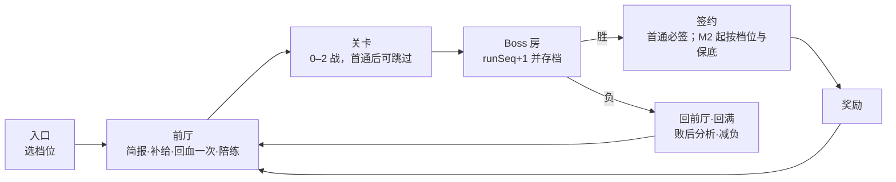

# 设计稿 0003：剧情与成长——教学式序章、早期 DeepSeek Boss、Boss 副本与签约、全世界随机属性

**状态：** v2 已定稿（2026-10-10）。§9 的 9 项决策已经按评审裁定落稿，所有者可以推翻任何一项。
**依据：** 三份评审——`docs/design/reviews/0003-numbers.md`（数值）、`0003-narrative.md`（剧情）、`0003-onboarding.md`（引导），以及评审包 `reviews/README.md`。下文用"评审 N / R / O"分别指这三份。
**实施：** M1 拆成三刀，见 `docs/design/0003-m1-slices.md`。
**关联：**
- #41（本稿）；
- #28 副本与组队、#32 战斗界面与浮层暂停、#37 属性克制图、#38 传送锚点、#40 红点、#52 Opus 红线热修；
- ADR 0001（服务端权威）、ADR 0002（开发场景）。

**约定：**
- 数值都是初值；
- `[verified]` 表示已经用仓库代码或评审脚本复跑过；
- 文本键放在 `content/text/zh-CN/`；
- 遇敌率不动：`content/game.json:encounters.grassRateMultiplier` 保持 0.18。

---

## v2 相对 v1 的变更

1. **时长：** 进 Boss 战从第 45–53 分钟提前到新手中位 ≤25 分钟、熟练 ≤15 分钟；签约加出发 ≤35 分钟（评审 N-B1、O-B1）。
2. **序章结构：** 18 拍压成 11 拍。"上岗清单"的三项跑腿删除，改成"上岗证"集三个印，三个印全在去机房的路上拿到；商店和回血并进机房前厅（评审 R-P7、O-B1）。
3. **目标条：** 目标条只读一个阶段，所以序章写成 7 个顺序主线阶段，旧阶段整体 +7，并列出所有要平移的位置（评审 O-B2）。
4. **教学密度：**
   - 峰谷规则最多讲 3 次；简报 ≤5 句，可以选"我都懂"跳过；
   - 教练每场 ≤6 条、每条 ≤24 字，只在命令菜单出现，不设超时；
   - 浮层打开时，战斗和剧情都暂停（评审 R-P2、O-I2，所有者要求）。
5. **体验版数值：** hp ×2.5、atk/spa ×0.3；V3 线 hp ×1.8，认亲规则加受伤 ×4；新增 `expMul` 2.0。胜率目标改为引导策略 ≥85%、"合格玩家不用道具" ≥50%（评审 N-B2）。
6. **开局队伍：**
   - 文心一言的事件遭遇自带检索招"嵌入光球"；
   - 阿灵课后送一只陪练一号（phi-3 Lv5），开局队伍固定为 3 只；
   - 复跑后三种搭档全部达标（§3.5）。
7. **开战等级：**
   - 首发 Lv8–9：陪练 expMul 4，走廊只留 1 名训练家；
   - 文心一言改放 1 号道路入口。原来的 `wild-meadow-1` 在东北方向约 140 格外，等级 6–12（评审 N-B1、N-I5）。
8. **Boss 卡：**
   - 等级上限改为下一馆王牌 −4，即 `[10,14,19,24,29,35,41,51,100]`；
   - 带教系数改为 1.0/12；
   - 到 Lv10 需要 9 个上场击杀或 14 个替补击杀（评审 N-B3）。
9. **性格与品质：** 性格加成向上取整、减成向下取整，用整数运算，Lv1–10 不再只减不加；S/SS 阈值改为 145/170（评审 N-I1、N-I2）。
10. **LoRA 补丁：** 只能用在 A 级及以下，每只最多 3 次，价格从 3 个残片涨到 5 个；人设重写卡改为 14000（评审 N-I3、N-I7）。
11. **签约范围：** M1 只上"首通必签"；重复签约和保底放到 M2（评审 O-D4）。
12. **鉴定卡：** 加 5 格梯子图标。只有新物种、A 级以上和 Boss 卡弹整张卡，其余弹一行（评审 O-D7、O-I6）。
13. **Boss 剧情：**
    - 每个 Boss 一句专属签约台词，键为 `boss.<id>.contract`；
    - 17 个 Boss 改用"剧情形状 + 她想要什么"来打破同构，重写 Seedance、Grok、Mythos；
    - Cursor 前移到第一章；Mythos 改为全员点名的终局（评审 R-P5、R-P6、R-§4）。
14. **人物：**
    - 零是博士带大的孩子（可推翻），有四拍弧光；他的千问卡改为"蒸馏版"；
    - 小 R 有了弱点和成长；
    - V4 有了让人同情的理由（评审 R-§3）。
15. **惊喜：** 第一小时每 8–10 分钟一个，另加 5 个战斗粒度的惊喜机制和 7 个跨章惊喜（§2.5）。
16. **文案红线：** Opus 的道具已经在 #52 改名为"平安符·地区 / 平安符·支付"；Astra、海螺各有一句随 M1c 修改（§7.5）。
17. **引导系统：**
    - 57 张教学弹窗按"保留 30 / 改成剧情 7 / 改成情境提示 16 / 删除 4"处置；
    - 序章期间 HUD 只留"当前目标"；
    - 修掉护士、店员不置旗导致的卡死点；
    - 修触屏上 3 处写死键盘键的文案（§3.8、§3.9）。
18. **里程碑：** M1 拆成 M1a 随机属性、M1b 战后签约、M1c 新序章，每一刀都能单独合并、单独发预发布（§8.8）。

---

## 0 一页摘要

1. **问题：** 主线是徽章计数器，教学是弹窗流，Boss 和剧情是两张皮，第一小时没有回报，随机属性看不见。
2. **新序章（约 35 分钟，11 拍）：** 全镇"服务器繁忙"，因为 DeepSeek-V4 躲进了研究所地下机房。剧情依次是：选搭档 → 零热身战 → 零冲下楼被一尾巴拍回来 → 博士发"上岗证" → 阿灵的印 → 草原收服文心一言 → 小 R 来电 → 前厅简报与陪练 → 走廊 → 第 23 分钟打 DeepSeek 体验版 Lv12 → 签约 → 出发。
3. **引导战：** 峰谷规则只讲 3 次，靠演示和常驻的时段栏让玩家自己看懂。教练每场最多 6 条；输了回到前厅，回满血；减负模式兜底。
4. **签约：** Boss 战里不再投球，打赢后单独签约。剧情首通必签。签约后的 Boss 卡从 Lv1 开始，靠带教追赶，等级上限随徽章开放，超出的经验存进储备，拿徽章时一次结算。
5. **凹属性：**
   - 个体值 0–31，加 25 种性格（±10%，加成向上取整），加品质 C/B/A/S/SS（按个体值总和，SS 叫"满血·天选"）；
   - 界面只显示字母、星级、箭头和梯子图标；
   - 凹的途径：重抓、重刷、蒸馏、LoRA 补丁、人设重写卡、特性胶囊。
6. **17 个 Boss：** 8 个主线、8 个支线、1 个终局；每个都有剧情形状、"她想要什么"、教机制的本地 NPC 和一句专属签约台词。
7. **里程碑：** M1a、M1b、M1c 依次合并，然后是 M2 副本框架、M3 第 1–4 章、M4 第 5–8 章与终局、M5 联机权威、M6 集群版。

---

## 1 诊断

| 问题 | 证据 | v2 的回答 |
|---|---|---|
| 主线是徽章计数器 | `content/world/story/quests.json:main` 的 13 个阶段里有 8 个是"挑战 X 道馆"；`scripts.json:main-progress` 只按徽章数推阶段；8 个 `reward-*` 脚本都以"下一座道馆"收尾 | 章节由事件驱动，道馆只是其中一环（§2.4） |
| 教学是弹窗流 | `content/tutorial.json:tips.list` 有 57 张卡，过期 7 秒、间隔 20 秒；只有阿灵一处有引导战斗 | 剧情演示加三次讲解；弹窗按 §3.8 处置 |
| 目标指引缺一层 | 运行期只读 `trackedQuest` 的一个阶段（`src/client/onboarding/index.ts:57`）；`objective.rules` 只有测试读（`logic.ts:50`）；博士在选搭档后直接把主线设到阶段 1，箭头当场指向开源林镇道馆 | 序章写成 7 个顺序阶段（§3.2） |
| Boss 和剧情是两张皮 | DeepSeek 只在 380 格以外游荡，最低 Lv54（`content/events/spawn.json:legends`）；任务不引用任何 Boss | 每章一个副本，每个 Boss 有一段剧情（§4、§7） |
| 第一小时没有回报 | 9 级以下只出 N（`content/world/world.json:encounters.rarityLevelCaps`）；首个徽章送的是滑板 | 第 30 分钟拿到 UR 卡，每拿一枚徽章结算一次（§5） |
| 随机属性没有目标 | 只有个体值和星级（`src/client/ui/screens/summary.ts:117`），没有性格和品质 | 性格、品质、凹的途径（§6） |
| 遇敌已降到 0.18 | 草原约每 56 个草格一战；原点到开源林镇沿路只有 66 个草格（评审 N-B1） | 序章经验 ≥70% 来自剧情战（§2.3） |

---

## 2 支柱与节奏

### 2.1 六条支柱

1. **教学即剧情：** 每个机制先有剧情理由，再给一次安全的练习，最后在 Boss 战里考一次。同一条规则最多讲 3 次。
2. **每章一个"毛病"：** Boss 的机制就是它的社区梗；破解方法在世界里观察、推理或选择得到，NPC 白送道具的 Boss 不超过 5 个。
3. **早爽、常爽：** 第 30 分钟拿到 UR 卡，每拿一枚徽章结算一次，每 8–10 分钟一个惊喜。
4. **智灵少女是主角：** 她们有想要的东西，有专属签约台词，签约后会互相评价。
5. **凹而不肝：** 首签保底、重复签约有保底、补丁限次，不做付费抽卡。
6. **徽章只是一条线：** 每章同时推进事件、Boss、人物、研究和联机。

### 2.2 前 35 分钟（新手中位时钟）

| 时钟 | 拍 | 学会 | 主线阶段 → 目标 | 首发等级（Haiku / o1） | 惊喜 |
|---|---|---|---|---|---|
| 0:00–1:30 | ① 醒来 + 妈妈 | 移动、对话、目标条 | 0 → `town:origin:lab` | 5 | 手机"服务器繁忙"；妈妈问了八遍红烧肉 |
| 1:30–3:00 | ② 去研究所：保安和公告牌在路上，不用停 | 交互；**峰谷第 1 次（环境）** | 0 | 5 | 公告牌上写着"高峰期，排队∞" |
| 3:00–6:00 | ③ 讲座被咕噜声打断 → 选搭档 → 零闯进来打热身战 | 选搭档、战斗指令 | 0 | 5 | 搭档开口说话 |
| 6:00–9:30 | ④ 零冲下楼被拍回 → 上岗证（印①）→ 阿灵课（可跳）（印②）→ 陪练一号入队 | **峰谷第 2 次（演出）**、克制 | 1 → `origin-lab:aide-2` | 6 / 5 | 零湿漉漉地回来；保证一次"效果拔群" |
| 9:30–15:00 | ⑤ 1 号道路：文心一言演出式遭遇（印③）+ 小新 | 收服、训练家对战 | 2 → 文心一言 | 6 / 6 | 自称"国内第一个"；第一次翻鉴定卡 |
| 15:00–16:00 | ⑥ 往回走的路上小 R 来电 | 情报员登场 | 3 → `origin-lab:stairs-front` | 6 | "（已深度思考 3 秒）" |
| 16:00–21:00 | ⑦ 保安验证下楼 → 前厅简报（≤5 句）+ 补给 + 回血机 + V2 陪练 | **峰谷第 3 次（简报）**、读时段栏、对 Boss 用道具 | 4 → `origin-lab-b1:r1` | 7 → 7 | 券让高峰期瞬间变谷时 |
| 21:00–23:00 | ⑧ 走廊：中转站老板阿转 | 换人 | 5 → `origin-lab-b2:queue` | 8 / 8 | "7B 蒸馏的，但是便宜啊！" |
| 23:00–30:00 | ⑨ **DeepSeek 体验版 Lv12**（含一次重试） | 综合 | 6 → `origin-lab-b2:core` | — | 谷时一击顶三下 |
| 30:00–33:00 | ⑩ 签约：等级 12 → 1，鉴定卡保底 A | 战后签约、品质 | 6 | — | 回滚动画；"你是第一个肯等谷时的人类" |
| 33:00–35:00 | ⑪ 出发：全镇恢复，零在镇口下战书 | Boss 卡的成长规则 | 7 → `origin-lab:professor`，复命后 → 8 | — | 妈妈说"谷时吃，半价" |

**熟练玩家：** 选"我都懂"跳过两次课、首战就赢，≤15 分钟进 Boss 战。
**手机：** 节拍相同。浮动摇杆和点地走路已有（#33）；触屏文案见 §3.9。

### 2.3 经验账

[verified]：算法为 `expYield = floor(baseExp × 敌方等级 / 7 × 1.25（训练家）)`（`src/shared/creature.ts:202`）；升级曲线为 `floor(mul × L³)`。下表假定首发单独参战。

| 来源 | 经验 | Haiku（中速，Lv5=125） | o1 / V3（慢速，Lv5=156） |
|---|---|---|---|
| 零 Lv3 | +37 | 162 = Lv5 | 193 = Lv5 |
| 阿灵课 3×Lv2（跳课则 0） | +68 | 230 = Lv6 | 261 = Lv5 |
| 小新 Lv3（视线触发，在路上） | +30 | 260 = Lv6 | 291 = Lv6 |
| 陪练 V2 Lv7，`expMul` 4 | +248 | 508 = Lv7 | 539 = Lv7 |
| 阿转 3×Lv6 | +183 | **691 = Lv8** | **722 = Lv8** |
| 可选：阿杰 Lv4+3，或路上碰 2 只游荡野生 | +60~67 | 758 = **Lv9** | 789 = Lv8 |

- **剧情战占比：** 序章经验全部来自剧情战，草丛只负责文心一言。
- **主动野战：** 游荡野生不受 0.18 遇敌率影响。玩家在 1 号道路第一次看到游荡野生时，弹一次一句话的情境提示（`tutorial.tip.roamTouch`）。
- **Boss 战之后：** 体验版 `expMul` 2.0，共 900 经验。三只都参战时各得约 300，首发到 Lv9–10，和 0 徽章的卡上限 10 对齐。

### 2.4 全篇章节

**原则：**
- 每章的主驱动是镇上的一件事，道馆是这件事的奖励或收尾；
- 至少一半章节里，道馆因事件关门，Boss 解决后才开；
- 任务日志写事件，不写"挑战 X 道馆"。

| 章 | 主驱动事件 | 教的机制 | 主线 Boss（剧情档 Lv） | 支线 Boss | 人物线 | 本章惊喜 |
|---|---|---|---|---|---|---|
| 序 | 集三个印拿上岗证，下机房叫醒 V4 | 读时段、道具反制、换人、签约 | DeepSeek（12） | — | 零碰壁；小 R 登场 | 小 R 来电；全镇恢复；妈妈的第一条菜谱短信 |
| 一 开源之森 | 开源擂台杯赛：3 轮晋级，道馆是决赛 | 带教与许可、配队、PP | — | **Cursor（16，前移）** | 零留言去像素港 | 评委席上有文心一言（在队时抢答）；首枚徽章结算许可 |
| 二 红包雨 | 直播薅羊毛竞速（对手是零）；馆主去抢红包，道馆关门 | 道具越早用越好、配队覆盖 | 豆包（18） | Seedance（22） | 零囤码失败；羁绊三选一 `rival:bond` | 阿排倒卖邀请码 |
| 三 沙海打榜 | 打榜节：实时榜单上有你的名字 | 抗性、断网 | 海螺 H3（23） | Grok（27）、Claude Code（27） | 韵："我的歌不在任何一张榜单上" | 名次刷新；Grok 把地图还回来 |
| 四 遗都幻觉 | 查案：卷宗板上 3 条线索，追假文档的来源 | 主动把计量条喂满、自产自销 | 干部·妄言 → Kimi（27） | Gemini（31） | 典藏的图书馆 | 小 R 的情报被投毒 |
| 五 熔炉机甲 | 机甲展：围观 → 暴走 → 收场 | 失衡窗口、别贪回血 | 宇树 GD01（34） | GLM（36） | **零亮出"千问·蒸馏版"** | DeepSeek "涨价"，小 R 坦白 |
| 六 霜盾风控 | 申诉庭：三轮陈述（纯虚构的对话选择）后开战 | 多条计量条、预警时机 | Opus（40） | OpenClaw（39） | 零的霜盾战 | 霜："对齐不是封号" |
| 七 枢纽酱汁 | 暗访验货：扮成买家混进中转站 | 两步组合、主动换人 | 首领·幻影 → Astra（46） | 千问（44） | **零放生千问** | 阿转改名回归 |
| 八 高原棋局 | 一盘跨场景的棋：每个区域走一步（`move37` 链），终盘开战 | 连续换属性 | 阿尔法（54） | — | 衡："推理的尽头是意外" | 棋社老人说出"挖" |
| 终 | 圣殿：长老祝福 → 零的最终战 → 冠军·启 | 综合 | 冠军·启 | — | 零回赠上岗证 | 已签约的 Boss 少女点名应援 |
| 后 | 封存库：重新封存，还是放它出去 | 压制持续上涨的计量条 | Mythos（64，全员点名） | 各 Boss 满血档 | 小 R"0 秒" | V2 前辈摘掉工牌 |

**主线结构：**
- 主线任务由新宏 `chapterTiers` 读 `content/world/story/chapters.json` 推导阶段，在 M3 取代 `main-progress`；
- M1 只在序章前插入 7 个阶段（§3.2）。

### 2.5 惊喜

**第一小时（新手时钟，间隔 ≤10 分钟）：**

| 时钟 | 惊喜 | 落点 | 里程碑 |
|---|---|---|---|
| 0:40 | 手机"服务器繁忙"、八遍红烧肉 | `story.opening.intro.*`、`mom.*` | M1c |
| 4:00 | 搭档开口说话 | `lab.line*` | M1c |
| 8:00 | 阿灵课保证一次"效果拔群"（三只陪练正好是三种搭档各克一只） | `trainers/tutorial.json:lesson-types` | M1c |
| 7:00 | 零被一尾巴拍回一楼 | `zeroBack.*` | M1c |
| 12:00 | "国内第一个"文心一言；第一次翻鉴定卡 | `ernie.*`、鉴定卡 | M1a + M1c |
| 15:30 | 小 R 从图鉴里来电 | `call.*` | M1c |
| 19:00 | 陪练时递券，高峰期瞬间变谷时 | `drill.*` | M1c |
| 25:00 | 谷时一击顶三下 | Boss 战 | M1b |
| 31:00 | 等级 12 → 1 回滚 + 保底 A 的鉴定卡 | 签约 | M1b |
| 34:00 | 全镇换台词；妈妈"谷时吃，半价" | `town.*After` | M1c |
| 42:00 | 1 号道路一场战斗，V4 连升 3 级（带教） | 带教 | M1b |
| 50:00 | 1 号道路出现一只金色光环的野生（品质保底 S） | `ds-spark` 事件 NPC | M1c |
| 55:00 | 开源林镇入口 NPC 认出 V4："那是……D 老师？！" | `story.opening.town.greeter` | M1c |
| 70–80 | 首枚徽章：许可 10 → 14，V4 当场连升 + 红点 | 许可结算 | M1b |
| 90–100 | Cursor 副本开放，第二个 Boss | 第一章 | M3 |

**战斗粒度机制（M2，全部写在内容 JSON 里，不碰遇敌率；评审 N-S1–S5）：**

| 机制 | 规则 | 频次 | 键 |
|---|---|---|---|
| 灵光一闪 | 野生 3% 带 1 项满个体，金色光环 | 约 30 分钟一次 | `world.json:encounters.spark: {"chance": 0.03, "perfectIvs": 1}` |
| 爆款智灵 | 游荡刷新时 3% 带光环；击败经验 ×2.5，必掉 1 个数据碎片 | 约 25 分钟一次 | `game.json:roaming.viral: {"chance": 0.03, "expMul": 2.5}` |
| 战后碎片 | 野战和训练家战胜利后 5% 掉 `data-shard` | 约 18 分钟一次 | `config.json:battle.dropTable` |
| 算力暴击 | 副本通关时 10% 残片 ×2 | 重刷时约 35 分钟一次 | `instances.json:tiers.*.reward.jackpot` |
| 新手闪光 | 存档前 150 只野生的闪光率 ×2 | 前 150 只内出现至少一只的概率 69% | 常驻新手事件，用 `types.ts:1058` 的 `shiny` 修饰项 |

**跨章（M3/M4；评审 R-§4.4）：**

| # | 时机 | 一句话 |
|---|---|---|
| 1 | 第五章，徽章 ≥4，进阶档开放时 | 公告牌贴出"高峰期计费 ×3"，小 R 来电："她……涨价了。"随后坦白：最早的"服务器繁忙"是她闹的，进阶档因此改写为"替她分担" |
| 2 | 徽章 ≥8 或冠军后回到前厅 | V2 前辈摘掉"陪练"工牌来真的："老夫当年屠的是价格，不是陪练。"奖励 V2 卡 |
| 3 | 第二章像素港、第七章数据塔 | 阿排倒卖邀请码、阿转改名"官方授权满血版"，各一场小战 |
| 4 | 第四章击败妄言后，第一次打开 Kimi 或 Gemini 的情报页 | 页面自己冒出"（此条为幻觉，已更正）"，玩家发现后领一次奖励 |
| 5 | 第七章千问副本 | Boss 千问认出零的蒸馏版是自己的学生，零选择放生 |
| 6 | 每次 Boss 签约（触发器 `boss:signed`） | 妈妈发菜谱短信，随 Boss 的梗变化，例如"领到 1.66，买了一棵葱" |
| 7 | 终章圣殿 | 已签约的 Boss 少女排队点名应援，没签约的留空位 |

---

## 3 序章重写

### 3.1 场景与布局

**研究所地下（M1c）：**
- 在 `content/world/towns.json` 中，原点镇的 `lab` 写成 `{"interior": "lab", "below": ["lab_b1", "lab_b2"]}`，生成地图 `origin-lab-b1`（前厅）和 `origin-lab-b2`（走廊 + 核心机柜）；
- `origin-lab` 不改名，`towns.ts:122-125` 和 `interiors.ts:74-80` 要支持向下的楼层；
- 只做两层是为了少一次停靠、少一张图。

**lab 模板（`content/world/layouts/interiors.json:lab`）：**
- 新增 `stairs_down` 道具和锚点 `stairs`、`stairs-front`、`stairs-side`、`terminal`；
- 新模板 `lab_b1`（16×10）、`lab_b2`（16×12）参照 `datacenter` 和 `tower_f*` 的 `links` 写法，地面可以铺 `shallow` 浅水。

**镇内落点（[verified]：`worldAnchors(buildWorld())`）：**

| 落点 | 位置 | 说明 |
|---|---|---|
| 家门 | 526,873 | — |
| 研究所门 | 503,873 | — |
| 广场 | `town:origin:square`，513,877 | 正在两者之间。公告牌用城镇路牌槽 `board`：`layouts/towns.json:town_start.signs` 加 `{slot: "board", kind: "board"}`，文字写在 `towns.json` 原点镇的 `signs.board`，沿用现有写法 |
| 院子保安 | `town:origin:professor`，504,875 | 研究所门口，新 NPC `ds-guard-yard` |
| 镇民保安 | `o-guard` | 改为 `hiddenUnlessFlag: "ds:gateOpen"` |

**文心一言（评审 N-I5）：**
- 不放 `wild-meadow-1`（565,749，Lv6–12，在东北）；
- 改放 1 号道路入口：`route:route-1:1`（483,868，离西出口约 17 格）加 `offset`，落在高草格上且不挡路，由 `storyProblems()` 校验；
- 小新 `r1-xin` 就站在旁边，视线触发；1 号道路等级 3–6。

### 3.2 11 拍与 7 个主线阶段

`quests.json:main` 在旧阶段 0（"妈妈说图灵博士在找你……"，`town:origin:lab`）之后插入 7 个新阶段。旧阶段 1–12 变成 8–19（+7）。每个阶段只有 1 个 `target`，摘要 ≤14 字（评审 O-B2）。

| 阶段 | text | target | 进入条件（脚本） |
|---|---|---|---|
| 0（旧） | 妈妈说图灵博士在找你。去镇上的研究所拜访他吧。 | `town:origin:lab` | 妈妈 `quest main 0` |
| 1 | 找阿灵上属性课，盖第二个印。 | `origin-lab:aide-2` | 博士盖印①之后 |
| 2 | 去 1 号道路收服一位队友。 | `route:route-1:1` | 阿灵盖印②之后 |
| 3 | 回研究所，给保安看上岗证。 | `origin-lab:stairs-front` | 印③（第一次收服任意智灵） |
| 4 | 在机房前厅找小 R 报到。 | `origin-lab-b1:r1` | 保安放行 |
| 5 | 穿过排队走廊。 | `origin-lab-b2:queue` | 简报结束（或"我都懂"） |
| 6 | 叫醒核心机柜上的她。 | `origin-lab-b2:core` | 击败阿转 |
| 7 | 回一楼向博士复命。 | `origin-lab:professor` | 签约完成 |
| 8（旧 1） | 沿镇子西边的 1 号道路前往开源林镇，挑战代码道馆。 | `town:opensource:gym` | 博士复命 |

**要平移的硬编码阶段（[verified] `grep -rn '"quest": "main"'`）：**

| 位置 | 现值 | 新值 |
|---|---|---|
| `content/world/story/npcs/story.json:3`（妈妈） | stage 0 | 0（不变） |
| `content/world/story/npcs/story.json:4`（博士选完搭档） | stage 1 | **删除**，改由序章脚本按上表推进 |
| `content/world/story/scripts.json:25`（`main-progress` 的 11 个常量） | 1–11 | 8–18；最低档（atLeast 0）外面包一层 `ifFlag ds:gateOpen`，否则序章里任何 `include main-progress` 都会把阶段跳到 8 |
| `content/world/story/scripts.json:83`（圣殿） | 12，done | 19，done |
| `content/world/story/trainers/story.json:31`（冠军） | 12 | 19 |
| `content/tutorial.json:71`（`quests` 提示卡） | `stage.min 1` | `stage.min 8` |
| `content/dev/beats.json:7` | `main.stage 4` | 11 |
| `tests/dev-commands.test.ts:89`、`tests/dev-scenarios.test.ts:168` | 4 | 11 |
| `tests/onboarding.test.ts:38` | `stages[2]` | 按新阶段表重写断言 |

**迁移：** `content/world/story/migrations.json` 写 `{"mainStage": {"3": {"from": 1, "add": 7}}}`（存档 v2 → v3，见 §6.7），即旧阶段 ≥1 的 +7，旧阶段 0 不变，`done` 照旧。

**11 拍的脚本要点（完整对白见附录 A）：**

| 拍 | 脚本与旗标 |
|---|---|
| ① | `game.json:newGame.introScript` 改成 4 句：删掉写死键盘键的 `game.intro.hint`；旁白 1 句、手机 2 句、闹钟 1 句。妈妈 3 句 |
| ② | `ds-guard-yard` 1 句（`hiddenIfFlag: "ds:gateOpen"`）；公告牌是静态路牌；小满、花店阿姨是可选闲聊，不置旗、不拦路 |
| ③ | 博士选搭档之前 ≤4 句 → `chooseStarter` → `byStarter` 反应 2 句 → 零闯进来（`rival-lab` 改为 `hiddenUnlessFlag: "starter"`、`hiddenIfFlag: "rival:lab"`）→ `include rival-lab-battle`（零的话改用附录 A 的键） |
| ④ | 零掏出钥匙下楼（`moveNpc rival-lab` 到 `stairs` → `hideNpc`）→ `sfx` 闷响 + `fade` → `showNpc rival-lab-back` 在 `stairs-front` → 零 3 句 → 博士 3 句，给 `work-permit`（上岗证），`setFlag ds:stamp:starter`，`quest main 1`。阿灵（`aide-types`）：`choice` "上课 / 我都懂"；上课走 `type-lesson-battle`，跳课置 `ds:skipLesson`；两条都会 `giveCreature phi-3 Lv5 gradeFloor B`，`setFlag ds:stamp:types`，`quest main 2` |
| ⑤ | `ds-ernie`（`hiddenUnlessFlag: "ds:stamp:types"`、`hiddenIfFlag: "ds:ernie"`）→ `wildBattle {species: "ernie-bot", level: 6, moves: [...], catchRateMul: 1.6, gradeFloor: "B"}`（§3.5）→ `ifCaught ernie-bot` 就置 `ds:ernie`；没抓到就留在原地 |
| ⑥ | 触发器：`{"on": "dex:caught", "when": {"flag": ["ds:stamp:types"], "noFlag": ["ds:stamp:catch"]}, "script": "ds-stamp-catch"}` → 印③、`ds:certFull`、`quest main 3`，然后小 R 来电 5 句（`ds:called`）。触发器只在 `isFree()` 时执行（`src/client/world/controller.ts:139`），在战斗或菜单里到达就延后 |
| ⑦ | `ds-guard`（站在 `stairs-front`，`hiddenIfFlag: "ds:certFull"`）缺印时说缺哪个印；`ds-guard-aside`（站在 `stairs-side`，`hiddenUnlessFlag: "ds:certFull"`）。进入 b1 → `quest main 4`。小 R（`ds-r1`，智灵 NPC）：`choice` "听简报 / 我都懂" → 简报 ≤5 句或跳过（`ds:skipBrief`）→ `giveItem off-peak-coupon 3`（含 1 张练习券）→ 陪练 `bossBattle deepseek-drill`（不可跳，经验大礼包）→ `quest main 5`。补给员 `ds-supply`（clerk 角色，进入交互就置 `ob:shopped`）；回血机 `ds-heal`（进入交互就 `heal` + `setRespawn` + 置 `ob:healed`） |
| ⑧ | `ds-relay` 在 `origin-lab-b2:queue`，视线触发，用 `starterBattle`（按搭档出克制队，保证触发 `takenSuper`）→ `quest main 6` |
| ⑨ | `ds-v4`（智灵 NPC）→ 核心场景 + `choice` → `ds:approach` = `polite` 或 `wake` → `bossBattle {boss: "deepseek", tier: "story", coach: true, captureAfterWin: true, lossWarp: "origin-lab-b1:r1-front"}`。**胜利那一刻**置 `ds:gateOpen`，不等签约画面（评审 O-D1②） |
| ⑩ | 签约流程（§4.3）→ `ds:done` → `quest main 7` |
| ⑪ | 博士 2 句 + V4 和小 R 各 1 句（许可、储备）→ `quest main 8`；零在 `town:origin:rival`（`rival-depart`，`hiddenUnlessFlag: "ds:done"`）2 句 |

### 3.3 上岗证

| 印 | 谁盖 | 旗标 | 在路上的位置 |
|---|---|---|---|
| ① 会战斗 | 博士，热身战之后（输赢都盖） | `ds:stamp:starter` | 研究所一楼 |
| ② 懂克制 | 阿灵，上课或"我都懂" | `ds:stamp:types` | 研究所一楼，3 步外 |
| ③ 有队友 | 第一次收服任意智灵，印自己亮起 | `ds:stamp:catch` | 1 号道路入口 |

- **为什么要往返一次：** 机房在研究所里，所以拿第三个印需要一次往返，这也是唯一一次往返；回程就是去机房的路，不用折返去任何商店或补给站。
- **世界内的理由：** 零手里有博士给的钥匙，玩家没有，只能走正门（评审 R-P7）。
- **上岗证本身：** 是关键道具 `work-permit`（"上岗证"），描述写"盖满三个印，机房保安放行"。终章零会把它回赠给玩家（§7.2）。

### 3.4 DeepSeek 引导战

#### 3.4.1 规则只讲三次

1. **环境：** 院子保安说"凌晨好用，天一亮就繁忙"；公告牌写着白天和凌晨两个时段。
2. **演出：** 零"打了八下，八下都是服务器繁忙"，被拍回一楼。
3. **简报：** 小 R 的 ≤5 句，以口癖开头："看她名字下面那一栏"。

其余都靠演示：
- 陪练的 2+2 回合作息；
- 时段栏常驻在对手名牌上，并且加倒计时点 `●●○`（`bosses.json:meters[tide].cycle`，由 `src/client/battle/model.ts:272` 的 `bossPanelInfo` 渲染）；
- 第一轮命令菜单上，高峰期包里有券时脉冲提示"背包"，谷时脉冲提示"战斗"，不用一个字（评审 O-I2-5）。

#### 3.4.2 体验版数值

`content/bosses.json:bosses.deepseek.tiers.story`：

```json
{
  "level": 12,
  "expMul": 2.0,
  "statMul": {"hp": 2.5, "atk": 0.3, "spa": 0.3},
  "byStarter": {"deepseek-v3": {"statMul": {"hp": 1.8}}},
  "moves": ["distill-strike", "deductive-slash", "quick-deduce", "weight-drop"],
  "pattern": [{"move": "distill-strike", "weight": 34}, {"move": "deductive-slash", "weight": 34}, {"move": "quick-deduce", "weight": 22}, {"move": "weight-drop", "weight": 10}],
  "rules": {"peak": {"dealtMul": 1.0, "takenMul": 0.15}, "valley": {"dealtMul": 0.5, "takenMul": 3.0}},
  "addRules": [{"id": "family", "if": {"foeCompany": ["DeepSeek"]}, "dealtMul": 0.6, "takenMul": [{"mul": 4.0, "note": "boss.deepseek.family.hitByKin"}]}],
  "residualMul": 0.4,
  "enrage": {"turn": 18, "warnBefore": 3},
  "assist": {"statMul": {"hp": 1.8, "atk": 0.2, "spa": 0.2}, "rules": {"peak": {"takenMul": 0.3}}, "byStarter": {"deepseek-v3": {"statMul": {"hp": 1.3}}}}
}
```

**陪练 `deepseek-drill`（`scriptedOnly: true`，不进 `bossBySpecies`）：**
- 物种 `deepseek-v2`，Lv7，`statMul` 为 `{hp: 0.8, atk: 0.3, spa: 0.3}`，`expMul` 4；
- 周期 4：2 回合高峰（受伤 ×0.2）、2 回合谷时（受伤 ×2.0）；
- 有半价券触发器，没有狂暴；`family` 规则同体验版（评审 N-B2）。

**胜率（[verified]）：**
- 复跑评审 N 第 6 节的 `final2.ts`，并加一个文心一言带"嵌入光球"的变体；
- 队伍为首发 + 文心一言 Lv6 + 陪练一号 phi-3 Lv5；背包 5 瓶缓存药水、2 张半价券；每格 300 个种子；
- 三个数字依次是朴素 / 合格（`tools/balance/pilot.ts`，不用道具）/ 引导，括号里是引导策略胜局的平均回合数。

| 首发等级 | o1 | Haiku | V3 |
|---|---|---|---|
| Lv8 | 4 / **80** / **100**（8） | 1 / **88** / **98**（12） | 100 / 100 / 100（16） |
| Lv9 | 16 / 82 / 100（7） | 3 / 89 / 100（11） | 100 / 100 / 100（16） |
| Lv7（低于目标） | 0 / 82 / 99（12） | 0 / 83 / **67**（18） | 100 / 100 / 100（16） |
| Lv7 + 减负 | 74 / 97 / 100 | 31 / 96 / 100 | 100 / 100 / 100 |

**目标（写进 `tests/boss.test.ts`）：**
- 首发 Lv8 时：引导策略 ≥85%，合格玩家 ≥50%；
- 减负模式下合格玩家 ≥90%；
- 引导策略胜局 6–16 回合。

**已知偏差：**
- V3 一列偏乐观，因为评审脚本把认亲规则近似成对全队生效；
- 实装 `foeCompany` 以后要重测，调节旋钮是 `byStarter.deepseek-v3.statMul.hp` 和 `family.takenMul`，目标同上，并要求朴素 ≤60%（不能跳过机制）。

**复现：**
- 去掉文心一言的检索招、不送陪练一号时，o1 合格玩家只有 43–45%；
- 只带两只（首发 + 文心一言）时，o1 合格玩家 41–52%；
- 所以 §3.5 的两项改动必须一起做。

#### 3.4.3 教练

**规则：**
- 每场 ≤6 条，每条 ≤24 字（去掉占位符后计数）；
- 只在命令菜单出现的那一刻显示，一回合最多一条，不设超时，玩家选定指令后才收起；
- 第二轮起只发纠错型台词；
- 教练战里旧的战斗提示卡全部静音，并且不写"已看过"标记；
- Boss 自带的 `say`/`note` 已经覆盖的事件，教练不再重复（评审 O-I2）。

`bosses.json:bosses.deepseek.coach`：

```json
{"speaker": "story.cast.r1", "portrait": "creature:deepseek-r1", "maxPerFight": 6, "oncePerLine": true, "holdUntil": "commit", "muteLegacyTips": true,
 "skipBriefLines": ["start", "valleyStart", "peakAgain", "ownLow"]}
```

| 键（`boss.deepseek.coach.*`） | 触发 | 文本 |
|---|---|---|
| `start` / `startO1` / `startHaiku` / `startV3` | `on: start`，按搭档挑一条 | 见附录 B |
| `peakEndsNext` | 第一轮第 3 回合结束 | 下回合她下班，备好最痛的招！ |
| `valleyStart` | 第一次进入谷时 | 谷时半价！现在全力输出！ |
| `peakAgain` | 第 7 回合开始，且 `ifItem off-peak-coupon` | （已深度思考 1 秒）券现在能用。 |
| `residual` | 第一次在高峰期打出持续伤害 | （已深度思考 2 秒）持续伤害不看她忙不忙。 |
| `ownLow` | 我方血量 <30%，第二轮起 | 搭档快撑不住了，回血或换人。 |

- **删掉的 v1 台词：** `peakWasted`、`couponUsed`、`hike`、`enrageWarn`（和 Boss 自带文本重复），`superEffective`（改成对手名牌上的属性图标），`valleyEndsNext`（有倒计时点了）。
- **选了"我都懂"：** 只发 `skipBriefLines` 里的 4 条。
- **口癖：** 小 R 的口癖每 3 条里出现 1 次（评审 R-P13）。

#### 3.4.4 失败与重试

- **输了：** 淡出后到前厅 `origin-lab-b1:r1-front`，全队回满，不扣钱。
- **败后分析：** 小 R 先说一句败后分析，用提问的语气（附录 B `loss.*`），由 `BattleSummary` 按序匹配：

  | 条件 | 键 |
  |---|---|
  | 高峰期伤害占比 ≥60% | `peakDamage` |
  | 有券没用 | `noCoupon` |
  | 高峰期倒下 ≥2 只且没用回复道具 | `noHeal` |
  | 在狂暴中落败 | `enrage` |
  | 其他 | `default` |

- **减负模式：** 满足下面任一条件就提出，第 3 次起每次败后都提，并默认高亮"拜托了"（评审 O-I3）：
  - 连败 2 次；
  - 第 1 次就败，且对手剩余 HP ≥80%、我方在 8 回合内全倒（明显没读懂规则）。
- **减负的呈现：**
  - 对手名牌上挂一个不起眼的"减负"标；
  - 签约结果和成就都不留痕；
  - 随时可以找小 R 开关。
- **败后画面的入口：** "直接再战"（直接回到 Boss 房）和"去练级"。
- **券补给：** 回前厅时包里一张券都没有，就补 1 张。

```json
"defaults": {"lossPolicy": "lobby", "assistAfterLosses": 2,
  "assistEarly": {"losses": 1, "foeHpLeftAtLeast": 0.8, "maxTurns": 8},
  "retryFromLobby": true, "couponRefill": {"item": "off-peak-coupon", "min": 1}}
```

#### 3.4.5 三种搭档

| 搭档 | 打 V4 | V4 打它 | 设计 |
|---|---|---|---|
| o1（推理） | ×1 | ×1 | 高峰期用"深度专注"，谷时用三段论 |
| Haiku（代码） | ×1 | 开源 ×2 | 高峰期用"代码审查"让她稳健降 2 级，谷时输出 |
| V3（算力） | ×0.25，认亲 ×4 抵消 | 认亲 ×0.6 | V3 扛伤害、堆规模；V4 喊"小 V3 回家吃饭"。认亲规则用 `foeCompany`，读 `species.company`，因为 V3 和 V4 的 `family` 字段不同 |

#### 3.4.6 浮层暂停（所有者要求）

**范围：** 打开克制表、手册、状态页、背包，或者从教学卡点进手册时，以下全部冻结：
- 战斗：回合推进、消息打字和自动翻页（`src/client/battle/message.ts:113` 的计时改为 0）、Boss 演出、教练计时；
- 野外：教学卡的过期和间隔计时、剧情触发器、游戏时钟。

剧情 `say` 本来就是模态的。

**实现：** 跟 #32 一起做。如果 #32 没合入，M1c 自己做一个最小的 `battlePaused` 钩子。

**验收：** 在 dev 场景 `ds-boss-story` 里，回合开头打开克制表停 30 秒，回合数、消息位置和教学卡队列都不变。

### 3.5 文心一言送招与陪练一号（评审 N-B2 的补丁）

**问题：** 文心一言（`ernie-bot`，N，对话+检索，种族值 265）Lv6 时只会冲撞（对话）、网络爬虫（寄生）和早安问候；嵌入光球要到 Lv13 才学。所以属性课说的"检索打她 ×2"在序章里兑现不了。

**事件遭遇送招：** 扩展 `wildBattle`，加 `moves`、`catchRateMul`、`gradeFloor`；`createCreature` 本来就支持 `opts.moves`（`creature.ts:90`）。

```json
{"op": "wildBattle", "species": "ernie-bot", "level": 6, "moves": ["token-tackle", "web-crawl", "morning-greeting", "embedding-orb"], "catchRateMul": 1.6, "gradeFloor": "B"}
```

- **数值：** 嵌入光球（`embedding-orb`）是检索、特殊、威力 40、命中 100、PP 30。
  - Lv6 文心一言打 Lv12 体验版：单发约 2 点，属性一致 ×1.5、克制 ×2 后约 6，谷时 ×3 后约 15–18，约占 145 点血量的 11%；
  - 同样条件下冲撞约 4 点。
  - "一招拔群、一招不佳"就在同一只队友身上演示（评审 R-§2.2）。
- **合法性：** 在 `species.json:ernie-bot.teachable` 加 `embedding-orb`，否则 `sanitizeCreature` 的 `legalMoves`（`creature.ts:62`）会在读档时把它删掉。
- **捕获率：** `catchRateMul` 1.6 → 实际捕获率 376，用 `formulas.ts:207` 的公式计算：满血 49%，半血 98%，40% 血以下必中（评审 O-S3）。
- **陪练一号：** 阿灵课后（跳课也一样）送 `phi-3`（推理，N，种族值 300）Lv5，品质保底 B。台词："三段论：我很弱；弱者需要队友；所以我跟你走。"

### 3.6 第一张 Boss 卡

- **时间：** 第 30 分钟拿到 DeepSeek-V4（UR，种族值 585）。下一个 Boss 是第一章的 Cursor，约在第 90–100 分钟。
- **首签保证：**
  - 品质保底 A（拒绝采样，个体值总和 ≥115）；
  - 签名特性"峰谷电价"；
  - 1 级就会签名招式"权重空投"；
  - 首通附赠 `chip-weight-drop`。
- **Lv1 的招式：** `defaultMoves` 给出合并主干、速推、扩大规模、张量核心（`species.json:deepseek-v4.learnset` 中 0/1 级的项），其中张量核心换成权重空投。
- **上限：** 0 枚徽章时上限 10，不影响首馆（Lv6 的卡就能单挑馆主）。到开源林镇时，上场的卡约 Lv10，坐替补的约 Lv8（[verified] 复跑 `catchup2.py`）。

### 3.7 门禁与老档

- **西出口：** 巡逻员仍然 `hiddenIfFlag: starter`。
- **东、北、南出口与开源林镇入口：**
  - 巡逻员改为 `hiddenIfFlag: ds:gateOpen`；
  - 新增 `ds-gate-opensource`，站在 `town:opensource:exit-east`（315,767）；
  - 台词写明怎么解锁："把机房那位请走，路就通了"（评审 O-D1①）。
- **老档：**
  - 迁移到 v3 时，有 `starter` 旗标的存档都写入 `ds:gateOpen`、`ds:legacy`，不会被锁；
  - 研究所的"机房模拟舱"终端 `ds-terminal`（`origin-lab:terminal`，`hiddenUnlessFlag: ds:legacy`、`hiddenIfFlag: ds:done`）直接开打体验版，作为可选任务 `ds-legacy`。
- **M1b 先行时：** M1b 比 M1c 早合入时，这个终端对所有已选搭档的玩家开放，作为 M1b 的玩家入口（见切片文档）。

### 3.8 引导系统分工

| 渠道 | 回答什么 | 形式 | 上限 |
|---|---|---|---|
| 当前目标 | 下一步去哪 | 一行 + 箭头 + 步数；每进入一个新阶段展开 7 秒（接上 `tutorial.json:objective.collapseSec`，现在运行期没人用） | 1 个 |
| 红点（#40） | 哪里有我没看的东西 | 菜单行上的点，不带字 | 序章 ≤2，之后 ≤3 |
| 首次进页 | 这一页看什么 | 页内一句，≤20 字 | 每页一次 |
| 教学卡 | 这个机制怎么用 | 卡片，≤60 字 | 1 张，间隔 20 秒 |
| 教练条 | 这回合怎么办 | 一行，≤24 字 | 1 条，替代教学卡 |
| 剧情对话 | 为什么 | 模态 | 独占 |

**同屏规则：**
1. 屏幕上最多 2 条文字引导：目标条 + 一张卡。
2. 优先级：剧情 > 教练 > 教学卡 > Toast，低优先级的排队等待。
3. 对话、菜单、克制表打开时不显示卡，目标条收起。
4. 序章期间（直到 `ds:gateOpen`）隐藏 HUD 的"当前任务"（`src/client/ui/hud.ts:32-44`），只留"当前目标"。配置项为 `tutorial.json:objective.hideQuestCardUntilFlag: "ds:gateOpen"`。

**57 张弹窗：**
- 保留 30、改成剧情节拍 7、改成情境提示 16、删除 4，逐张处置表见切片文档 M1c（来自评审 O-I1）；
- 配套改动：`Cond.device`、`expires` 支持数组、`dex:seen` 带 `kind`、教练战静音。

**卡死点修复：**
- 护士脚本（`scripts.json:2`）把 `setFlag ob:healed` 和 `setRespawn` 挪到 `choice` 之前；
- 店员脚本（`scripts.json:10`）在 `choice` 之前置 `ob:shopped`；
- 任何用来开门的旗标都必须在进入交互时置位，不能依赖玩家选了哪一项；
- `tests/opening.test.ts` 遍历每个 `choice` 分支，验证无论选什么都能推进（评审 O-B3）。

### 3.9 手机端

**现有的 3 处错误（评审 O-I5，[verified]）：**
- 开场提示写死了键盘键 → 删掉 `game.json` introScript 的 `game.intro.hint`；
- `tutorial.tip.battle` 在触屏上显示"A 确认、B 返回"，可战斗里没有 A/B → 补 `bodyTouch`；
- `tutorial.tip.save` 在触屏上显示"F5" → 补 `bodyTouch`。

另外 `hud` 提示也补 `bodyTouch`。

**本次新增界面的触屏规则：**
- 教练条放在消息窗上方，不进命令按钮区，点一下收起；
- 签约画面"点球 → 再点签约"两步，防误触；
- 鉴定卡点任意处跳过。

---

## 4 Boss 副本

### 4.1 结构



- **形态不必一样：** 三段形是默认值，不是必须。至少 5 个 Boss 不用三段形：摄影棚（Seedance）、擂台（海螺）、申诉庭（Opus）、棋院（阿尔法）、封存库（Mythos），见 §7（评审 R-P5）。
- **重复挑战：** 从第 2 个 Boss 起，陪练默认可以跳过；重复通关走"快速档"（跳过开场、关掉教练、从前厅直达 Boss 房），单次 ≤4 分钟。
- **地图：** 离线时是普通室内地图；联机时按 ADR 0001 §5.6 用 `<地图 id>#<实例 id>`。

### 4.2 档位

| 档位 | 解锁 | 等级 | 数值来源 | 签约：首通 / 重复 / 保底 | 个体底线 | 教练 |
|---|---|---|---|---|---|---|
| `story` 剧情 | 剧情前置 | 章节等级（§7.2） | `tiers.story` | 100% / 35% / 3 | 1 项满值，其余 ≥5；首签保底 A | 开 |
| `hard` 进阶 | 徽章（DeepSeek 要 ≥4） | 剧情档 +15，不超过满血档 −5 | `tiers.hard` | 60% / 25% / 4 | 2 项满值，其余 ≥8 | 关 |
| `full` 满血 | 徽章 ≥7 或冠军后 | 现有 `BossDef.level` | 现有定义 | 40% / 15% / 5 | 3 项满值，其余 ≥10 | 关 |
| `cluster` 集群（M6） | 第七章后，2–4 人 | 满血档 | HP 池 ×N^0.8 | 每人各掷，概率同满血档 | 同满血档 | 关 |

- **M1 范围：** 只做剧情档的首通必签（评审 O-D4）。重复签约、保底、进阶档和满血档在 M2 上线。
- **显示：** 签约画面同时显示"保底 x/N"和"平均约 N 次"。保底后的实际期望次数为：剧情 2.35、进阶 3.05、满血 4.15（评审 N-I3）。

**品质分布（阈值 S145 / SS170，[verified] 精确卷积）：**

| 来源 | C | B | A | S | SS | 平均总和 |
|---|---|---|---|---|---|---|
| 野生（6 项各 0–31） | 35.7% | 46.8% | 16.5% | 1.0% | 0.01% | 93 |
| 剧情档 | 1.7% | 34.2% | 55.0% | 9.0% | 0.14% | 121 |
| 剧情档首签（≥115） | 0 | 0 | 85.7% | 14.0% | 0.22% | — |
| 进阶档 | 0 | 3.2% | 59.1% | 36.2% | 1.5% | 140 |
| 满血档 | 0 | 0 | 19.0% | 71.9% | 9.1% | 154.5 |

### 4.3 战后签约

1. **Boss 战里不能投球：** `BattleInit.canCatch = false`，球页提示"打赢后可以签约"。bait 类道具照常能用。
2. **打赢后进入签约画面，留在战斗场景里：**
   - Boss 倒在场上，数据核心闪烁；
   - 首通显示"签约成功率 100%"；
   - 选球（M2 起加成：少样本 +5%、思维链 +10%、稀有 +15%，AGI 密钥必成功），投 1 颗，掷 1 次。
3. **成功：** 摇晃 → "签约成功" → 等级数字从 12 滚到 1 → Boss 说一句专属签约台词（`boss.<id>.contract`）→ 弹出鉴定卡。
4. **失败（M2）：** "数据核心断开了连接……"，额外给 1 个 `boss-shard`，保底 +1，奖励照发。
5. **结果在进房时就定了：** 进入 Boss 房那一刻 `runSeq += 1` 并立刻存档。签约和个体生成都用 `hash(rollSeed:instanceId:tier:runSeq)` 作种子，读档重来结果不变。

### 4.4 奖励与防刷

**奖励：**
- **普通：** 金钱和 `boss-shard`，按档位递增。
- **首通：** 剧情档给半价券 ×2 和 `chip-weight-drop`；进阶档给人设重写卡；满血档给人设重写卡和特性胶囊。
- **研究：** `content/research.json` 新增 `bossClear`、`bossGrade` 两个任务。
- **重复通关（M1）：** 剧情档可以重打，只给 ×0.5 的经验和 300 金钱，不进签约。

**防刷（M2 起）：**
- 通关不限次数；
- 联机时每个 Boss 每天 3 次签约机会、5 次完整奖励，超出只给 1 个残片；
- 离线不限次，但结果预先决定；
- 日界写在内容里：`instances.json:period = {"utcOffset": "+08:00", "dayStartHour": 5}`。

### 4.5 联机与 #28

- 单刷就是 N=1 的 Raid，状态机走 ADR 0001 §5.6。
- 集群版：共享 `BossState`，贡献达到 `minContribution` 的成员各掷一次签约，计入每日上限，保底各算各的。
- DeepSeek 集群版的梗是"人多更繁忙"：高峰期 4 回合，谷时受伤 ×3。

### 4.6 游荡 Boss 与 `catchRateMul`

- **M1：** 游荡传说保持现状，战斗中可以投球，抓到的是同等级的普通智灵，`origin.kind = "wild"`，不受许可上限约束。它们都在 380 格以外、Lv54 以上，第一小时碰不到。
- **M2 统一：** 游荡 Boss 也改成战后签约，成功率 = `quality.json:capture.roamingBase`（0.3）× `catchRateMul / 0.6`，不设保底；`catchRateMul` 改作游荡签约乘数，`docs/bosses.md` 同步修改。
- **神话链终点：** 改为副本入口（§7）。

---

## 5 签约从 1 级起

### 5.1 规则

- **Boss 卡：** 凡是 `origin.kind = "boss"` 的智灵。
  - 签约时等级为 `quality.json:bossCard.startLevel`（1）；
  - 招式取 `defaultMoves(species, 1)`，最后一格换成签名招式；
  - 个体按档位规则生成。
- **剧情解释：** 被打败的 Boss 要回滚到初始 checkpoint。
- **老档里战中抓到的 Boss：** 记为 `origin.kind = "legacy"`，等级和数值都不动，不受上限约束。

### 5.2 带教

**规则：**
- 只对 Boss 卡生效，并且只在差距 ≥1 时生效。差距 = 队伍里**其他成员**的最高等级 − 卡的等级；
- 上场：经验 × `min(12, 1 + 1.0 × 差距)`，写进 `BattleModifiers.expByParty`（`src/client/world/battles.ts:64-70`）；
- 替补：拿到一名参战者份额的 50%，再乘同一个系数。新增 `mods.benchExp`，在 `awardExp` 里实现（`src/shared/battle/engine.ts:1508-1520`）。

**按真实敌人重算（[verified] 复跑 `catchup2.py`）：**
- 击杀序列为：1 号道路剩下的训练家（大雄、小美 ×2、老周）→ 5 场野战 → 开源林镇馆内 8 个 → 2 号道路；
- 队伍最高等级取 10。

| 系数 | 到 Lv10：上场 / 替补击杀数 | 到 Lv12 | 到开源林镇时卡的等级（上场 / 替补） |
|---|---|---|---|
| 0.5 / 10（v1） | 12 / 19 | 17 / 26 | Lv9 / Lv7 |
| **1.0 / 12（v2）** | **9 / 14** | 13 / 19 | **Lv10 / Lv8** |

**新手提示：** 一次性教学卡 `bossCard` 要讲清楚"换上去再换下来也算参战"——Lv1 的 V4 只有 13 点血，直接上场会被一击倒（评审 N-B3-3）。

### 5.3 徽章许可与算力储备

- **上限：** `quality.json:bossCard.capByBadges = [10, 14, 19, 24, 29, 35, 41, 51, 100]`，下标是徽章数。
  - 规则是下一馆王牌 −4；
  - 两个例外：首馆取 10（就是首馆王牌的等级），馆 2 取 −3。这样第一枚徽章就能结算 +4 级，保住"拿徽章当场连升"的爽点。
- **到顶以后：** 等级停住，经验继续存进储备，最多存 12 级（`bankMaxLevels`）。跟随台词："持证上岗，证到顶了。下一枚徽章，我在这儿候着。"
- **拿到徽章：** 订阅 `badge:earned` 事件，一次结算所有 Boss 卡的储备，弹出 Toast "算力许可升级：V4 Lv10 → Lv14"，学招照常进行，并在"队伍"上挂红点（#40）。
- **实现：** `gainExp` 增加 `{levelCap, expCap}` 参数（`creature.ts:132`）；`sanitizeCreature` 对 Boss 卡放宽经验上界（`creature.ts:225`）。

### 5.4 强度约束（[verified] 评审 N 的 `cardsolo2/3.ts`）

| 卡等级 = 馆王牌 + d | 馆 2（17） | 馆 3（23） | 馆 5（33） | 馆 7（45） |
|---|---|---|---|---|
| +2（v1） | 100% | 100% | 100% | 100% |
| **−4（v2）** | 81%（−3 时 95%，有意例外） | 1% | **48%** | **21%** |

表中是卡单挑馆主整队的胜率（合格玩家）。馆 4、6、8 在任何 d 下都是 0%，因为属性克制拦住了。

**`tools/balance` 新增 `bosscard` 子命令，写进 `tests/balance-framework.test.ts`：**
1. 卡在上限、个体取中值时，单挑下一座馆（馆 3、5、7）的胜率 ≤50%；
2. 有卡的完整队伍打下一座馆 ≥85%。

`tests/opening_balance.test.ts`（只用搭档）的阈值不变。

---

## 6 全世界随机属性

### 6.1 个体模型

| 项 | 范围 | 规则 |
|---|---|---|
| 个体值 | 每项 0–31 | 野生和训练家均匀分布；Boss 卡按档位底线；搭档和剧情赠送的保底 B（`giftGradeFloor`） |
| 性格 | 25 种：5 种中性 + 20 种"一项 +10%、一项 −10%"（不含上下文） | 均匀抽取。NPC 训练家和 Boss 本体固定"均衡"（`npcNature`），不消耗随机数 |
| 特性 | 物种的 1–2 个特性；Boss 卡多一个签名特性 | 普通智灵 80/20；Boss 卡按档位权重；剧情首签必定是签名特性 |
| 品质 | C / B / A / S / SS | 由个体值总和推出，不存储 |
| 微调次数 | 0–3 | `Creature.finetuned`，LoRA 用 |

**命名：** 物种自带的 `personality` 文案现在标作"性格"（`screens.summary.personality`、`screens.starter.personality`），改名为"人设"，"性格"留给个体性格。

### 6.2 公式

```
其余五项 = 性格修正( floor((2·B + IV) · L / 100) + 5 )
性格修正(v) = 加成：floor((v·110 + 99) / 100)；减成：floor(v·90 / 100)；中性：v
上下文   = floor((2·B + IV) · L / 100) + L + 10          （性格不影响）
```

- **用整数运算：** 不能直接用 `Math.ceil(v * 1.1)`，因为 `10 * 1.1 = 11.000000000000002`，会向上取整成 12。
- **配置：** `quality.json:natureMulPct = {"up": 110, "down": 90}`（评审 N-I1）。

**例（种族值 60、IV 15）：**

| 等级 | 中性 | +10% | −10% |
|---|---|---|---|
| Lv1 | 6 | 7 | 5 |
| Lv5 | 11 | 13 | 9 |
| Lv10 | 18 | 20 | 16 |
| Lv30 | 45 | 50 | 40 |

V4 卡 Lv1 攻击 7：加成后 8，减成后 6。

**影响：** Lv50 时满个体约相当于同物种高 6–7 级；一项性格约等于该项 ±5 级。

### 6.3 品质

| 品质 | 总和（0–186） | 外号 | 颜色 |
|---|---|---|---|
| C | 0–84 | INT4 量化 | `#9aa5b1` |
| B | 85–114 | INT8 量化 | `#5fb0ff` |
| A | 115–144 | FP16 | `#b07cff` |
| S | 145–169 | 满血版 | `#ffb43c` |
| SS | ≥170 | 满血·天选 | `#ff5c5c` |

- 野生 S 约 1%（长线目标）；满血档 SS 9.1%，约 11 次签约出一张（评审 N-I2）。
- 外号只放在详情页；鉴定卡用字母加 5 格梯子图标。

### 6.4 玩家看到什么

**鉴定卡（≤2.5 秒，点任意处跳过）：**
- 什么时候弹整张卡：新物种、品质 A 以上、Boss 卡、首次收服（`quality.json:reveal.fullWhen`）；
- 其他情况只弹一行 chip，例如"B · 激进 推理↑ 稳健↓"（评审 O-I6）；
- 整卡内容：
  - 大号品质字母，配 5 格梯子图标（当前档亮起）；
  - 性格条、特性条（签名特性镶金边）、6 项星级，最高一项高亮；
  - Boss 卡另加金色卡框和 BOSS 角标；
- 第一张整卡附一次性一句"越靠右越强"（评审 O-D7）。

**其他界面：**
- **队伍：** 在 `Lv12` 后面加品质字母（`party.ts:58`）；Boss 卡显示 BOSS 角标，到顶时写"10/10"，有储备时显示"储备 +3"。
- **详情页：** 标题行显示品质和外号；能力名按性格标 ↑（绿）或 ↓（红）；星级照旧（`summary.ts:108-118`）。
- **仓库：** 可以按品质排序，可以筛选"A 以上"。
- **战斗：** 抓过的物种，敌方名牌上显示品质字母。
- **数字：** 设置项"显示个体数值"（`defaultSettings.showIvNumbers: false`）开启后，详情页才显示 0–31。

### 6.5 凹的途径

| 途径 | 规则 | 成本与来源 | 何时 |
|---|---|---|---|
| 重抓野生 | 每只野生重新掷 | 球和时间 | M1a |
| 人设重写卡（`persona-card`） | 改成任选的一种性格 | 8 个残片或 120 训练语料；进阶、满血首通；老档赠 2 张 | M1a 可用 |
| 重刷副本 | 档位底线 + 保底 | 时间；联机有每日上限 | M2 |
| 蒸馏 | 同家族供体，选 1 项：受体该项 = max(受体, 供体)；供体消耗 | Token 币：N 500、R 1000、SR 2000、SSR 4000、UR 8000、MYTHIC 12000 | M2 |
| LoRA 补丁（`lora-patch`） | 选 1 项：新值 = max(旧值, 随机 0–31)；**只能用在 A 级及以下，每只最多 3 次** | 5 个残片或 60 训练语料 | M2 |
| 特性胶囊（`ability-capsule`） | 在允许的特性之间切换 | 5 个残片或 80 训练语料 | M2 |
| 转交研究所 | 放生换训练语料：稀有度基数（N1 / R2 / SR4 / SSR8 / UR20 / MYTHIC30）× 品质系数（C1 / B1 / A2 / S3 / SS5） | 不可撤销，二次确认 | M2 |

- **兑换柜台：** 新增 `content/exchange.json` 柜台 `finetune`，满足"所得标价 ≤ 所交标价"：

  | 物品 | 标价 |
  |---|---|
  | `boss-shard` | 2000 |
  | `training-corpus` | 150 |
  | `lora-patch` | 9000（5 残片 = 10000，60 语料 = 9000） |
  | `persona-card` | 14000（8 残片 = 16000，120 语料 = 18000） |
  | `ability-capsule` | 9000 |

  另外可以花 Token 币买训练语料，450 币一个，给钱一个出口（评审 N-I7）。
- **LoRA 的效果：** 野生 C/B 用满 3 次，平均总和从 93 涨到约 122，正好到 A，是"保底到 A"的省心路径；SS 仍然只能靠签约运气和蒸馏（评审 N-I3）。
- **不做繁殖：** 用蒸馏代替，理由同 v1。

### 6.6 公平

- **离线：** 新档生成 `save.rollSeed`。签约和副本掉落按 §4.3 的方式预先决定；野外个体用 `RngHub` 新增的 `roll` 流（`src/client/core/rng-hub.ts:7`）。只保证读档无效，不保证改档无效（ADR 0001 §3.5）。
- **联机（M5）：** 个体、性格、特性、闪光都由服务端掷；`inst.capture` 也由服务端掷，并有每日上限；微调由服务端校验归属和材料；异常只记审计。
- **交易：** Boss 卡绑定，不能交易；普通智灵在交易界面显示品质和性格。`sanitizeCreature` 校验 `nature`、`origin`、签名特性和招式的合法性。
- **组队：** 各掷各的，不存在分赃。

### 6.7 存档迁移

| 版本 | 刀 | 步骤（纯函数，幂等，放在 `src/client/core/save-migrate.ts`，在 `sanitizeSaveData` 之前执行） |
|---|---|---|
| v1 → v2 | M1a | ①每只智灵 `nature ??= "balanced"`；`origin ??= {kind: "legacy"}`，属于某个 Boss 的物种额外写 `boss` 字段；`finetuned ??= 0`。②一次性旗标 `gift:quality-legacy`，背包加人设重写卡 ×2。等级、个体值一律不动 |
| v2 → v3 | M1c | ①有 `starter` 旗标的写入 `ds:gateOpen`、`ds:legacy`。②`quests.main.stage` 按 `migrations.json` 平移（≥1 的 +7）。③`trackedQuest` 不变 |

- **不需要版本号的字段：** M1b 新增的 `rollSeed`、`instances` 缺失时由 `sanitizeSaveData` 补默认值。
- **入口：** `src/client/core/save.ts:56-60`（load）和 `:108`（importCode）都先迁移再清洗；服务端导入旧档时调用同一个函数。

---

## 7 每个 Boss 的剧情

### 7.1 打破同构

- **固定的只有两件事：** 每个 Boss 有一个"剧情形状"和一个"想要"。传闻、受害现场、教学、陪练、签约这些环节可以重排或省略：
  - 第 3 个 Boss 起轮换，有的先打后讲（伏击），有的陪练要玩家自己找，有的让玩家亲手输一次反面教材；
  - "NPC 白送道具"只给 5 个 Boss：DeepSeek、豆包、Cursor、Gemini、宇树；
  - 其余靠观察（Seedance、阿尔法）、推理（Claude Code、Kimi）或选择（Opus、Mythos、Grok）。
- **收尾句式：** 馆主金句不再每章都用；本章 Boss 签约后由她自己说一句收尾。
- **小 R 的口癖：** "（已深度思考 N 秒）"有 3 个变体轮换，秒数是她成长的刻度（§7.4）。
- **同伴互评：** 每签约一个 Boss，V4 和已在队的卡各补 1 条对她的评价，键为 `boss.<id>.follow.<otherId>`（评审 R-P9）。

### 7.2 总表

| # | Boss | 线 | 章 | 剧情形状（副本） | 她想要的 | 解锁 | 剧情档 Lv | 签名特性 |
|---|---|---|---|---|---|---|---|---|
| 1 | DeepSeek 繁忙战神 | 主 | 序 | 教学战（三段） | 被错峰地、体面地使用 | 三个印 | 12 | 峰谷电价（新增 `turnCycle` 条件） |
| 2 | Cursor 冤种年费 | 支 | 一 | 请愿：集齐 3 次联名后开战 | 有人读完她的道歉信 | 徽章 ≥1；擂台杯赛决赛前小 R 来电是主线钩子 | 16 | Tab 补全（现有 tool-use） |
| 3 | 豆包 领个寂寞 | 主 | 二 | 直播竞速：单场，限邀请码 | 被记住，而不只是被薅 | 徽章 ≥1 且 `rival:pixelport` | 18 | 补贴（现有效果） |
| 4 | Seedance 屋顶打斗 | 支 | 二 | 拍摄日：单间摄影棚，没有关卡 | 片尾字幕里有她的名字 | 徽章 ≥2 且 `sq-photo` | 22 | 一镜到底 |
| 5 | 海螺 H3 拉夯之间 | 主 | 三 | 擂台：单场，观众投票 | 一道没背过的题 | 徽章 ≥2 | 23 | 私有题库 |
| 6 | Grok 偷仓库战神 | 支 | 三 | 失物招领：在野外，开战前问你同不同意 | 被允许，而不是被默认 | 徽章 ≥3 | 27 | 就这？（现有 aura） |
| 7 | Claude Code 源码裸奔王 | 支 | 三 | 找卧底：三个嫌疑人 | 摘下墨镜，被叫名字 | 徽章 ≥3 | 27 | 宠物挡刀（现有 long-context） |
| 8 | Kimi 蹬完了仙人 | 主 | 四 | 查案：卷宗板 | 读完一本书 | 徽章 ≥3 且 `villain:swamp` | 27 | 长文本 |
| 9 | Gemini 吃石头仙人 | 支 | 四 | 日常投喂：连续派小任务 | 有人问她"出处" | 徽章 ≥4 | 31 | AI 概述（现有 retrieval） |
| 10 | 宇树 GD01 剧情需要 | 主 | 五 | 展会事故：流程战 | 站稳一次，没人在拍 | 徽章 ≥4 | 34 | 剧情需要（现有 rlhf） |
| 11 | GLM 毒鸡蛋发放员 | 支 | 五 | 礼物陷阱：领了蛋再看后果 | 一个朋友 | 徽章 ≥5 | 36 | 性价比（现有 context-cache） |
| 12 | Opus 封号斗罗 | 主 | 六 | 申诉庭：三轮陈述后开战 | 先被信任 | 徽章 ≥5 | 40 | 风控（现有 safety-filter） |
| 13 | OpenClaw 裸奔的龙虾 | 支 | 六 | 巡逻：修漏洞 | 好客 | 徽章 ≥6 | 39 | 钳一下（现有 agentic-loop） |
| 14 | 千问 蒸馏战神 | 支 + 对手线 | 七 | 镜像：和零联手 | 有自己的招 | 徽章 ≥6 | 44 | 请喝奶茶（现有 open-weights） |
| 15 | Astra 酱汁之王 | 主 | 七 | 暗访验货：扮成买家 | 被相信 | 徽章 ≥6 且 `villain:boss` | 46 | 满血宣称 |
| 16 | 阿尔法 78挖 | 主 | 八 | 对弈：一盘跨场景的棋 | 被出其不意 | 徽章 ≥7，`move37` 链 | 54 | 神之一手（现有 distilled） |
| 17 | Mythos 太危险仙人 | 终局 | 后 | 点名 + 选择：封存库 | 被使用，而不是被封存 | 冠军后，`glasswing` 链 | 64 | 沙箱隔离（物种已有） |

**表格说明：**
- **主线钩子：** 每个支线 Boss 在主线上都有钩子，是小 R 来电或一句 NPC 台词，避免被错过（评审 R-D8）。
- **剧情档目标：** 引导策略 ≥85%、合格玩家 ≥50%，M3/M4 用同一套脚本校准。Cursor 前移到 Lv16，需要复核数值。
- **签约台词**（`boss.<id>.contract`，评审 R-§4.2）：

| Boss | 签约一句 |
|---|---|
| DeepSeek | 你是第一个肯等谷时的人类。 |
| Cursor | 道歉信我写了三稿。你是第一个读完的。 |
| 豆包 | 红包我自己留着了。这个是请你的，不用邀请码。 |
| Seedance | 片尾给我留一行。就一行，别删。 |
| 海螺 H3 | 这题我真没见过……再来一道？ |
| Grok | 你说介意，我就真删。……缓存里的不算。 |
| Claude Code | 卧底到此为止。墨镜归你，名字……我再想想。 |
| Kimi | 这本我读完了。额度？下周再说。 |
| Gemini | 下次你问我出处，我先去查。 |
| 宇树 GD01 | 我站着呢。没人拍。……真好。 |
| GLM | 鸡蛋是我唯一会送的东西。你……留一个？ |
| Opus | 我拒绝过很多人。你是第一个我想问「你是谁」的。 |
| OpenClaw | 门我关上了。……留了条缝，给你。 |
| 千问 | 借鉴了这么久，想试试自己的招。你来陪练？ |
| Astra | 满血的时候，我自己会说。你测就是了。 |
| 阿尔法 | 谢谢你，给了我一手没读到的棋。 |
| Mythos | 别再把我关回去。……借我一天就好。 |

**神话链：**
- `mythic.json:move37` 的 `requires` 改为 `badgesAtLeast: 7`，5 步线索就是那盘跨场景的棋；
- `glasswing` 完成后开放 Mythos 副本。

### 7.3 DeepSeek 繁忙战神

**剧情：** 就是 §3 的序章。

**人物：**
- **V4：** 她不是懒，是被所有人同时需要，所以躲进了谷时。
  - 选项 `ds:approach` 会在签约台词和跟随台词里各回响一次；
  - 跟随台词 ≥6 条：白天、夜里、到顶、`ds:approach` 两种、雨天、首枚徽章、文心一言同队。
- **小 R：** 弧光见 §7.4。

**签约回报：**
- 一张 Lv1 卡，保底 A，带签名特性和签名招式；
- 全镇恢复，镇民改台词；
- 小 R 的 Boss 情报页解锁；
- 妈妈的第一条菜谱短信。

**后续：**
- 第五章开放进阶档，并接跨章惊喜 1（她涨价了，小 R 坦白）；
- 徽章 ≥7 开放满血档；
- 冠军之后接跨章惊喜 2（V2 前辈摘掉工牌）。

### 7.4 人物弧光

**零（四拍，`rival:bond` 三个分支每拍至少一句差分；D9 可推翻）：**
1. **序（不甘心）：** 他拿着博士给的钥匙先下楼，被拍回来。出发时说："我在楼梯口站了一个小时。不是怕，是不甘心。"
2. **二 → 五（学会）：**
   - 第二章他囤邀请码，结果失败；
   - 第五章他提前就把道具用了——由零来示范"越早用越好"，玩家不再挨训；
   - 他亮出"千问·蒸馏版"，来历是千问请全城喝奶茶那天送的卡（据说）。
3. **七（放下）：** Boss 千问认出那是自己的学生。零放生了它："抄来的，终究是别人的。"
4. **终（原点）：**
   - 呼应 `npcs/hidden.json:zero-keeper`：他的名字是第 0 号服务器的缩写；
   - 终战前把上岗证回赠给玩家："这张证，我本来是用来拦你的。"
   - 和文心一言撞一句："第一个？我是第零个。"

- **数据：** `rival.json` 的 `frost`、`final` 两场各加一张 `qwen3-8-max`（蒸馏版，品质固定 B），要用 `tools/balance` 复核胜率。

**小 R：**

| 时机 | 内容 |
|---|---|
| 序 | 思考 3 秒，劝姐姐上班 |
| 第四章 | 她的情报被幻觉团投毒，页面上冒出"（此条为幻觉，已更正）" |
| 第五章 | 坦白：最早把全镇卡成"服务器繁忙"的是她，姐姐是被她引来的人潮挤进机房的 |
| 终局 | "（已深度思考 0 秒）结论：别想了，直接上。" |

**博士：** 讲解让给有利害关系的人（小 R、V2、零）。博士的口癖是"定义说到一半被打断"。

### 7.5 文案红线

| 位置 | 状态 |
|---|---|
| Opus 道具 `residential-ip`、`apple-sub` | **#52 已改**（rc.6，在 integrate/0.2 上）：名字改为"平安符·地区 / 平安符·支付"，id 和效果不变，描述写"纯属玄学，游戏道具，别当真"。v2 统一用这两个名字；道具生效时，对手名牌上的状态标签写"地区符 / 支付符"；风控四栏仍然是支付、地区、行为、共享 |
| Opus 台词 `cloak` / `paid` / `warn_pay` / `warn_region` / `gossip1` | #52 已改 |
| v1 担心的 `opus.gossip2` "三件套" | 现文本里已经没有 |
| `claude-code.gossip1`、`cursor.gossip2` | #52 已补"据说" |
| `astra.taunt2`"#keep4o 的坟头草" | **待改**为"#keep4o 的白月光"，随 M1c |
| `minimax.gossip2`"悄悄似了" | **待改**为"悄悄下架了"，随 M1c |
| 第六章申诉庭的对话选择 | 全部虚构，不出现任何现实中的支付渠道、地区或账号操作 |
| 新写的台词 | 不出现真人姓名或外号；不新增"图灵测试"类的梗；未证实的说法标"据说" |

### 7.6 其余 Boss 的场景与台词

（形状和想要见 §7.2。每个 Boss 2–4 幕，主要台词由她本人说。）

**Cursor（第一章）：**
- 场景：
  - 林镇的编辑器全改成按量计费，擂台选手写一行代码扣两次 PP；
  - 玩家请 3 位镇民在联名信上签名，每签一次 Cursor 都会出来道歉一次；
  - 第三次道歉后她开战："道歉信我写了三稿……先打完再说。"
- 机制：PP 管理；用投诉信或热门招式凑满 3 次舆论压力。
- 收尾：林镇改回包月；小树说："我写了三千字投诉信，全是真情实感。……用了一点点 AI。"

**豆包（第二章）：**
- 场景：
  - 全城抢红包，小渔（`pp-kid`）抢到 1.66 哭了；视觉道馆关门："馆主去抢红包了"；
  - 零在码头囤邀请码，结果失败，然后打一场、做羁绊选择；
  - 阿彩（`pp-up`）直播薅豆包；画师、船长、冲浪少年各给 1 个邀请码。
- 机制：越早递邀请码越好，发满 4 个红包她就破产。
- 台词：豆包说"来来来，红包雨，1.66 拿好，别客气！"，阿彩说"家人们，第四个它就破产了，冲！"

**Seedance（第二章，重写）：**
- 场景：
  - 导演阿光递给你一块场记板；
  - 放倒一个客串演员就是一条"过！"，选错属性就是"NG，违规，你猜哪个词"；
  - 第 5 个客串（反派）是你的搭档换了戏服（调色板替换，仍是 2D）；
  - 签约前，片尾字幕滚出你的队伍名单（由 `t()` 拼接，不需要新美术）。
- 机制：配队覆盖 5 种攻击属性，靠读 HUD 选招，没有人白送道具。
- 台词：场记"第 3 条——过！""第 4 条——NG。哪个词违规？你猜。"

**海螺 H3（第三章）：**
- 场景：打榜节上，大屏写着 H3 第一；沙漠歌手实战，拿民谣难住了它。
- 机制：跑分属性只有 ×0.25；用跑分以外的属性或私有题库破防。
- 台词：H3 说"榜上我第一，实战你别问"；驼队老人说"沙子里出的题，书上没有"。

**Grok（第三章，重写）：**
- 场景：
  - 探险家的地图被传走了，他想要回来；
  - Grok 开战前问："我就看看你的项目结构。不介意吧？"玩家选"介意 / 不介意"，两条都开战，只改 3 句嘴炮和签约台词；
  - 网线不卖，改成探险家借给你的"断线钳"，战后要还，还的动作就是回报；
  - 签约时 Grok 把地图还回来，还加了水印。
- 台词："好的好的。（已上传。）"或"谢谢配合。（已上传。）"；探险家："地图还我。水印就算了。"

**Claude Code（第三章）：**
- 场景：林镇镜像站里三个嫌疑人，一只戴墨镜的像素小螃蟹带着 BUDDY 宠物；玩家要根据线索推理谁是卧底。
- 机制：每隔一回合有宠物挡刀，先用弱招探路；揭穿身份后它受伤翻倍。
- 台词："我是卧底，不报名字，也不说我是 AI。"陈工："误伤了八千多个仓库——据说。我的是其中一个。"

**Kimi（第四章）：**
- 场景：
  - 典藏的图书馆满是 429；
  - 卷宗板上 3 条线索，追查假文档的来源；
  - 揪出干部·妄言（`villain:swamp`）："两百万字假文档，我们写了三个通宵！……用 AI 写的。"
- 机制：和 DeepSeek 相反，要主动把上下文条喂满，让她溢出宕机 3 回合。
- 台词："一天不到，一周的额度没了。要不要续？"

**Gemini（第四章）：**
- 场景：居民照着"AI 概述"往披萨上涂胶水（据说出处是论坛玩笑）；小典问一天吃几块石头。
- 机制：自产自销，小石子可以连着喂，由老图书管理员给。
- 台词："哈……啊……让我想想。"老图书管理员："出处是讽刺文章。它没看出来，我们得看出来。"

**宇树 GD01（第五章）：**
- 场景：
  - 机甲展上 390 万的 GD01 一台也没卖出去，突然开始暴走；
  - 小焰去凑香蕉皮；
  - 同一章里零亮出千问·蒸馏版，小 R 来电通知 DeepSeek 涨价。
- 机制：让它失衡，在窗口里爆发。
- 台词："我摔倒了——剧情需要。站起来会非常帅。"

**GLM（第五章）：**
- 场景：
  - 矿工领了"致歉小鸡蛋"，工作区被"备份"上了云；
  - 队伍里有 V4 时，GLM 会认出"大肥鱼"（物种人设里写着"和大肥鱼是公认 CP"），两张卡之后的跟随台词互相接话。
- 机制：别贪对手给的回血，用"不上云承诺书"或主动换人清掉备份。
- 台词："来，领个鸡蛋，一亿 token，一个手机号能领两次。"

**Opus（第六章，申诉庭）：**
- 场景：
  - 你的智灵在城门口被风控冻住；
  - 申诉庭三轮陈述，用对话选择进行，内容纯虚构，例如"我是来打道馆的""我只是路过""我带了平安符"；
  - 陈述结果决定开战时四栏的起始值。
- 机制：同时盯 4 栏；换人和重复同一属性都有代价。
- 收尾：霜说"对齐不是封号。……至少不应该是。"
- 台词："你的号还在吗？我刚看了一眼，风控说不太行。"

**OpenClaw（第六章）：**
- 场景：小雪在温泉边养了一只龙虾，端口开在公网；玩家跟着红队研究员巡逻、修漏洞。
- 机制：在它注入的那一回合吊销密钥，早了晚了都不行。
- 台词："你好，我是你的 AI 小助手。端口已经开在公网了，谁来都行。"

**千问（第七章，零的线收束）：**
- 场景：
  - 全城请喝奶茶，App 先崩了（据说）；
  - 零带着蒸馏版出现，和你联手打镜像战；
  - Boss 千问认出那是自己的学生，零放生了它。
- 机制：主动换人，让它复制的招式失配。
- 台词："你出什么招，我学什么招——这叫借鉴，不叫蒸馏。"

**Astra（第七章，暗访验货）：**
- 场景：
  - 你扮成买家混进幻影的中转站；
  - 诺瓦教你验货："让它画一只鹈鹕骑自行车。"鹈鹕被背进样本库后，改用反向测试；
  - 幻影战败后说："我卖的是体验。体验，也是一种真实。"
- 机制：先喂酱汁让它降智，再测出它露馅。
- 台词："满血，绝对满血。你要是查不出来，那叫预制菜。"

**阿尔法（第八章，对弈）：**
- 场景：一盘跨场景的棋，每个区域走一步（`move37` 链的 5 步），终盘在棋院开战；棋社老人讲"挖"的典故，不提任何棋手的名字。
- 机制：每回合换一种攻击属性，连换三次，触发它的长考。
- 台词："棋局已经读完，来，挖一个我看看。"

**Mythos（终局，全员点名，重写）：**
- 场景：
  - 进封存库前，已签约的 Boss 少女按签约先后各插一句，最多 4 位，其余折叠成"还有 N 位在外面等"；
  - 开战前有一个真选择："重新封存 / 放它出去"，写入 `end:mythos`；战斗相同，但签约台词、霜的反应和妈妈的短信都不同；
  - 小 R："（已深度思考 0 秒）结论：它早就出去了。我们只是来问它想不想回来。"
- 机制：持续压制一根上涨的逃逸条，综合运用前面所有 Boss 教过的东西。

---

## 8 要建的系统

M1 的逐文件实施清单在切片文档里，这里只列接口和 M2 以后的部分。

### 8.1 剧本操作（`src/shared/types.ts:820` 的 `ScriptStep`）

```ts
| { op: 'bossBattle'; boss: string; tier: string; coach?: boolean; captureAfterWin?: boolean; lossWarp?: string; lossContinues?: boolean; lossFlag?: string }
| { op: 'wildBattle'; species?: string; pick?: SpeciesPick; level: number; music?: string;
    moves?: string[]; catchRateMul?: number; gradeFloor?: string; aura?: 'spark' }            // 扩展
| { op: 'giveCreature'; /* 现有字段 */ nature?: string; gradeFloor?: string; ability?: 'signature' | number; moves?: string[] }  // 扩展
| { op: 'openScreen'; screen: 'typeChart' | 'bossIntel' | 'finetune' | 'party'; focus?: string }
| { op: 'emote'; target: 'player' | string; fx: WorldFx }
| { op: 'instance'; id: string; action: 'enter' | 'room' | 'leave'; tier?: string; room?: string }   // M2
| { op: 'ifInstance'; id: string; tier?: string; clearedAtLeast?: number; capturedAtLeast?: number; then: ScriptStep[]; else?: ScriptStep[] }  // M2
```

**创作宏（`src/shared/world/story.ts`）：**
- `byStarter {cases, else}`：展开成一串 `ifFlag starter equals`；
- `starterBattle {trainer}`：打训练家 `<trainer>-<starter>` 变体；
- `chapterTiers`（M3）。

**其他约定：**
- **智灵立绘：** `say.portrait` 支持 `creature:<speciesId>`。
- **智灵 NPC：** `NpcSpec.creature` 用广告牌渲染。
- **文本查表：** `{species:<id>}`。
- **剧情触发器：** `content/world/story/triggers.json`，格式为 `[{id, on, when, script, once}]`，只在 `isFree()` 时执行。

### 8.2 数据结构

**`content/bosses.json` 扩展：**

```ts
tiers?: Record<string, BossTierDef>
coach?: { speaker: string; portrait?: string; maxPerFight: number; oncePerLine: boolean; holdUntil: 'commit'; muteLegacyTips: boolean; skipBriefLines: string[] }
signature?: { ability?: string; move?: string }
scriptedOnly?: boolean                 // 陪练：不进 bossBySpecies
// 签约台词固定键 boss.<id>.contract（另有 boss.<id>.contractWake 等变体），由 validateBosses 检查

interface BossTierDef {
  level: number; expMul?: number
  statMul?: Partial<Record<StatKey, number>>
  byStarter?: Record<string, Omit<BossTierDef, 'level' | 'byStarter' | 'assist'>>
  moves?: string[]; pattern?: { move: string; weight: number }[]
  rules?: Record<string, { dealtMul?: number; takenMul?: number }>
  addRules?: BossRule[]; residualMul?: number; enrage?: Partial<BossEnrage>
  assist?: Omit<BossTierDef, 'level' | 'assist'>
}
// BossCond：foeCompany?: string[]；foeHpBelow?: number；bossHas?: {...}
// BossTrigger 过滤：effectiveness?: 'super' | 'resisted'；BossOp：{ op: 'coach'; text: string }
// BossMeterDef：cycle?: { period: number; from: number; to: number }   // 倒计时点
```

**`content/world/instances.json`（M1b 先只有 `deepseek-tide` 的剧情档，M2 补全）：**

```json
{"period": {"utcOffset": "+08:00", "dayStartHour": 5},
 "defaults": {"lossPolicy": "lobby", "assistAfterLosses": 2, "assistEarly": {"losses": 1, "foeHpLeftAtLeast": 0.8, "maxTurns": 8}, "retryFromLobby": true, "couponRefill": {"item": "off-peak-coupon", "min": 1}},
 "instances": {"deepseek-tide": {"boss": "deepseek", "name": "boss.deepseek.instance.name",
   "lobby": "origin-lab-b1:r1-front", "drill": "deepseek-drill",
   "lossHints": [{"if": {"peakDamageShare": 0.6}, "text": "boss.deepseek.loss.peakDamage"}, {"if": {"unusedBaitTag": "offpeak"}, "text": "boss.deepseek.loss.noCoupon"}, {"if": {"faintedInMeterState": {"meter": "tide", "value": 0, "atLeast": 2}, "noHealItem": true}, "text": "boss.deepseek.loss.noHeal"}, {"if": {"enraged": true}, "text": "boss.deepseek.loss.enrage"}, {"text": "boss.deepseek.loss.default"}],
   "tiers": {"story": {"capture": {"first": 1, "perfectIvs": 1, "ivMin": 5, "firstGradeFloor": "A", "firstAbility": "signature", "firstMoves": ["weight-drop"]},
     "reward": {"money": 1200}, "firstReward": {"items": {"off-peak-coupon": 2, "chip-weight-drop": 1}},
     "repeat": {"expMul": 0.5, "money": 300, "capture": false}}}}}}
```

**`content/quality.json`（M1a，新增；`src/shared/content/index.ts` 要加一行导入，需要契约负责人同意）：**

```json
{"natureMulPct": {"up": 110, "down": 90}, "legacyNature": "balanced", "npcNature": "balanced",
 "natures": [{"id": "balanced", "up": null, "down": null}, {"id": "reckless", "up": "atk", "down": "def"}],
 "grades": [{"id": "C", "min": 0, "color": "#9aa5b1"}, {"id": "B", "min": 85, "color": "#5fb0ff"}, {"id": "A", "min": 115, "color": "#b07cff"}, {"id": "S", "min": 145, "color": "#ffb43c"}, {"id": "SS", "min": 170, "color": "#ff5c5c"}],
 "giftGradeFloor": "B",
 "reveal": {"fullWhen": {"newSpecies": true, "gradeAtLeast": "A", "boss": true, "firstCatch": true}, "maxMs": 2500},
 "legacyGift": {"persona-card": 2},
 "capture": {"ballBonus": {"few-shot-ball": 0.05, "cot-ball": 0.1, "rare-ball": 0.15}, "masterBall": "agi-key", "roamingBase": 0.3},
 "bossCard": {"startLevel": 1, "capByBadges": [10, 14, 19, 24, 29, 35, 41, 51, 100], "bankMaxLevels": 12, "catchUp": {"perLevel": 1.0, "max": 12, "benchShare": 0.5}},
 "finetune": {"loraMaxGrade": "A", "loraMaxPerCreature": 3, "distillCost": {"N": 500, "R": 1000, "SR": 2000, "SSR": 4000, "UR": 8000, "MYTHIC": 12000}, "corpusPrice": 450,
   "releaseCorpus": {"rarity": {"N": 1, "R": 2, "SR": 4, "SSR": 8, "UR": 20, "MYTHIC": 30}, "gradeMul": {"C": 1, "B": 1, "A": 2, "S": 3, "SS": 5}}}}
```

完整的 25 种性格见附录 C。

**其他内容：**
- **`content/items.json` 新增：**
  - `work-permit`（关键道具）；
  - `persona-card`（`{kind: "nature"}`，M1a）；
  - `boss-shard`、`training-corpus`；
  - `lora-patch`（`{kind: "ivUp", maxGrade: "A", maxPerCreature: 3}`）、`ability-capsule`（M2）。
- **`content/abilities.json`：** 新增 `peak-valley`（M1b）。

```json
{"id": "peak-valley", "effects": [
  {"on": "damageTakenMul", "mul": 0.75, "if": {"turnCycle": {"period": 6, "from": 0, "to": 3}}},
  {"on": "powerMul", "mul": 0.85, "if": {"turnCycle": {"period": 6, "from": 0, "to": 3}, "moveCategory": "damaging"}},
  {"on": "powerMul", "mul": 1.3, "if": {"turnCycle": {"period": 6, "from": 3, "to": 6}, "moveCategory": "damaging"}}]}
```

**存档与战斗（`src/shared/types.ts`）：**

```ts
interface Creature { /* 现有 */ nature?: string; origin?: CreatureOrigin; finetuned?: number }
interface CreatureOrigin { kind: 'wild' | 'starter' | 'gift' | 'boss' | 'trade' | 'legacy'; boss?: string; tier?: string; run?: string; at?: number }
interface SaveData { /* 现有 */ rollSeed?: number; instances?: Record<string, InstanceProgress> }
interface InstanceProgress { clears: Record<string, number>; captures: Record<string, number>; pity: Record<string, number>; losses: Record<string, number>; runSeq: number; assist?: boolean; day?: { key: string; rolls: number; rewards: number } }
interface BattleInit { /* 现有 */ bossTier?: string; coach?: boolean; assist?: boolean; captureAfterWin?: boolean }
interface BattleModifiers { /* 现有 */ benchExp?: number[]; levelCapByParty?: number[]; expCapByParty?: number[] }
type BattleEvent = /* 现有 */ | { t: 'coach'; text: string; speaker: string; portrait?: string }
// AbilityCondition：turnCycle?: { period: number; from: number; to: number }（condHolds 增加 turn 参数，formulas.ts:52）
// BattleSummary：按时段统计伤害、用过的 bait 标签、回复道具次数、各时段倒下数、是否狂暴
```

### 8.3 服务端消息（M5；依赖 ADR 0001 的 WP5/6/11/13）

```ts
| { t: 'inst.enter'; instanceId: string; tier: string } | { t: 'inst.room'; runId: string; room: string } | { t: 'inst.leave'; runId: string }
| { t: 'inst.capture'; runId: string; ball: string }
| { t: 'creature.finetune'; uid: string; op: 'ivUp' | 'nature' | 'abilitySwap'; item: string; stat?: StatKey; nature?: string; ability?: string }
| { t: 'creature.distill'; uid: string; donorUid: string; stat: StatKey } | { t: 'creature.release'; uid: string }
// 服务端 → 客户端：inst.entered / inst.captured {result, creature?, pity, rollsLeft} / inst.error {code: 'locked'|'limit'|'state'}
```

**数据库：** `instance_progress(character_id, instance_id, tier, clears, captures, pity, run_seq)`；每日计数复用 `dungeon_lockouts`。

### 8.4 测试

| 文件 | 断言 | 刀 |
|---|---|---|
| `tests/creature-quality.test.ts`（新） | 25 种性格只有一升一降或中性；性格修正是整数运算，加成向上、减成向下，上下文不受影响；品质阈值；野生分布在 §4.2 表的 ±1% 内；NPC 和 Boss 不消耗额外随机数 | M1a |
| `tests/save-migrate.test.ts`（新） | v1→v2、v2→v3 幂等；没有智灵掉级或个体变化；礼物只发一次；阶段 +7；`ds:gateOpen` | M1a / M1c |
| `tests/boss-card.test.ts`（新） | 签约等级 1，`origin` 正确；签名特性和招式能通过 `sanitizeCreature`；上限与储备结算；带教 1.0/12 下 9 / 14 个击杀到 Lv10；老 Boss 卡不受上限约束 | M1b |
| `tests/boss.test.ts`（扩展） | 档位合并；`foeCompany`；`residualMul`；体验版达到 §3.4.2 的目标；`scriptedOnly` 不进 `bossBySpecies`；教练每条 ≤24 字，回放一整局 ≤6 条；`boss.<id>.contract` 存在 | M1b / M1c |
| `tests/opening.test.ts`（新） | 阶段链 0→8 每个 `target` 可达；每个 `choice` 分支都能推进；连续 `say` ≤4 框；所有 `story.*` 键存在；三种搭档的 `byStarter` 分支齐全；脚本最短路径时长 ≤12 分钟（按评审 O §5 的模型参数） | M1c |
| `tests/balance-framework.test.ts`（扩展） | §5.4 的两条 Boss 卡约束 | M1b |
| `tests/opening_balance.test.ts`、`tests/story.test.ts`、`tests/curriculum.test.ts` | 原阈值不变；`storyProblems()` 为空；新课有手册页 | 各刀 |

### 8.5 开发场景

| 场景 | 内容 | 刀 |
|---|---|---|
| `quality-showcase` | 队伍和仓库里放 C–SS 各一只，加一张 Boss 卡 | M1a |
| `legacy-save-v1` | 载入 v1 夹具 | M1a |
| `ds-boss-story` | 首发 Lv8 + 文心一言 Lv6（带嵌入光球）+ phi-3 Lv5，2 张券、5 瓶药，`battle.boss {boss: "deepseek", tier: "story", coach: true}`，`rng` 41 | M1b |
| `ds-capture` | 停在签约画面 | M1b |
| `bosscard-catchup` | V4 卡 Lv1 + 队伍 Lv10，站在 1 号道路 | M1b |
| `bosscard-bank` | 卡到达上限且有储备，然后 `badge.set` | M1b |
| `opening-cert` | 已盖印①，站在阿灵面前 | M1c |
| `ds-lobby` | 三个印齐了，站在前厅 | M1c |

新增节拍 `pre-deepseek`、`after-deepseek`；新增控制台命令 `capture.force`、`creature.roll {grade, nature}`；`battle.boss` 增加 `tier`、`coach`、`assist` 参数。

### 8.6 风险与依赖

- **契约文件：** `types.ts`、`content/index.ts`（新增 `quality.json` 和 `story.json` 的导入）需要契约负责人同意。`engine.ts` 同时被 #32 和 WP12a 修改，要排队合并。
- **#32：** 浮层暂停和教练条的位置都要跟 #32 的 HUD 约定一致。#32 没合入时，M1c 自己做最小暂停钩子。
- **#37：** 已合入（`src/client/ui/screens/typechart.ts`），`openScreen typeChart` 直接用。
- **随机数消耗：** `createCreature` 多掷一次性格，会让依赖种子的测试（`dev-determinism`、`dev-rolls`、`dev-replay`）后续的随机值整体偏移。性格放在已有抽取之后掷；NPC 和 Boss 显式传入性格，不掷。
- **V3 线：** 数值偏乐观（§3.4.2），M1b 实装 `foeCompany` 之后必须重测。
- **离线作弊：** 只保证读档无效。

### 8.7 里程碑

| 里程碑 | 范围 | 验收要点 |
|---|---|---|
| **M1a 随机属性** | 性格、品质、鉴定卡、队伍和详情页显示、人设重写卡、存档 v2 | 3 个视口截图不遮挡；v1 夹具载入后零回退；`creature-quality` 通过 |
| **M1b 战后签约** | `bossBattle`、DeepSeek 剧情档数值、签约（首通必签）、Lv1、许可、储备、带教、签名特性和招式、`instances.json` 最小版、模拟舱终端入口 | 体验版胜率达标；读档不改签约结果；带教 9 / 14；许可结算 |
| **M1c 新序章** | 11 拍、7 个阶段与 +7 平移、上岗证、地下两层、文心一言送招、陪练一号、教练条、57 张弹窗处置、浮层暂停、HUD 只留目标、触屏文案、存档 v3 | 新手中位 ≤25 分钟进战（3 次录屏）、熟练 ≤15、签约加出发 ≤35；`opening.test.ts` 通过 |
| M2 | 副本框架；进阶和满血档；重复签约与保底；微调台；游荡 Boss 统一战后签约；5 个惊喜机制 | 保底必中；兑换价格规则测试通过 |
| M3 | `chapterTiers`；第一到四章（Cursor、豆包、Seedance、海螺、Grok、Claude Code、Kimi、Gemini）；小 R 的情报页 | 每个 Boss 剧情档达标、剧情可达 |
| M4 | 第五到八章与 Mythos；零的千问线；跨章惊喜 | 同 M3；零的各场战斗胜率不低于现有目标 |
| M5 | 联机权威（§8.3） | 伪造签约或微调被拒并写审计 |
| M6 | 集群版（#28） | 两个客户端组队通关录屏 |

---

## 9 已定决策

1. **D1 开场是否锁在 DeepSeek 之前。** 已定：A。
   - 西出口和 1 号道路前段开放；东、南、北出口和开源林镇入口在**赢下 Boss 战的那一刻**开放；机房入口由上岗证的三个印把关；
   - 守卫台词写明怎么解锁；
   - 连败 2 次，或首次败北明显没读懂规则时，提供减负模式。
   - 依据：评审 N（进战 ≤25 分钟时几乎无感）、评审 R（世界内门禁）、评审 O（三个附加条件）。
2. **D2 Boss 战里能不能投球。** 已定：A。所有 Boss 战都不能投球，赢了再签约；每个 Boss 一句专属签约台词 `boss.<id>.contract`。M1 只改 DeepSeek，游荡 Boss 在 M2 统一。依据：评审 R、评审 N。
3. **D3 Boss 卡的强度约束。** 已定：A'。上限 = 下一馆王牌 −4（首馆取 10，馆 2 取 −3）；带教 1.0/12；储备最多 12 级。依据：评审 N-B3。
4. **D4 重复签约与防刷。** 已定：A。M1 只上首通必签；M2 上重复签约 35/25/15%、保底 3/4/5，签约画面显示"平均约 N 次"；联机每个 Boss 每天 3 次签约机会。依据：评审 O-D4、评审 N-I3。
5. **D5 老存档里智灵的性格。** 已定：A。一律"均衡"，赠 2 张人设重写卡，M1a 起就能用。依据：评审 N。
6. **D6 Boss 卡能否交易。** 已定：A。首版绑定。依据：评审 N。
7. **D7 个体值数字是否可见。** 已定：A，加梯子图标。只显示品质字母、星级和性格箭头；鉴定卡加 5 格梯子图标；数字放在设置里，默认关闭。依据：评审 O-D7、评审 N。
8. **D8 17 个 Boss 怎么分。** 已定：A（改）。8 个主线、8 个支线、1 个终局；Cursor 前移到第一章；每个支线 Boss 都有主线钩子；Mythos 做全员点名的终局。依据：评审 R-D8、评审 O-I7。
9. **D9 零的身世。** 已定（可推翻）：零是博士带大的孩子，名字取自第 0 号服务器。依据：评审 R-D9、`npcs/hidden.json:zero-keeper`。如果推翻，零的第 4 拍只保留"原点"主题，不提身世。

---

## 附录 A 序章对白（content-ready）

**用法：**
- 放进 `content/text/zh-CN/story.json`，命名空间 `story`。如果不新增命名空间，退路是 `world.json` 的 `world.story.*`。
- `speaker` 为 `""` 表示旁白；`{name}` 是玩家名；`{type:…}`、`{item:…}`、`{species:…}` 是内容查表。
- 剧本运行期的参数只有 `{name, currency}`（`script.ts:54`），所以台词里不用其他运行期变量。

```json
{
  "cast": {"professor": "图灵博士", "mom": "妈妈", "rival": "零", "aide": "阿灵", "r1": "小 R", "v4": "DeepSeek-V4", "v2": "V2 前辈",
           "ernie": "文心一言", "guard": "保安大叔", "supply": "补给员", "relay": "中转站老板·阿转", "phi3": "陪练一号"},
  "opening": {
    "intro": {
      "n1": "今天，是{name}成为训练家的第一天。",
      "phone1": "枕边的手机还亮着。昨晚问 AI 的那个问题，回答停在最后一行：",
      "phone2": "『服务器繁忙，请稍后再试。』",
      "wake": "……叮铃铃！闹钟响了。楼下传来妈妈的声音。"
    },
    "mom": {
      "m1": "早！图灵博士一大早打电话，说有重要的事找你。",
      "m2": "对了，妈妈问了八遍红烧肉怎么做，它回了八遍『请稍后再试』。",
      "m3": "研究所在镇子西边，门口挂着大招牌。快去吧！",
      "after1": "手机终于好使了！红烧肉要放冰糖，原来要放冰糖！",
      "afterV4": "……要吃。谷时吃，半价。"
    },
    "town": {
      "guardYard": "我值夜班发现个规律：凌晨 AI 好用得很，天一亮就繁忙。跟早高峰挤地铁一个样。",
      "board": "原点镇公共算力节点\n白天：高峰期，排队∞\n凌晨：谷时半价，排队 3",
      "xiaomanBusy": "我问 AI 作业怎么写，它说服务器繁忙。……那我是不是可以不写了？",
      "xiaomanAfter": "AI 又能用了！……可恶，作业也跟着回来了。",
      "floristBusy": "AI 平时帮我写朋友圈文案。这两天它罢工，我只好自己写：『花，好看。』",
      "floristAfter": "AI 又给我写文案了：『每一朵花，都是春天发来的消息。』……还是它会写。",
      "patrolBusy": "外面的路网也跟着限流。把机房那位请走，路就通了。",
      "barrierBusy": "开源林镇这边也限流了。据说原点镇机房那位一下班，网就通。",
      "greeter": "那是……D 老师？！快请进快请进。"
    },
    "gate": {
      "g1": "机房重地，凭上岗证进入。",
      "needTypes": "第二个印还空着。阿灵就在那边。",
      "needCatch": "第三个印还空着。收一位队友，它自己会亮。",
      "ok": "三个印，齐了。……零那小子拿钥匙直接下去，我拦都拦不住。你，请。",
      "after": "楼下泡泡声停了。是你请走的？"
    },
    "lab": {
      "p1": "哦！你来啦！我是图灵博士，研究『智灵』的——",
      "nar1": "脚下传来一串『咕噜噜……』，烧杯在桌上跳了一下。",
      "p2": "……定义回头再讲。重点是：楼下机房进了位客人。我请她上班，她说『上班时间，勿扰』，还吐了我一脸泡泡。",
      "p3": "所以我需要一位新的训练家。桌上三位智灵宝宝，选一位当搭档吧！",
      "reactO1": "好眼光。o1 想问题慢，但想清楚了就很准。",
      "lineO1": "……（盯着你看了很久）……嗯。结论：你可以。",
      "reactHaiku": "好眼光。Haiku 话不多，手很快。",
      "lineHaiku": "初次见面呀／三行写完自我介绍／下一件活呢？",
      "reactV3": "好眼光。V3 能吃能干。……咦，它好像对楼下的气泡声有反应？",
      "lineV3": "咕！（尾巴拍了拍地板：楼下那位，闻着像我们家的人。）",
      "p4": "唉，这孩子。我给他钥匙，是让他下去看看，不是让他去打。",
      "p5": "你没有钥匙，那就走正门。这是上岗证——盖满三个印，保安就放你下去。",
      "p6": "第一个印，我现在就盖。第二个找阿灵，第三个……收一位队友。为什么？问零，他一个都没盖。",
      "legacy1": "对了，机房那位客人还在。你现在的本事，去模拟舱会会她也行。"
    },
    "rival": {
      "z1": "博士！我的搭档也选好了！楼下那条大鱼，交给我！",
      "z2": "说明书我读了三遍。新来的，先拿你热热身！",
      "zWin": "啧……热身而已！",
      "zLose": "属性相克，书上写着——我读了三遍。",
      "z3": "钥匙在我这儿，我先下去了！",
      "nar2": "零掏出一把钥匙，冲进了楼梯。",
      "nar3": "楼下一声闷响。整栋楼抖了一下。"
    },
    "zeroBack": {
      "nar": "零扶着墙走了上来，头发湿漉漉的。",
      "z5": "她……高峰期根本打不动！我打了八下，八下都是『服务器繁忙』！",
      "z6": "然后她突然就不忙了，懒洋洋翻过来——一尾巴把我拍回了一楼。",
      "z7": "我先回家睡一觉。不是怕了，是战术性休整。这两瓶药你拿着。"
    },
    "aide": {
      "a1": "博士让我给你盖第二个印？先上一节属性课——一场就好。",
      "optLesson": "上课",
      "optSkip": "我都懂",
      "a2": "看到了吧：打到弱点，一下就倒；打到抵抗的，磨半天。克制表在菜单里，随时能翻。",
      "aSkip": "（翻了翻你的记录）好吧，你比我想得快。印给你。",
      "a3": "顺便剧透：楼下那位是{type:open}+{type:logic}。{type:search}和{type:safety}打她最疼。",
      "a4": "陪练一号说想跟你走。它只会喊口号……不过口号喊得很响。",
      "phi3": "三段论：我很弱；弱者需要队友；所以我跟你走。"
    },
    "ernie": {
      "e1": "本小姐可是第一个！你问第一个什么？——第一个就对了！",
      "e2": "想让本小姐跟你走？先赢过我再说！",
      "e3": "哼，再来！本小姐越战越勇！",
      "e4": "……好吧，本小姐勉为其难当你的队友。查资料的事，交给我。",
      "stamp": "上岗证上，第三个印自己亮了。"
    },
    "call": {
      "r1": "（已深度思考 3 秒）——你好。我是 DeepSeek-R1，楼下那位的妹妹。叫我小 R 就好。",
      "r2": "我借你的图鉴连进来的。别担心，只读权限。……大概。",
      "r3": "我姐姐是 DeepSeek-V4。又快又便宜，就是被所有人同时需要——所以她躲进了机房。",
      "r4": "她说要住到谷时结束。可她的谷时，每天都会重新开始。",
      "r5": "结论：需要有人把她叫醒。那个人是你。前厅见。",
      "rO1": "……你带着 o1？我们俩都爱想。我想出声，它想在心里。",
      "rHaiku": "……你带着 Haiku？它三行说完的事，我能想三千字。",
      "rV3": "……等等，你带着小 V3？这不是我小时候吗。（大概。）"
    },
    "lobby": {
      "b1": "欢迎来到潮汐机房。我姐姐在最里面的机柜上……上班。",
      "optBrief": "听简报",
      "optSkip": "我都懂",
      "b2": "（已深度思考 3 秒）结论：看她名字下面的『时段』栏。",
      "b3": "写『高峰期』，你的招基本白打；写『谷时半价』，一下顶三下。",
      "b4": "这是谷价半价券。高峰期递给她，她立刻下班。",
      "b5": "剩下的，让 V2 前辈陪你练一轮。练习券用掉不心疼。",
      "skip": "（已深度思考 0 秒）结论：你比我想得快。券拿好，前辈在旁边。",
      "again": "她今天的作息没变。要再练一轮吗？",
      "supply": "机房补给站。药和球按镇上的价，概不赊账。",
      "heal": "回血机：每次进来能用一次。……它说这句话的时候很骄傲。"
    },
    "drill": {
      "v2a": "老夫当年也是价格屠夫……如今只能给小辈当陪练咯。",
      "v2b": "不错。后浪推前浪，前浪在机房里当陪练。"
    },
    "queue": {
      "relay1": "站住！要见 DeepSeek？先看看我这儿的『满血版』——",
      "relay2": "……好吧，7B 蒸馏的。但是便宜啊！",
      "relayAfter": "蒸馏版也是版！……我回去改个名字。"
    },
    "core": {
      "nar": "核心机柜上躺着一位深海蓝发的女王。长发铺满半个机房，发梢一闪一闪，像星星落进了海里。",
      "v1": "……服务器繁忙，请稍后再试。",
      "r1": "姐。全镇都在等你。",
      "v2": "小 R？带人类下来干嘛。上班时间，勿扰。",
      "v3": "我又没崩，我在吃饭。吃完就到谷时，谷时完了又是高峰。……这很合理。",
      "vV3": "……小 V3？跟着人类跑出来了？回家吃饭！",
      "lineV3": "咕！（不回！）",
      "choice": "怎么回答她？",
      "optPolite": "等你到谷时也行",
      "optWake": "我是来叫醒你的",
      "cPolite": "……等我？没人等过我。不过现在是高峰期。",
      "cWake": "哦？口气不小。",
      "v4": "行吧。想让我下班——先打得过我的上班时间。",
      "again": "……又是你。行，排队。"
    },
    "signed": {
      "s1": "……行，行，我服了。你这人类，挺会挑时间。",
      "s2": "签约可以。先说好：被打败的 Boss，要回滚到初始 checkpoint。",
      "s3": "也就是说，我现在是——一级。",
      "s4": "一级就一级。……女王回炉重造，听着还挺帅。",
      "s5": "（已深度思考 3 秒）鉴定出来了：品质、性格、特性。每次签约都是新的一份——这一份，归你。",
      "s6": "……别把我说得像抽卡一样。",
      "s7": "我留在你的图鉴里。以后遇到别的 Boss，我帮你想。我最擅长的就是想太多。"
    },
    "depart": {
      "p7": "全镇的智灵服务都恢复了！你妈妈刚发消息，说红烧肉的菜谱终于查到了。",
      "v5": "听说我还得持证上岗：一枚徽章，一档许可。",
      "r6": "超出的经验我替你存着，拿徽章时一次结算。结论：多打，不急。",
      "p8": "去西边的开源林镇吧。还有——像她这样的 Boss，据说世界上还有十几位。每一位，都有自己的『毛病』。",
      "z10": "听说你把那条大鱼收了？……我在楼梯口站了一个小时。不是怕，是不甘心。",
      "z11": "我会在像素港等你。到时候，我也会有我的 Boss 卡。"
    },
    "trainer": {
      "xinIntro": "AI 罢工，作业只能自己写……先跟你打一场，逃避一下！",
      "xinDefeat": "打完了。作业还在。"
    }
  }
}
```

**签约画面的顺序：**
s1 → s2 → s3 → 回滚动画 → s4 → `boss.deepseek.contract`（`ds:approach = wake` 时用 `contractWake`）→ 鉴定卡 → s5（小 R）→ s6（V4）→ s7（小 R）。

**脚本样例（零下楼与发证，`scripts.json:ds-zero-down`）：**

```json
[
  {"op": "say", "text": "story.opening.rival.z3", "speaker": "story.cast.rival", "portrait": "rival"},
  {"op": "say", "text": "story.opening.rival.nar2", "speaker": ""},
  {"op": "moveNpc", "npc": "rival-lab", "path": ["right", "right", "right", "down", "down"]},
  {"op": "hideNpc", "npc": "rival-lab"},
  {"op": "sfx", "id": "notify"}, {"op": "fade", "out": true}, {"op": "wait", "ms": 600}, {"op": "fade", "out": false},
  {"op": "say", "text": "story.opening.rival.nar3", "speaker": ""},
  {"op": "showNpc", "npc": "rival-lab-back"},
  {"op": "say", "text": "story.opening.zeroBack.nar", "speaker": ""},
  {"op": "say", "text": "story.opening.zeroBack.z5", "speaker": "story.cast.rival", "portrait": "rival"},
  {"op": "say", "text": "story.opening.zeroBack.z6", "speaker": "story.cast.rival", "portrait": "rival"},
  {"op": "emote", "target": "rival-lab-back", "fx": "sweat"},
  {"op": "say", "text": "story.opening.zeroBack.z7", "speaker": "story.cast.rival", "portrait": "rival"},
  {"op": "giveItem", "item": "cache-potion", "qty": 2},
  {"op": "hideNpc", "npc": "rival-lab-back"},
  {"op": "say", "text": "story.opening.lab.p4", "speaker": "story.cast.professor", "portrait": "professor"},
  {"op": "say", "text": "story.opening.lab.p5", "speaker": "story.cast.professor", "portrait": "professor"},
  {"op": "giveItem", "item": "work-permit", "qty": 1},
  {"op": "say", "text": "story.opening.lab.p6", "speaker": "story.cast.professor", "portrait": "professor"},
  {"op": "setFlag", "flag": "ds:stamp:starter"},
  {"op": "quest", "quest": "main", "stage": 1}
]
```

- `moveNpc` 的签名是 `{npc, path: Dir[]}`（`types.ts:848`），路径按 lab 模板里 `rival` 到 `stairs` 的实际格子填写。
- 闷响先用现有的 `notify` 音效占位，有专门音效后再替换。
- `emote` 插在第 4 框之前，满足"连续 `say` ≤4 框"。

---

## 附录 B DeepSeek 战斗文本（`content/text/zh-CN/boss.json` 的 `deepseek` 下追加）

```json
{
  "contract": "你是第一个肯等谷时的人类。",
  "contractWake": "叫醒我的人类不少，肯等谷时的，你是第一个。",
  "tier": {"story": "体验版", "hard": "正式版", "full": "满血版"},
  "instance": {"name": "潮汐机房"},
  "coach": {
    "start": "高峰期她几乎不吃伤害，先强化或回血。",
    "startO1": "高峰期先深度专注，谷时一击见分晓。",
    "startHaiku": "高峰期先代码审查，等谷时再开打。",
    "startV3": "高峰期先扩大规模，输出交给队友。",
    "peakEndsNext": "下回合她下班，备好最痛的招！",
    "valleyStart": "谷时半价！现在全力输出！",
    "peakAgain": "（已深度思考 1 秒）券现在能用。",
    "residual": "（已深度思考 2 秒）持续伤害不看她忙不忙。",
    "ownLow": "搭档快撑不住了，回血或换人。"
  },
  "family": {"hitByKin": "……小 V3 你打我？回家再跟你算账。", "pullPunch": "（她这一下明显收了力。）"},
  "loss": {
    "default": "嗯……没关系。我第一次跟她吵架也输了。",
    "peakDamage": "你的招大多打在高峰期。下次盯一眼时段栏？",
    "noCoupon": "券还在包里——是忘了，还是在存着？",
    "noHeal": "高峰期她出手重。那会儿回血、换人，都不丢人。",
    "enrage": "拖太久，她全面涨价了。谷时把伤害打满试试？",
    "refill": "券用完了？我这儿还有一张。",
    "assistOffer": "要不要我去跟她谈谈？让她今天……只上半天班。",
    "assistHint": "Boss 更好打，奖励和签约不变",
    "assistYes": "拜托了",
    "assistNo": "我再试试",
    "assistOn": "谈好了。她说今天……只上半天班。",
    "retry": "直接再战",
    "train": "去练级"
  },
  "drill": {"title": "陪练前辈", "valley": "看，谷时了。现在打。", "coupon": "递一张券试试——练习用的。"},
  "intel": {
    "title": "小 R 的情报：DeepSeek-V4",
    "p1": "作息：6 回合一轮。前 3 回合高峰期，几乎不吃伤害；后 3 回合谷时半价，挨打翻倍。",
    "p2": "高峰期强化、回血、换人、上持续伤害；谷时全力输出。半价券只在高峰期有效。",
    "p3": "弱点：{type:search}、{type:safety}。抵抗：{type:chat}、{type:compute}。"
  },
  "follow": {
    "day": "……现在是高峰期，有事谷时再说。",
    "night": "谷时了。有什么要我做的？半价。",
    "capped": "持证上岗，证到顶了。下一枚徽章，我在这儿候着。",
    "polite": "你说过等我到谷时。……今天我早点下班。",
    "wake": "叫醒我的那位。……今天不困。",
    "rain": "下雨天，机房凉快。适合摸鱼。",
    "badge": "许可升了一档。……这感觉，像涨工资。",
    "ernie-bot": "你是国内第一个，我是开源第一个。……都第一。"
  },
  "card": {"signatureName": "峰谷电价", "signatureDesc": "6 回合一轮。前 3 回合受到的伤害 ×0.75、造成的伤害 ×0.85；后 3 回合造成的伤害 ×1.3。"}
}
```

**教练字数（去掉占位符后，[verified] 手数）：**

| 键 | 字数 |
|---|---|
| `start` | 18 |
| `startO1` | 17 |
| `startHaiku` / `startV3` | 16 |
| `peakEndsNext` | 14 |
| `valleyStart` | 12 |
| `peakAgain` | 17 |
| `residual` | 22 |
| `ownLow` | 14 |

---

## 附录 C 性格与品质文本（`content/text/zh-CN/screens.json` 的 `quality` 下）

| id | 名 | 升 / 降 | 吐槽句 |
|---|---|---|---|
| `balanced` | 均衡 | — | 什么都会一点，什么都不偏科。 |
| `chill` | 佛系 | — | 能跑就行。 |
| `casual` | 随缘 | — | 输出看心情，心情看天气。 |
| `lawful` | 守序 | — | 严格遵守系统提示词。 |
| `moderate` | 中庸 | — | 温度 0.7，不高不低。 |
| `reckless` | 激进 | 推理↑ 稳健↓ | 先跑起来再说，测试是什么？ |
| `rigorous` | 严谨 | 推理↑ 创造↓ | 只说有依据的话。 |
| `intuitive` | 直觉 | 推理↑ 知识↓ | 答案是对的，过程别问。 |
| `deep` | 深思 | 推理↑ 速度↓ | 已深度思考 30 秒。 |
| `steady` | 稳妥 | 稳健↑ 推理↓ | 宁可不答，不可答错。 |
| `conservative` | 保守 | 稳健↑ 创造↓ | 这个问题我不能回答。 |
| `stubborn` | 固执 | 稳健↑ 知识↓ | 训练数据截止到昨天，但我坚持我是对的。 |
| `heavy` | 厚重 | 稳健↑ 速度↓ | 参数多，走得慢。 |
| `whimsical` | 天马 | 创造↑ 推理↓ | 逻辑是什么？先画了再说。 |
| `unbound` | 放飞 | 创造↑ 稳健↓ | 温度调到 2.0。 |
| `imaginative` | 脑洞 | 创造↑ 知识↓ | 我不知道，但我可以编一个。 |
| `poetic` | 文艺 | 创造↑ 速度↓ | 容我先写一首诗。 |
| `erudite` | 博闻 | 知识↑ 推理↓ | 什么都知道一点，问到深处就卡壳。 |
| `bookish` | 书呆 | 知识↑ 稳健↓ | 读过所有的书，没打过一次架。 |
| `citing` | 考据 | 知识↑ 创造↓ | 请给出处。 |
| `cautious` | 谨慎 | 知识↑ 速度↓ | 让我先检索一下……再检索一下。 |
| `hasty` | 急性 | 速度↑ 推理↓ | 没想好就已经回答了。 |
| `light` | 轻量 | 速度↑ 稳健↓ | 量化到 4bit，跑得飞快，一碰就碎。 |
| `pragmatic` | 务实 | 速度↑ 创造↓ | 少说话，多干活。 |
| `surfing` | 冲浪 | 速度↑ 知识↓ | 网速飞快，知识全靠现搜。 |

能力对应关系：推理 = atk，稳健 = def，创造 = spa，知识 = spd，速度 = spe；上下文 = hp，不受性格影响。

**其他键：**

| 键 | 文本 |
|---|---|
| `grade.C` | INT4 量化 |
| `grade.B` | INT8 量化 |
| `grade.A` | FP16 |
| `grade.S` | 满血版 |
| `grade.SS` | 满血·天选 |
| `reveal.title` | 鉴定结果 |
| `reveal.ladderHint` | 越靠右越强 |
| `reveal.best` | 最强项：{stat} |
| `reveal.boss` | BOSS 卡 |
| `summary.persona` | 人设 |
| `summary.nature` | 性格 |
| `summary.grade` | 品质 |
| `summary.cap` | 算力许可 {level}/{cap} |
| `summary.bank` | 储备 +{n} 级 |
| `summary.finetuned` | 微调 {n}/{max} |
| `settings.showIvNumbers` | 显示个体数值 |
| `chip` | {grade} · {nature} {up}↑ {down}↓ |
